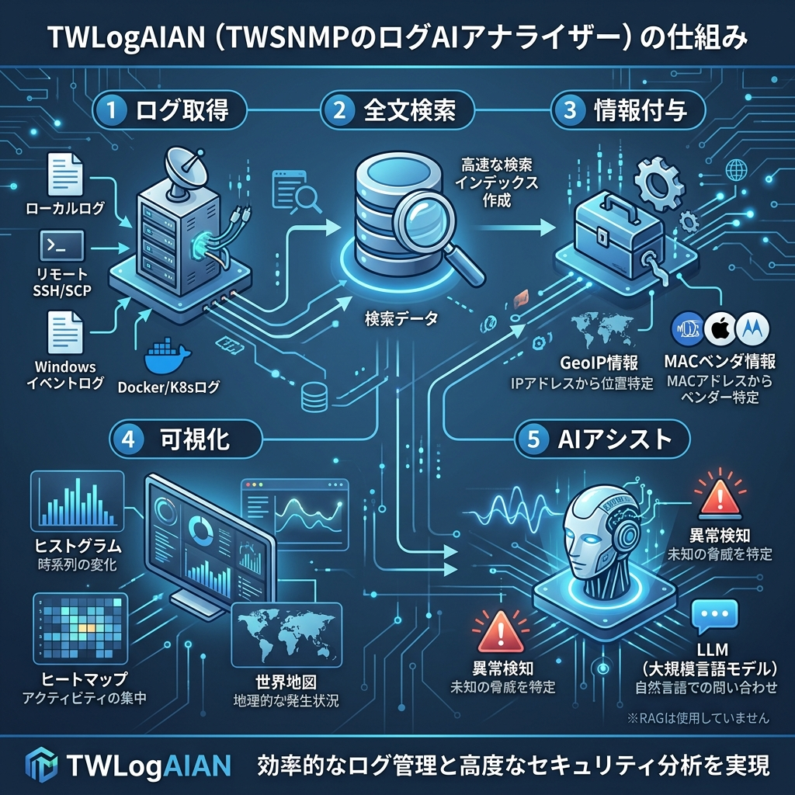
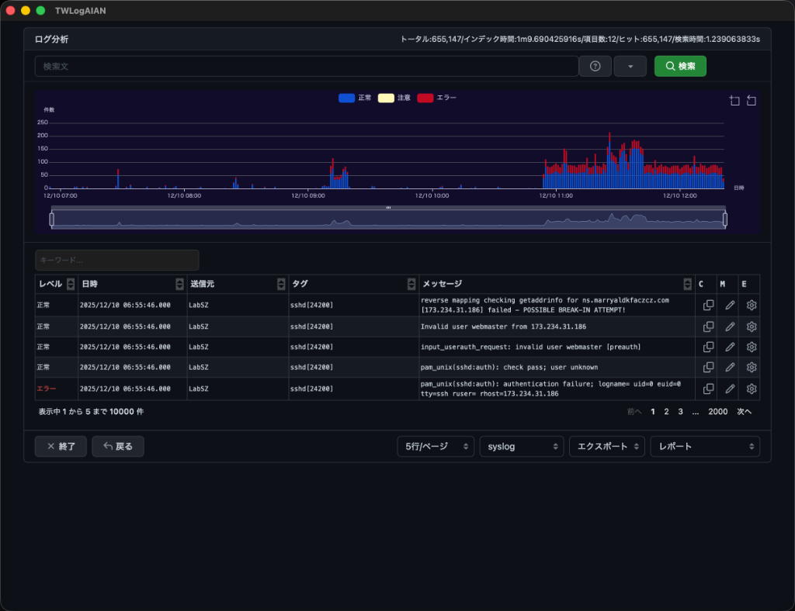

# TWLogAIAN

TWSNMP`s Log AI Analyzer
AIアシスト付きのログ分析ツール

[English Document (README.md)](README.md)

## Overview

TWSNMP FCで開発したsyslogの分析機能を拡張してデスクトップアプリケーションとして開発するプロジェクトです。
ログ分析はログサーバーにアクセスして行うよりもファイルを提供してもらって自分のパソコンで行うほうが圧倒的に
多いと思います。Unixのコマンドの達人ならばコマンドを駆使してログを検索したり整形したりして分析を行っていると
と思います。エディターに読み込んでエディタの検索機能などで作業している人も多いと思います。Excelを使っている
人もいると思います。このツールは、そのような人を少しだけ手助けするためのツールです。提供されたログ・ファイルを圧縮された状態から直接読み込んだり、リモートのサーバーから直接読み込んだり、DockerやKubernetesのコマンドから直接読み込んで全文検索エンジンでインデックスを作成し検索可能にします。インデックスにはログから抽出したIPアドレスから
位置情報やホスト名などの補足情報を含めることもできます。検索した結果もWebの技術を使って簡単にビジュアライズできます。分析が終わったログデータはフォルダごと削除すればよいだけです。





分析対象のログファイルは、

- ローカルファイル（ZIP、EVTX、テキストなど）
- ローカルディレクトリ
- ローカルでのコマンド実行結果(DockerやKubernetes)
- リモートサーバーからSCPで転送
- リモートサーバーでのSSHによるコマンド実行結果(DockerやKubernetes)
- TWSNMP FC連携 (v1.1.0から)
- Windowsイベントログ(v1.1.0から)

により取得できます。

ログの分析機能としては、

- ログの種類を自動判別する
- タイムスタンプを自動取得する
- 正規表現や簡易な方法でフィルターできる
- ログの中から特定パターンのデータを抽出できる
- 抽出したIPアドレスから位置情報、ホスト名を推定できる
- 抽出したMACアドレスからベンダ名を推定できる
- ログと抽出したデータを全文検索エンジンでインデックス作成できる
- 全文検索エンジンで、時間範囲、キーワード、数値範囲、地理的な位置範囲で検索できる
- ログの件数や抽出したデータをグラフや世界地図上にビジュアライズできる
	- ヒストグラム
	- クラスター
	- 時系列
	- 世界地図
	- 地球儀
	- ヒートマップ(v1.1.0)
- 分析結果をCSVやEXCELに出力できる
- ログを選択して時系列に並べたメモを作成できる(v1.2.0)
- AI(機械学習)のアシストにより異常ログを検知できる(v1.3.0から)
- 検索時のデータ抽出に対応（v1.5.0から）
- LLM（Ollama、Gemini、OpenAI、Anthropic）連携によるログ解説・問い合わせ機能（v2.0.0から）

を実現しました。

デスクトップアプリを開発するために使った技術は

- Go言語
- Wails v2 : Go言語版のGUI作成ツール
- Svelte 5 / Vite 8 : フロントエンドフレームワーク & ビルドツール
- Bluge : Go言語版全文検索エンジン
- langchaingo : LLM連携ライブラリ（Go言語）
- p5.js / p5-svelte : 2D/3Dビジュアライズ
- Apache ECharts : グラフ表示
- Primer/CSS, Octicons : 画面デザイン
- TensorFlow.js : AIによる異常検知

です。

バックエンドをGo言語により並列/高速処理し、JS/CSS/HTMLのフロントエンドにより豊かな表現力を実現します。

## Document

https://twsnmp.github.io/TWLogAIAN/

## Status

- v1.0.0 (2022/3/2) 最初のリリース
- v1.1.0 (2022/3/14) 外部連携（TWSNMP FC連携、Windowsイベントログ）
- v1.2.0 (2022/3/21) メモ機能対応
- v1.3.0 (2022/4/3) AIアシスト対応
- v1.4.0 (2022/4/11) Grokパターン編集機能の改善
- v1.5.0 (2022/4/24) 検索時データ抽出に対応、Grokパターン編集機能の改善
- v1.6.0 (2022/10/29) Grokパターン、フィールド編集機能の改善、ログ種別の自動判定
- v1.7.0 (2023/1/15) 英語対応、ログ検索機能の改善
- v1.8.0 (2023/2/5) Grokパターン編集と選択の改善、タイムスタンプ処理の改善
- v1.9.0 (2023/2/12) Windowsイベントログ処理の改善、ハイライト表示
- v1.10.0 (2023/6/12) Windowsイベントログ処理の改善、TF-IDFによる異常検知
- v1.11.0 (2025/4/14) LLM/RAG対応
- v2.0.0 (2026/6/20) Svelte 5 / Vite 8への移行、カスタムGrokEditorの導入、LLM対応（RAG機能の削除）

## Build

ビルドのためには、wails v2のインストールが必要です。

https://wails.io/docs/gettingstarted/installation/

ビルドはmakeで行います。

```
$make
```

以下のターゲットが指定できます。
```
	all        全実行ファイルのビルド（省略可能）
	mac        Mac用の実行ファイルのビルド
	windows    Windows用の実行ファイルのビルド
	windebug   Windows用のデバック版の実行ファイルのビルド
	clean      ビルドした実行ファイルの削除
	dev        デバッグ環境の起動
```

を実行すれば、MacOS,Windows用の実行ファイルが、`build/bin`のディレクトリに作成されます。

デバッグ用に起動するためには
```
$make dev
```
を実行します。

## Copyright

see ./LICENSE

```
Copyright 2022-2026 Masayuki Yamai
```
