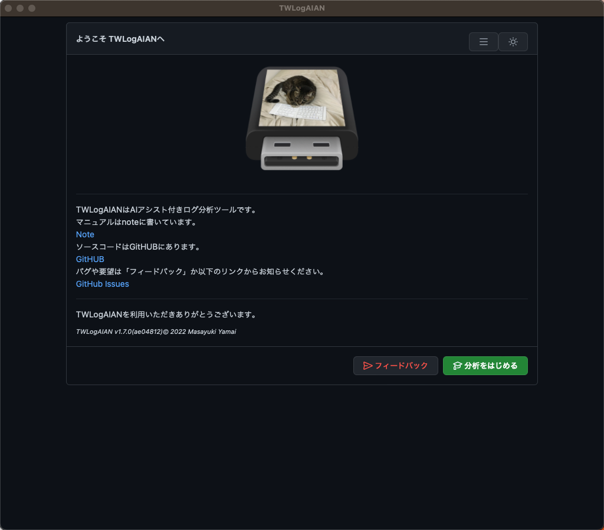
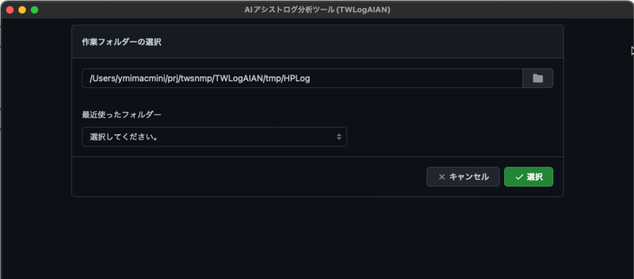
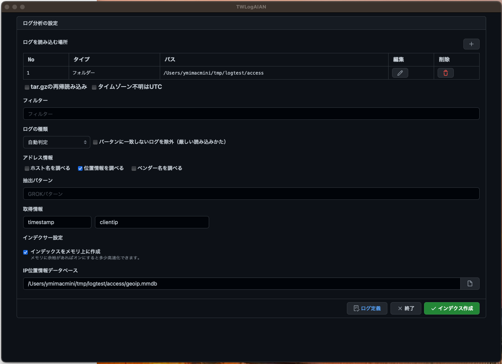
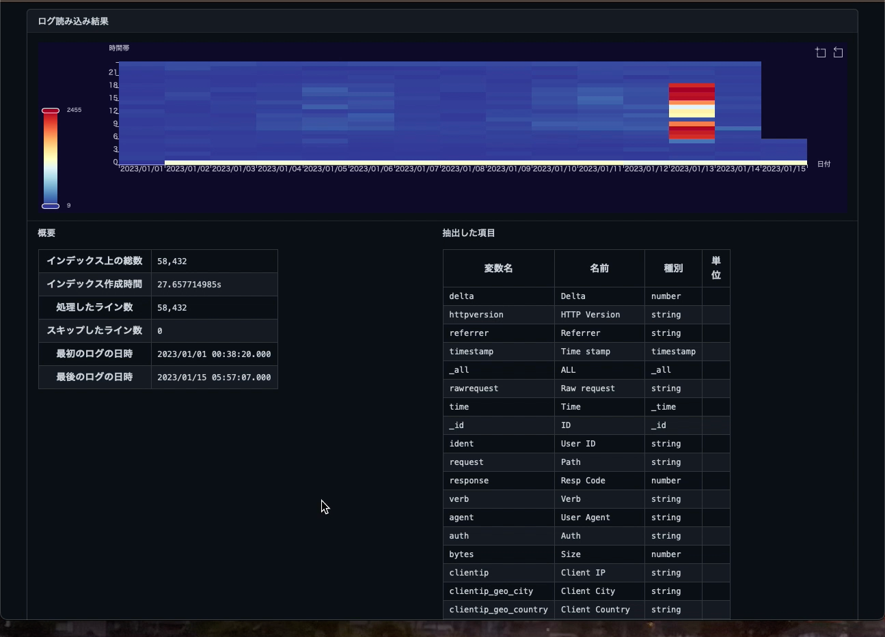
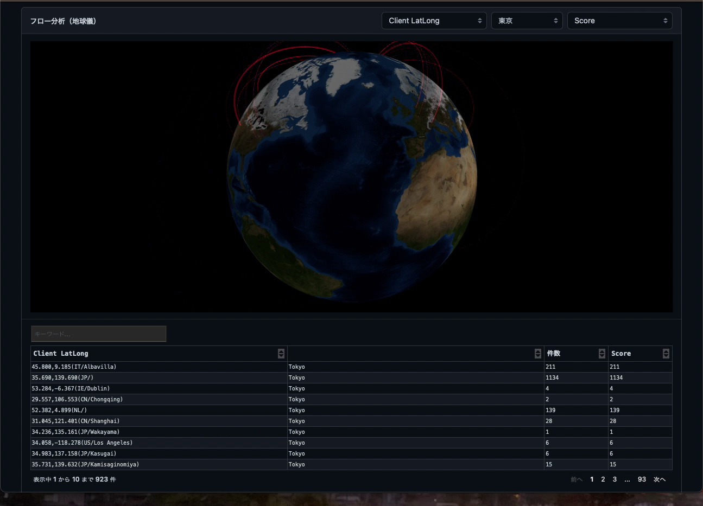

# はじめてのTWLogAIAN
AIアシスト付きのすごいログ分析ツール


---

# はじめに
便利なAIアシスト付きログ分析ツールTWLogAIANをインストールして使い始めるまでの説明です。TWLogAIANはソフトウェアの開発やサポートを行っている人のためのログ分析ツールです。「ログを簡単に集めて、検索が楽になるインデックスを作成し、検索結果をリッチな表現で分析でき、終わったら簡単に片付ける」という考えで作っています。

---
# TWLogAIANの仕組み

全文検索エンジンにログを読み込んで検索できるようになっています。検索結果を機械学習(AI)や可視化によって分析を助けてくれます。


---

## Windows版Microsoft Store
https://ms-windows-store//pdp/?productid=9P8TQLG999Z3


## Windows版MSI 
https://github.com/twsnmp/TWLogAIAN/releases

からTWLogAIAN.msiをダウンロードしてインストール


---
## Scoop

https://scoop.sh/
を参照してScoopをインストール後に

```
>scoop bucket add twsnmp https://github.com/twsnmp/scoop-bucket
>scoop install twlogaian
```
でTWLogAIANをインストール

---

## Mac OS版のApp Store

App Store

https://apps.apple.com/app/twlogaian/id1664596440

からインスール


---

## TWLogAIANの起動

Windowsの場合はスタートメニューからMac OSの場合はランチャーからなどお好きな方法で起動してください。ようこそ画面が表示されるはずです。


---
## ダークモード

右上の🌙マークをクリックすれば、ダークモードになります。
私はダークモードが好きです。
たぶんホワイトハッカーの目指す人はダークモードが好きだと思います。猫の世界にはホワイトハッカーしかいないそうです。By 助手の猫



---
## 言語切替
右上のメニューで画面の表示を英語に切り替えられます。


---
# TWLogAIANによる分析の流れ
大まかな分析の流れは
 
1. 作業フォルダの選択
2. ログの読み込み場所の設定
3. ログの読み込み処理の設定
4. ログの読み込み
5. ログの検索と分析

です。

---

## 作業フォルダの選択
＜分析をはじめる＞ボタンをクリックすると、作業フォルダの選択画面が表示されます。作業フォルダーには分析のための設定ファイルと全文検索エンジンのインデックスが作成されます。分析が終わったらフォルダーごと削除すれば全部消えます。証拠隠滅できます。



---

## ログの読み込み場所の設定
作業フォルダーを選択するとログ分析の設定画面が表示されます。
最初に、ログを読み込む場所の設定をします。分析対象のログが何処にあるかを設定します。最初は＜＋＞ボタンで追加できます。
この例だと指定のフォルダにあるファイル名がaccessから始まるもの対象です。


---

## ログの読み込み処理の設定

対象のログを読み込む場所を指定したら読み込む時の処理の設定です。圧縮ファイルの中の圧縮ファイルの扱いやタイムゾーンがない場合の時刻の扱い、読み込むログをフィルターで制限する設定、ログの中からデータを抽出するための設定、IPアドレスなどの情報からホスト名や位置情報を調べる設定、インデックスの作成場所に関する設定があります。



---
## ログの読み込み
＜インデックス作成＞ボタンをクリックするとログの読み込みを開始します。読み込み中は進行状況を表示します。


---
## ログの検索

ログを読み込んでインデックスの作成が完了すると検索画面が表示されます。とりあえず＜検索＞ボタンをクリックすれば検索できます。


---
## 処理結果

ログの読み込みの状況は＜処理結果＞ボタンで確認できます。ログから抽出したデータの項目やログの多い時間帯を確認できます。



---
## 検索条件
検索条件を指定して検索することもできます。
時間範囲、キーワード、数値範囲、位置情報など。
異常検知やデータ抽出の設定もあります。


---
## レポート
時間範囲や位置情報、IPアドレスから位置情報を抽出する設定にすればレポートも表示できます。


 ---

 # それでは快適なログ分析ライフをお楽しみください。
