# TWLogAIANのマニュアル

AIアシスト付きのすごいログ分析ツール

{: width="256" }


## TWLogAIANを作っている理由

TWLogAIANは2022年の元日から開発を開始した
**「私のためにAIがアシストしてくれるログ分析ツール」**
です。このツールを開発している一番の目的は私自身が実務で使うことです。開発や保守しているソフトの問題を調査するためのログ分析に利用するのが一番の目的です。このような目的に最適なツールを作っています。

## 一般的なログ分析システムと違う点

- 分析中だけログを保持する
- 分析が終わったら跡形もなく削除できる
- 普通のパソコンで使える
- 自分専用の全文検索のためのインデックスを作成/削除できる

というようなことだと思っています。問題の調査のためにログを提供してもらって調査によって問題が解決したらフォルダーを削除すれば全部消せるという感じです。大規模なログ分析システムだと、それなりの性能のサーバーが必要ですが、自分のパソコンで簡単に分析できるような工夫をしています。


## できること

- ログをどこからでも高速に集めてこれる
- 集めたログを高速にフィルターできる
- ログから簡単かつ高速にデータを抽出できる
- ログと抽出したデータから全文検索エンジンのインデックスを作成できる
- 集計や抽出したデータを簡単に検索してAI分析できるる
- 集計や抽出したデータ、AI分析結果を簡単にビジュル化できる
- 分析結果のリストやグラフを簡単にCSV,Excelファイルに保存できる


# 分析対象のログ

- ローカルファイル
- リモートファイル（SCP経由）
- TWSNMP FCに保存したログ
- Docker/Kubernetsのログ（コマンド/SSH経由）
- Gravwellのログ
- Windowsのイベントログ(リモートも含む)


# TWLogAIANの中身

開発はGO言語で行っています。全文検索エンジンにはBluge

https://blugelabs.com/bluge/

を使っています。

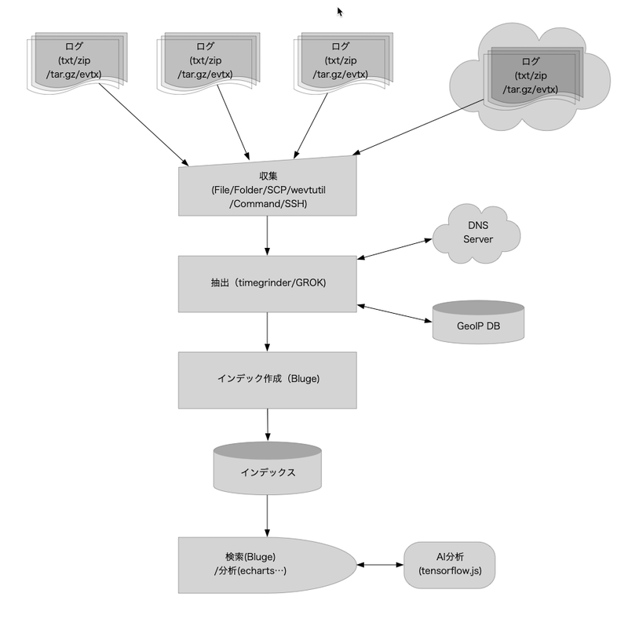

## Windows版のインストール

Microsoft Storeに公開しています。

https://www.microsoft.com/store/apps/9P8TQLG999Z3


## MacOS版のインストール

Apple App Storeで公開しています。

https://apps.apple.com/app/twlogaian/id1664596440

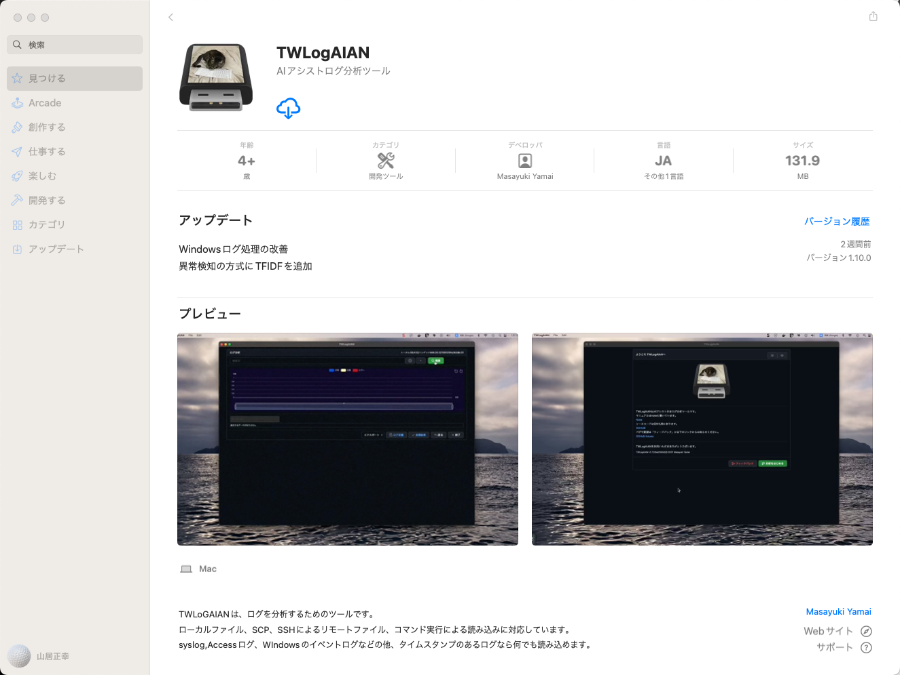


## インストーラーのダウンロード

最新のリリースは

https://github.com/twsnmp/TWLogAIAN/releases

にもあります。

Windows版のMSI形式のインストラーファイルTWLogAIAN.msiかMacOS版のMacOS版のTWLogAIAN.dmgをダウンロードしてください。


## Windows版の起動

Windowsの場合はスタートメニューから起動してください。

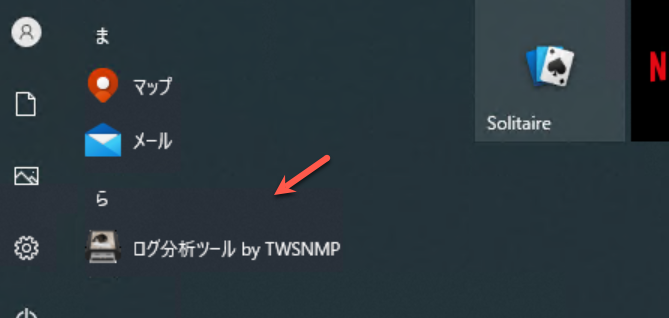

## MacOS版の起動

MacOSの場合はランチャーなどからお好きな方法で起動してください。


## ようこそ画面

起動すると「ようこそ画面」が表示されます。


## 画面モードの切り替え

最初はライトモード（白い画面）です。右上の月アイコンをクリックすれば、ダークモードになります。右上の太陽アイコンをクリックすれば、ライトモードに戻ります。切り替えは、この画面でしかできません。ダークモードを使うと玄人ぽく見えます。


## フィードバック

＜フィードバック＞ボタンをクリックするとフィードバック画面
が表示されます。問題点や要望を入力して＜送信＞してください。
開発者に直接届きます。できるだけ対応します。
**※送信元のIPアドレス以外の情報は送信されません。**

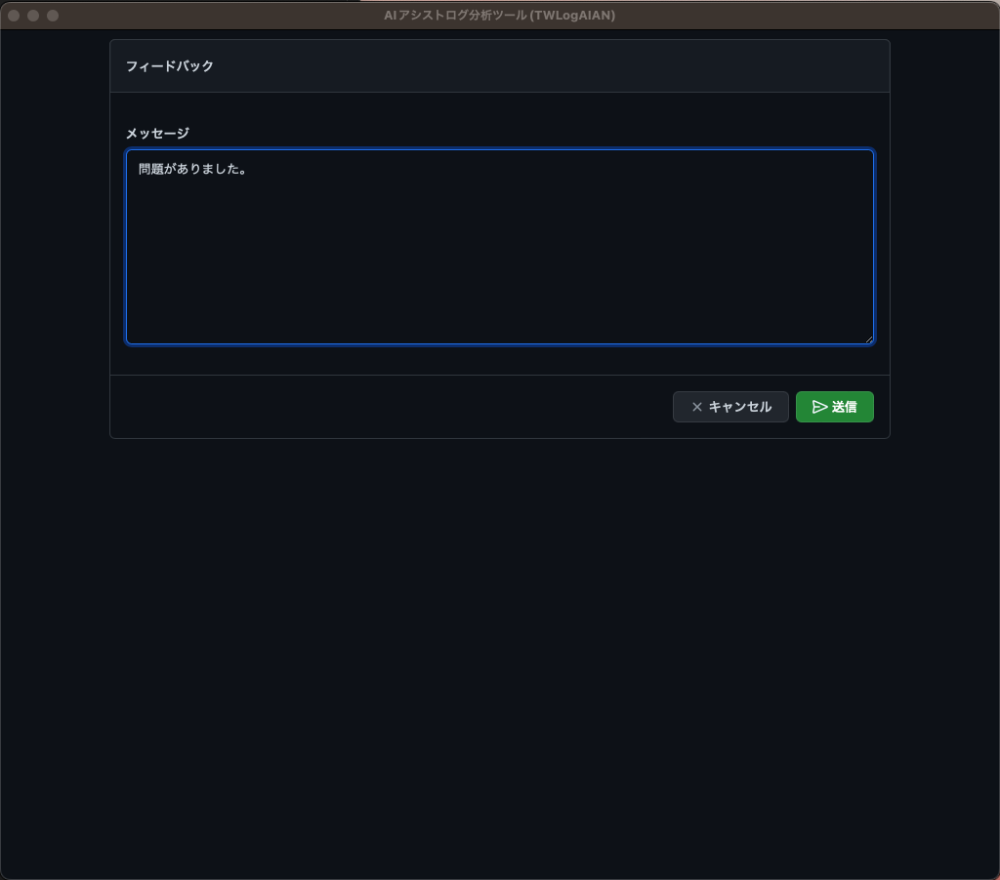


## ログ分析のおおまかな流れ

1. 作業フォルダの選択
1. ログを読み込む場所の設定
1. インデックス作成の設定
1. ログの読み込み
1. ログの検索
1. 分析レポート


## 作業フォルダの選択

ようこそ画面の＜分析をはじめる＞ボタンをクリックすると、作業フォルダの選択画面が表示されます。作業フォルダーには分析のための設定ファイルと全文検索エンジンのインデックスが作成されます。分析が終わったらフォルダーごと削除すれば全部消えます。作業フォルダーを選んで＜選択>ボタンをクリックするとログ分析設定画面を表示します。


## ログ分析設定画面

作業フォルダーを選択するとログ分析の設定画面が表示されます。ログの種類にカスタム設定を選択して全ての項目を表示した状態です。

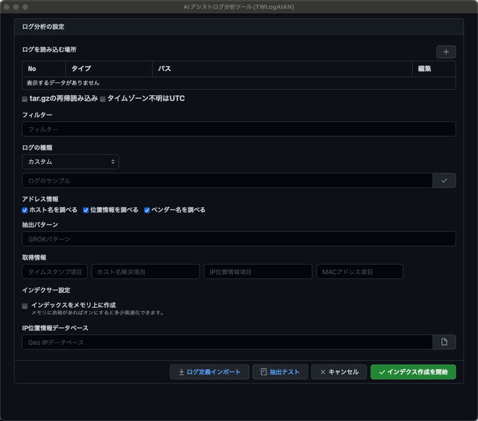


### tar.gzの再帰読み込み

tar.gzで圧縮されたファイルの中に更にtar.gzので圧縮されたファイルがあった場合に、その中身も再帰的に読み込みたい場合にチェックします。階層に制限はありません。注意しないと大量のログを読み込むことになります。

### タイムゾーン不明はUTC

ログのタイムスタンプにはタイムゾーンが含まれていないものが多いので、タイムゾーンが不明の場合はローカルタイムとして扱うことにしています。でも、それが嫌な人のためにUTCにする設定をつけておきました。

### フィルター

ログを読み込む時に読み込む行を制限するための設定です。正規表現で指定できます。大量のログの中から分析したいログだけ読み出してインデックスを作成するためのものです。対象のログの量を減らしたほうが読み込みや検索の時間を少なくできます。インデックスのサイズも小さくできます。

アクセスログの例では、

```
POST
```

と設定すればログにPOSTという文字列があるログ(POSTリクエスト)だけ読み込むことができます。


## ログの種類

読み込むログの種類を指定します。情報の抽出方法をTWLogAIANが知っているログの種類には、右のようなものがあります。syslogだけでも古いBSD形式やタイムスタンプにタイムゾーンや秒以下の桁に対応した新しいIETF形式があります。自分で細かく設定したい時は、カスタムを選択します。自動判定を選択すれば、ある程度自動で判定します。


## ホスト名を調べる

ログの中にあるIPアドレスの項目からDNSでホスト名を調べて項目を追加します。
カスタム設定の場合は、”ホスト名解決項目”にホスト名を調べたい項目の変数名を記載します。Apacheのアクセスログなどの組み込みのログタイプの場合は、項目を自動で設定します。


## 位置情報を調べる

ログの中にあるIPアドレスの項目からGeoIPデータベースで位置情報を調べて項目を追加します。カスタム設定の場合は、”IP位置情報項目”に位置情報を調べたい項目の変数名を記載します。Apacheのアクセスログなどの組み込みのログタイプの場合は、項目を自動で設定します。

位置情報のデータベースの入手方法は

https://qiita.com/twsnmp/items/bfeab550b7f9b775f754

で説明してしています。ダウンロードの方法は変わっているかもしれません。
このファイルを設定の下の方にあるIP位置情報データベースに設定してください。


## ベンダー名を調べる

ログの中にあるMACアドレスからベンダー名を調べて項目を追加します。MACアドレスを調べる項目名を"MACアドレス項目"に指定します。MACアドレスとベンダー名の関係はTWLogAIANに組み込んであります。

## タイムスタンプ項目

タイムスタンプとして使う項目の変数名を指定します。空欄の場合は一番左側にあるタイムスタンプぽい文字列を自動でタイムスタンプとして取得します。


## ホスト名解決項目

IPアドレスからホスト名を解決する項目の変数名を指定します。カンマ区切りで複数指定できます。

## IP位置情報項目

IPアドレスから位置情報を取得する項目の変数名を指定します。カンマ区切りで複数指定できます。

## MACアドレス項目

ベンダー名を調べるMACアドレスの項目の変数名を指定します。カンマ区切りで複数指定できます。


## インデックスをメモリ上に作成

全文検索エンジンBlugeのインデックスをメモリ上に作成します。読み込んだログもメモリ上に保存します。プログラムを終了すると消えてしまいます。大量のログを読み込みと当然メモリ不足になると思います。チェックしない場合はインデックスを作業フォルダーに作成します。

## IP位置情報データベース

GeoIPのデータベースファイルを指定します。


## ログの読み込み場所

TWLogAIANが読み込むことのできるログの場所についての説明です。
右の図の赤枠の部分の説明です。圧縮ファイルの中にあるログファイルも直接読み込むことができます。Windowsのイベントログにも対応しています。

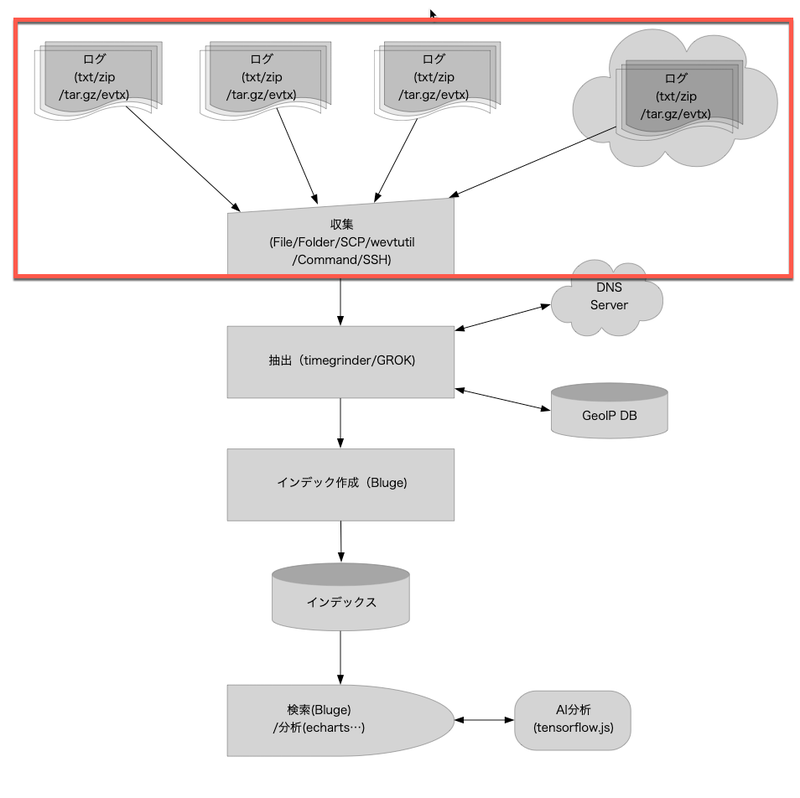


## ログ読み込み元の追加

ログの読み込み元を指定するためには、ログ分析の設定画面の「ログを読み込む場所」のリストにある＜＋＞ボタンをクリックします。ログ読み込み元（ソース）の編集画面が表示されます。


## ログ読み込み元の編集

一度追加した読み込み元はリストの編集ボタン（鉛筆アイコン）をクリック
してください。編集画面を表示します。

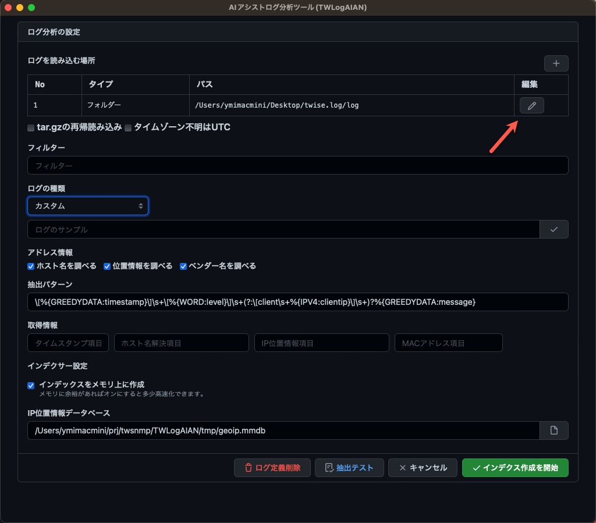

## ログソース編集画面

ログソース（読み込み元）の編集画面は右の図ののような感じです。

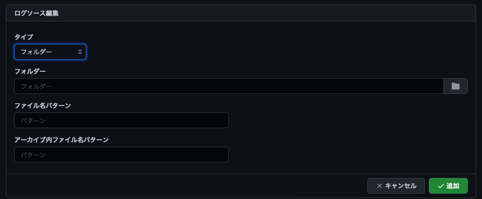

## ログソースの削除

編集画面では編集中のログ読み込み元は削除することができます。
右図の＜削除＞ボタンをクリックしてください。
リストの削除ボタンでも削除できます。

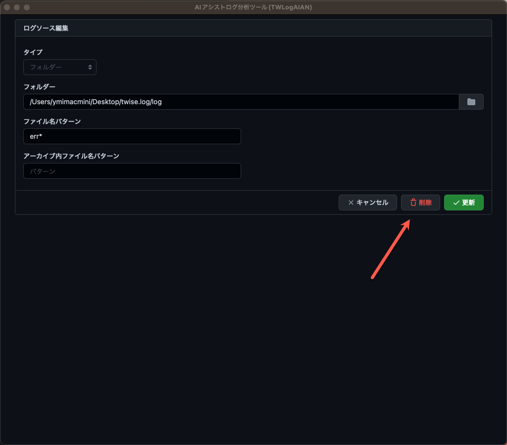


## ログ読み込み元のタイプ

ログ読み込み元のタイプには、図のようなものがあります。Windows版ではWindowsのイベントログを取得するタイプがあります。

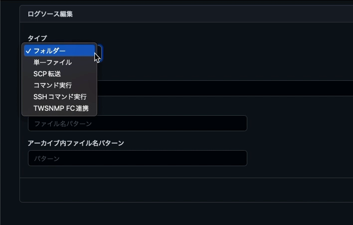


### 単一ファイル

単一のファイルから読み込みます。読み込むログファイルを指定できます。ファイルはファイル名の右にあるボタンをクリックして選択できます。Mac版は、なぜかファイル選択のダイアログが英語になってしまいます。

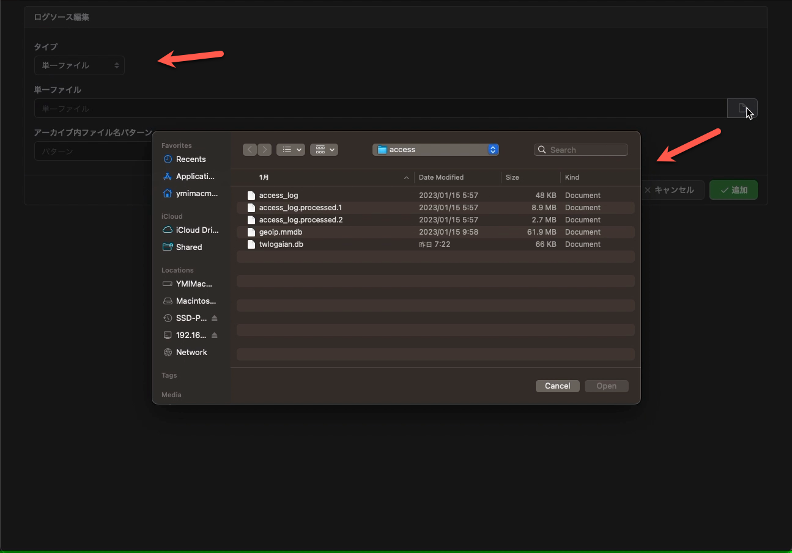


#### アーカイブ内のファイル名パターン

ZIPやtar.gzで圧縮されたファイルも指定できます。圧縮されたファイルの場合には圧縮ファイル内にあるファイルをファイル名で選択するとこができます。アーカイブ内のファイル名パターンで

```
access*
```

のように指定すれば、圧縮ファイル内のaccessから始まるファイルだけ読み込みます。

---

### フォルダー

複数のログファイルが保存されているフォルダーを指定します。選択したフォルダーの中にあるファイルを読み込みます。フォルダーの階層は１階層だけです。子のフォルダーには対応していません。

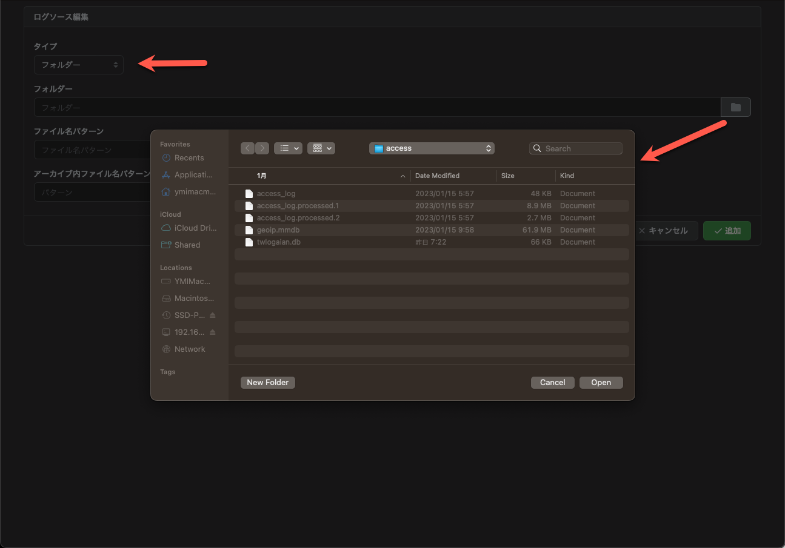

#### ファイル名パターン

フォルダーの中にある特定のファイルだけ対象にしたい場合は、ファイル名パターンを指定します。

```
access*
```

と指定すれば、accessから始まるファイルだけを対象にします。フォルダー内のZIPやtar.gzで圧縮されたファイルも対象です。内部のログファイルを読み込みます。圧縮されたファイルの場合には圧縮ファイル内にあるファイルをファイル名で選択するとこができます。これは単一ファイルの場合と同じです。


### SCP転送

LinuxなどのサーバーにあるログファイルをSCPで転送して直接読み込むこともできます。ファイルを転送してローカルPCに保存してから読み込むよりかなり楽ができます。サーバーのIPアドレス、ホスト名、サーバー上のログファイルのパス、ユーザーIDと秘密鍵のパスワード（あれば）、SSH秘密鍵（キー）ファイル（指定しなければデフォルトの保存場所のファイルを使います。）ファイルがサーバー上のフォルダーにあるだけで後はローカルのフォルダーを指定場合と同じです。ファイル名のパターンや圧縮ファイル名内のファイル名パターンを指定して読み込むログファイルを選択できます。

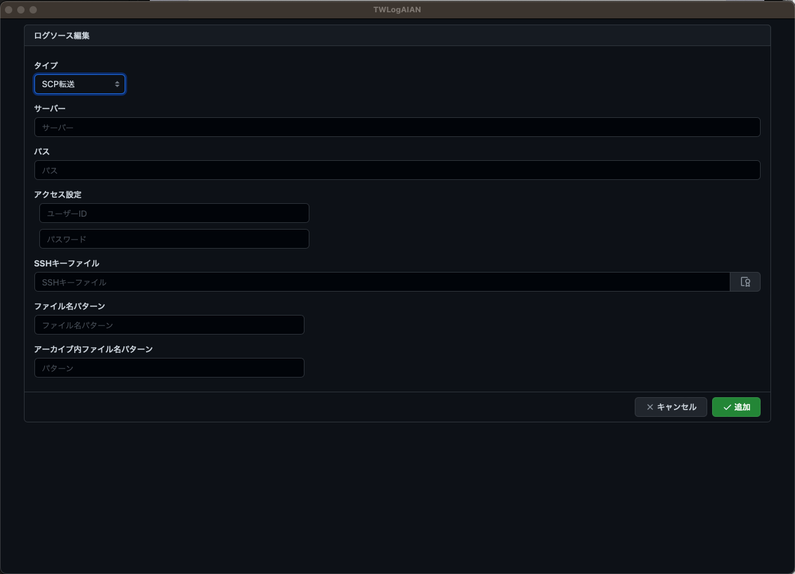


### コマンド実行

コマンドを実行した出力をログとして読み込む機能です。DockerやKubernetsのログをコマンドで取得して分析する時に便利です。実行するコマンドを指定します。


### SSHコマンド実行

コマンド実行と似ていますが、ログを取得するコマンドを実行するのはSSHで接続するサーバー上です。クラウド環境で使うと便利じゃないかと思っています。使ってませんが。実行するコマンド以外にSSHでアクセスするための設定があります。SSHサーバーのアドレス、ユーザー名、パスワード、SSHキーファイルの場所です。

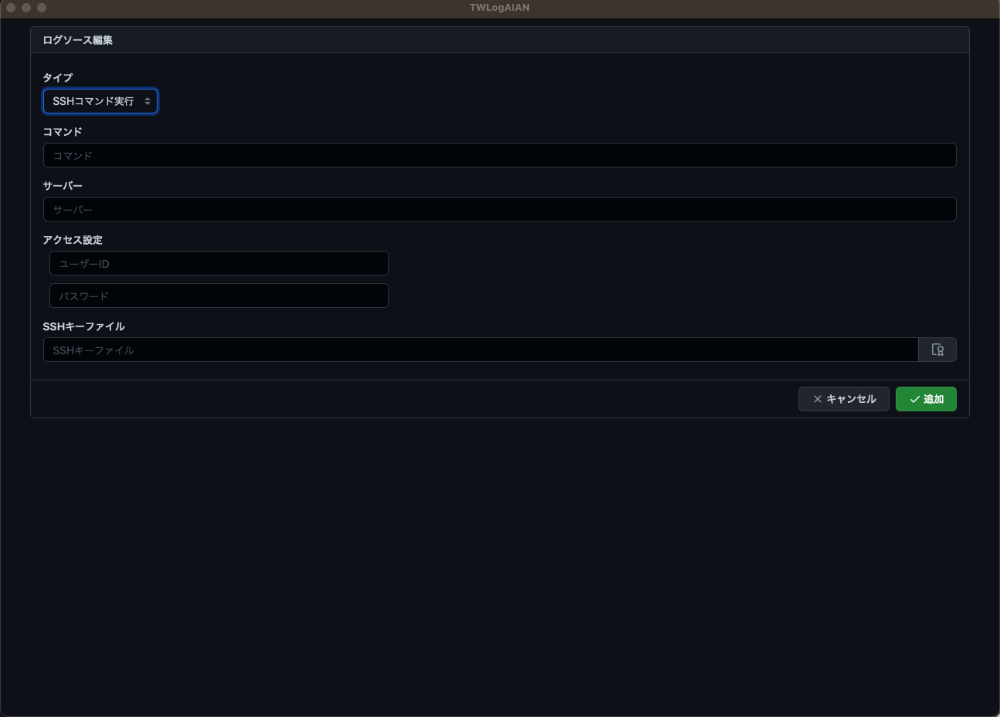

### TWSNMP FC連携

TWNMP FCが集めているsyslogを直接読み込むことができます。サーバーにTWSNMP FCのURLを指定します。アクセス設定にTWSNMP FCにログインするためのユーザーIDとパスワードを指定します。取得するログを検索する条件も指定します。期間とホスト名、タグ、メッセージのフィルターを指定できます。

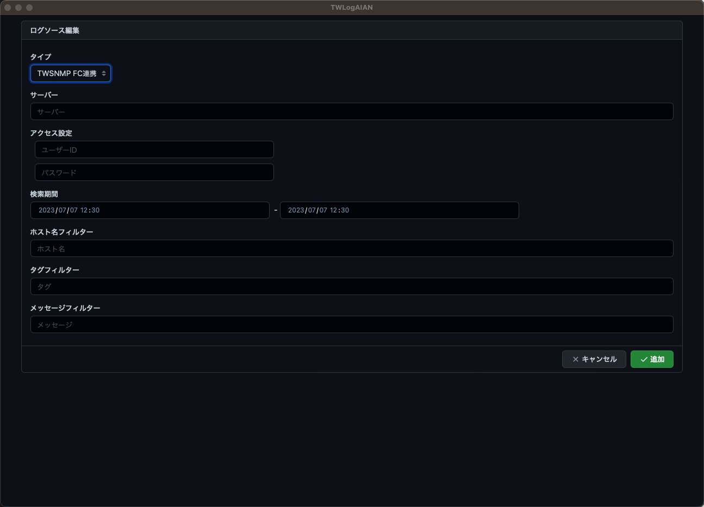


### Windowsイベントログ

Windows環境の場合は、Windowsのイベントログを直接読み込むことができます。wevtutil.exe を実行してログを取得しています。

https://docs.microsoft.com/ja-jp/windows-server/administration/windows-commands/wevtutil


取得中はコマンドプロンプトが表示されます。意図的に表示していますので驚かないでください。TWLogAIANを実行しているWindowsマシンだけでなくリモートサーバーのログも取得できます。サーバーにリモートサーバーを指定します。アクセス設定に認証するためのユーザーID、パスワード、認証の方式を指定います。ローカルのログを取得する場合は指定する必要はありません。取得するログは、期間とチャネルで指定します。セキュリティーチャネルのイベントログを取得するためには、TWLogAIAN を管理者権限で実行する必要があります。


## 読み込めるファイルの種類

基本的にはタイムスタンプのあるテキスト形式のログファイルに対応しています。
タイムスタンプの形式は自動で認識できます。gzで圧縮されたファイルは自動で解凍して読み込みます。ZIPファイル内のログファイルも１階層まで読み込めます。tar.gzの場合には、複数階層のフォルダーと多重圧縮に対応してます。tar.gz 内のgzやtar.gzも解凍して読み込めるということです。この再帰的に読み込む場合は、"tar.gzの再帰読み込み"にチェックしてください。Windowsのevtx形式のイベントログにも対応しています。ただし、メモリ上に読み込むために１ファイル１GBまでです。


## インデックス作成

TWLogAIANはログファイルを読み込んで全文検索エンジンのインデックスを作成をします。インデックス作成するための流れについて説明します。右の図の赤枠の部分の説明です。

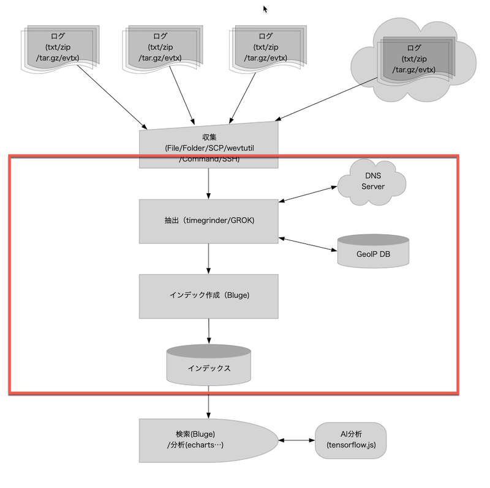


## インデックス作成とは

ログを読み込んだら行単位で意味のなる情報を抽出してインデックスに登録します。例えば、

```
114.119.136.254 - - [03/Apr/2022:00:39:21 +0900] "GET /wiki/index.php?
title=Must_Know_Mlm_Concepts_For_Accomplishment&action=history HTTP/1.1" 404 1417
 "-" "Mozilla/5.0 (Linux; Android 7.0;) AppleWebKit/537.36 (KHTML, like Gecko)
  Mobile Safari/537.36 (compatible; 
  PetalBot;+https://webmaster.petalsearch.com/site/petalbot)"
```

のようなApacheのアクセスログの場合、クライアントのIPアドレス、時刻、リクエスト、パスなどの情報があります。この行をまとめて全文検索エンジンに登録することもできますが、
各項目を抽出してインデックスの項目（フィールド）として登録したほうが検索する時に役に立ちます。検索が早くなるととか集計しやすいとかです。

## ログの種類別の項目取得

この例をApache(Combined)のタイプとして処理すると右の図のような項目を抽出します。この例ではログに書かれている内容から取得したものとクライアントのIPからDNSでホスト名を調べたり、位置情報を調べたりして項目を追加しています。TWLogAIANはログ分析ツールなので、最低タイムスタンプは抽出します。世の中で使われているログの形式に関しては組み込んであります。カスタム設定で自分で抽出項目を選ぶこともできます。

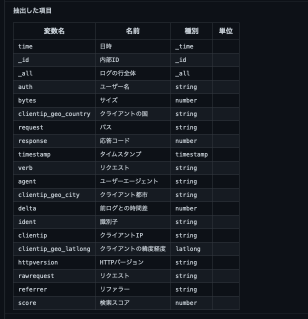


## ログの検索

ログを読み込んで全文検索エンジンのインデックスを作成できたらログを検索することができます。右の図の赤枠の部分です。

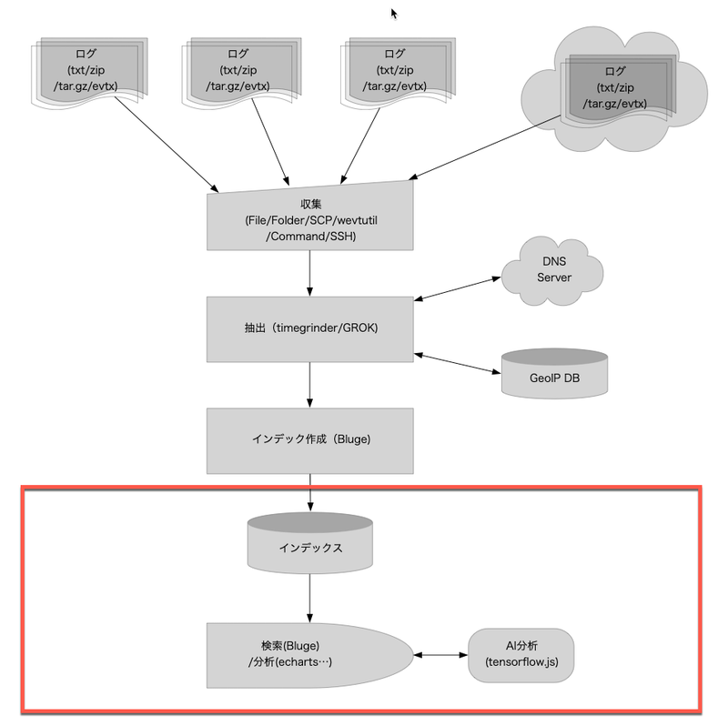

## ログ検索の基本

インデックスの作成が終わった直後は、右の図のような画面になります。インデックスに読み込んだログの件数や処理時間が右上に表示されます。ログ検索の基本は上のほうにある検索文の欄に、検索したいキーワードを入力して検索できます。空欄で検索すると全件表示します。
モードを変更すれば、
https://blevesearch.com/docs/Query-String-Query/
の構文で検索文を入力してできます。

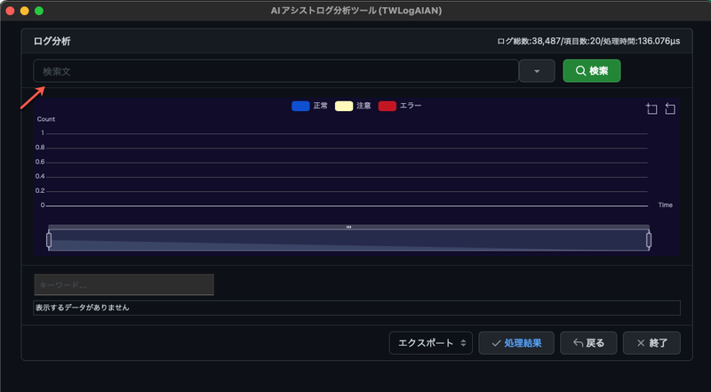


## 検索条件を指定する

検索文の横にある下矢印ボタンをクリックすれば検索条件を指定する画面が表示されます。細かな条件を設定できる画面です。

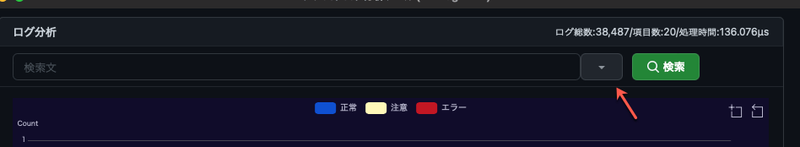

## 検索条件の指定画面

- 検索履歴
- 検索文のモード
- 検索期間
- 最大件数
- 異常ログ検知方法
- 検索時データ抽出

同じ場所にある上矢印ボタンで閉じることができます。

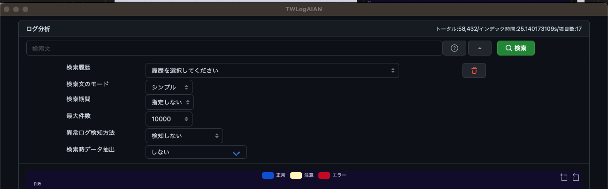

### 検索履歴

以前に実行した検索文のリストです。選択すれば、検索文へ入力します。右端の削除ボタンでクリアできます。


### 検索文のモード

検索文の入力方法を指定します。シンプル/正規表現/全文検索があります。シンプルは単純に検索したいキーワードを入力します。正規表現は検索文を正規表現で入力します。全文検索を選択するとキーワードと数値判定の入力が表示されます。条件を指定して右の＋ボタンで検索文に入力します。

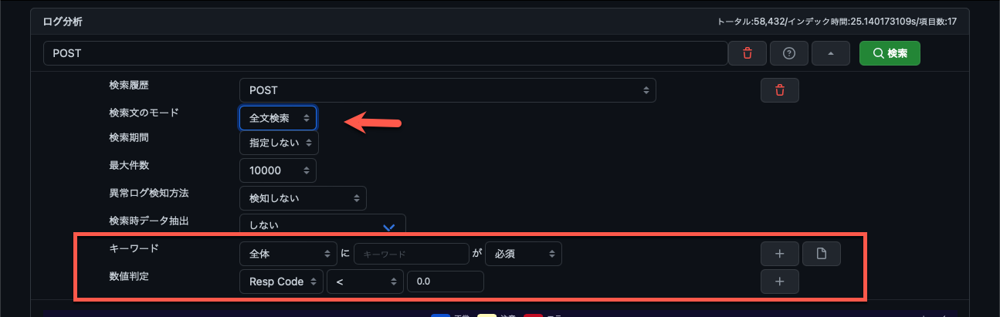


###  検索期間

ログを検索する時間範囲を指定します。２つの指定方法があります。
- 対象指定
タイムスタンプをコピペして対象の時間を指定するモード


- 範囲指定
時間の範囲を指定するモード


## 異常ログ検知方法

AI（機械学習）で検索したログの中から異常ログを検知します。検知するためのアルゴリズムを指定します。検知しない/Isolation Forest /Local Outlier Factor/Auto Encoderがあります。検知しない以外を選択した場合に特徴量の計算方法を選択できます。ログから抽出した数値データや文字列、SQLインジェクションに使わるキーワードの数などが指定できます。曜日と時間帯は、ログのタイムスタンプから曜日と24時間制の時間帯を計算して特徴量に加えるというものです。例えば、サーバーの負荷の数値は日曜の夜中は低いけど月曜の朝は高いというような特徴があると思って付けたものです。

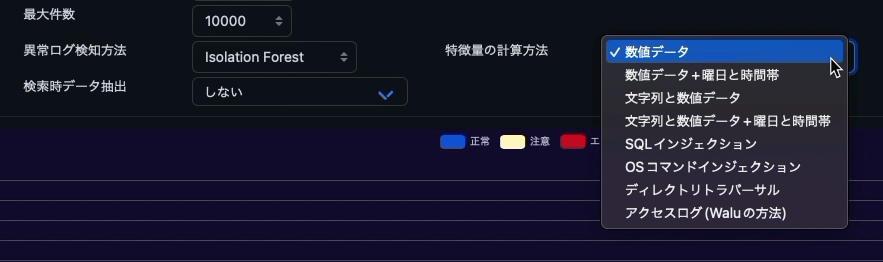


# 検索結果の表示

検索文を入力して検索を実行すると結果が表示されます。

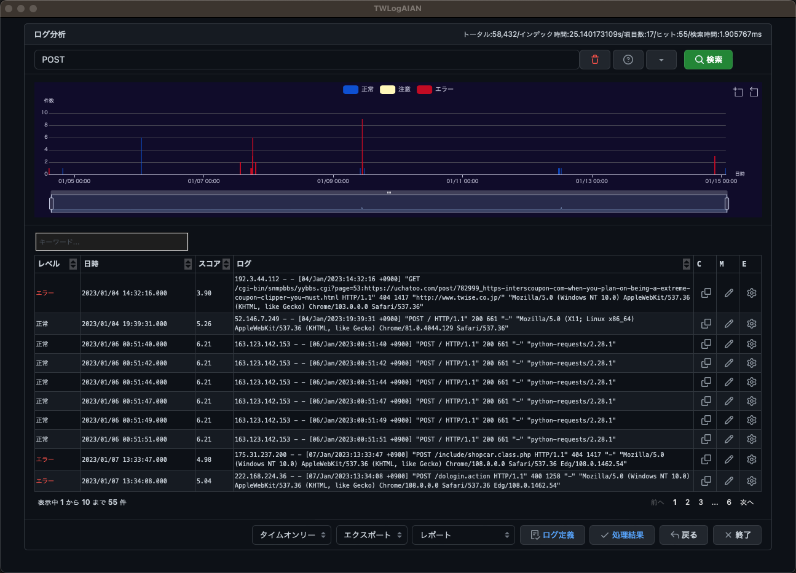

## グラフの時間範囲と連動

グラフの時間範囲を変更するとログのリストも連動して表示するログを変えます。
グラフの右上のズームボタンを押せばグラフをドラックして範囲を指定できます。


## キーワードでフィルター

キーワードに文字列を入力すれば、ログの中に含まれる文字列でフィルター表示できます。

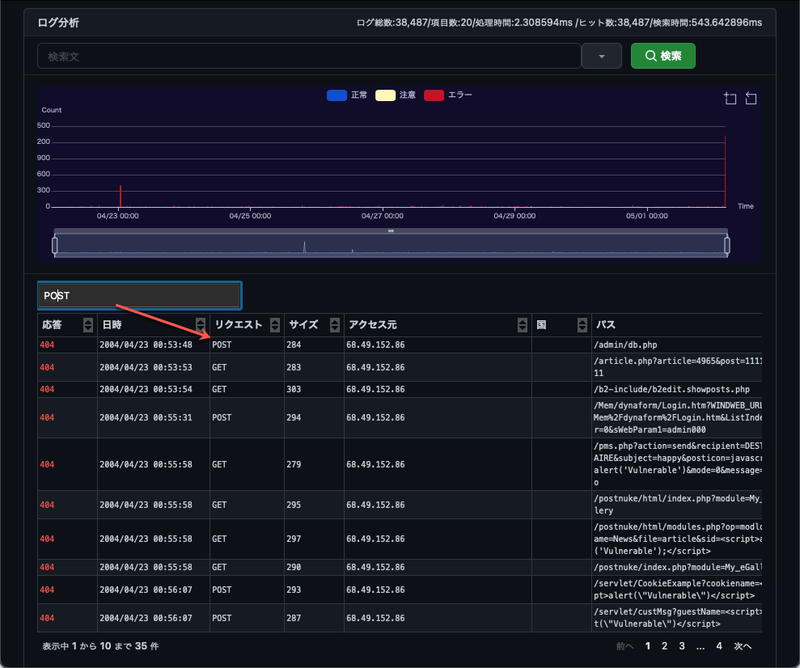

## ログの表示形式

検索結果の下にログの表示形式を選択する項目があります。これを切り替えるとリストの表示形式を変えることができます。

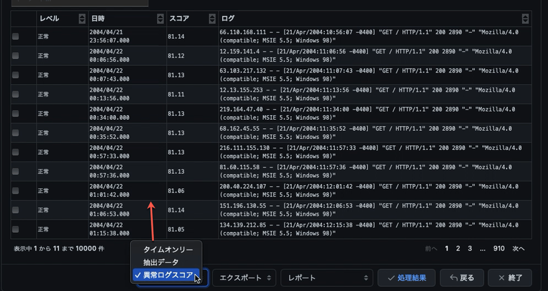

### タイムオンリー

時刻、検索スコア、ログの行だけの表示です。左側のチェックボックスにチェックしてログを選択すると、クリップボードにコピーやメモに保存できます。

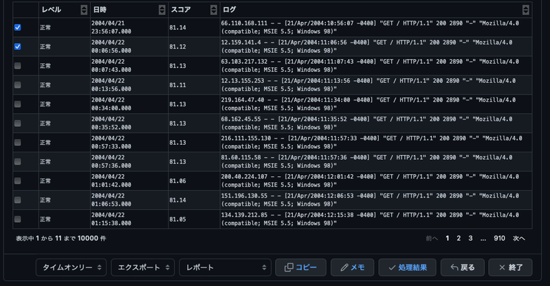

### syslog

syslogに特化した表示です。syslog形式で情報を抽出していないログでは表示できません。

### アクセスログ

アクセスログに特化した表示形式です。アクセス形式で情報を抽出していないログでは表示できません。右の図です。


### 抽出データ

ログから抽出したデータをテーブル形式で表示します。項目が多い時には横スクロールできます。

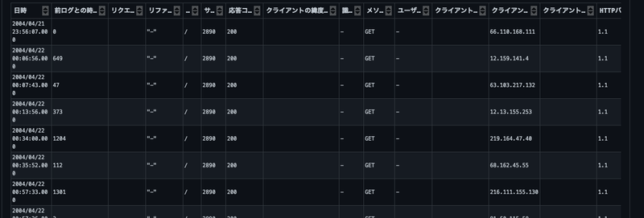

### 異常ログスコア

タイムオンリーと似ていますが、スコアの部分が異常スコアになります。
選択してコピーメモもできます。異常ログの検知をONにした場合だけ表示されます。


### エクスポート

検索結果の下のほうにエクスポートの選択項目があります。
- CSV:
CSVファイルに表示しているリストを保存します。
- Excel:
Excelファイルに表示しているリストとグラフの画像を保存します。
- AI:
AIにログを説明付きでエクスポートすます。


## レポート

ログ分析結果をグラフやリストで表示するレポート機能の説明です。TWLogAIANでログを検索すると画面の下のほうにレポートメニューが表示されます。クリックするとレポートの項目が表示されます。クリックすると対応するレポート画面を表示します。


### 処理結果

インデックスの作成やAIの学習状況を後から確認するための画面を表示します。ログの量、抽出した項目、ログの量が多い時間帯が確認できます。


### メモ

ログ検索の画面でメモに追加したログに関するメモを表示するレポートです。
ログのリストの右にある＜メモ＞ボタンで追加できます。


### メモの表示
「レポート」メニューの「メモ」をクリックするとのような画面を表示します。メモに追加したログを時系列に並べて表示します。


メモには削除するための＜削除＞ボタンと＜編集＞ボタンがあります。

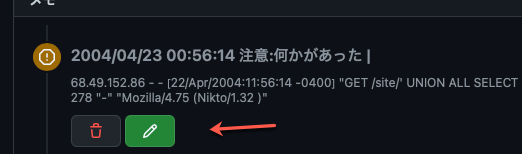

編集画面で、レベルを選択して説明を追加できます。選んだログが何を表しているかメモしておくための機能です。

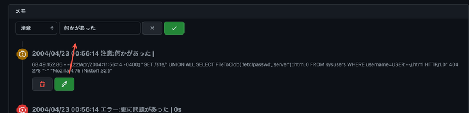

メモが完成したら画面の下にある＜コピー＞ボタンをクリックすれば、メモをテキスト形式でクリップボードにコピーできます。分析結果をメールに貼り付けて報告するのに便利です。

### ランキング分析

ログから抽出した情報を元に集計したランキングを表示します。集計する項目を右上のメニューで選択できます。

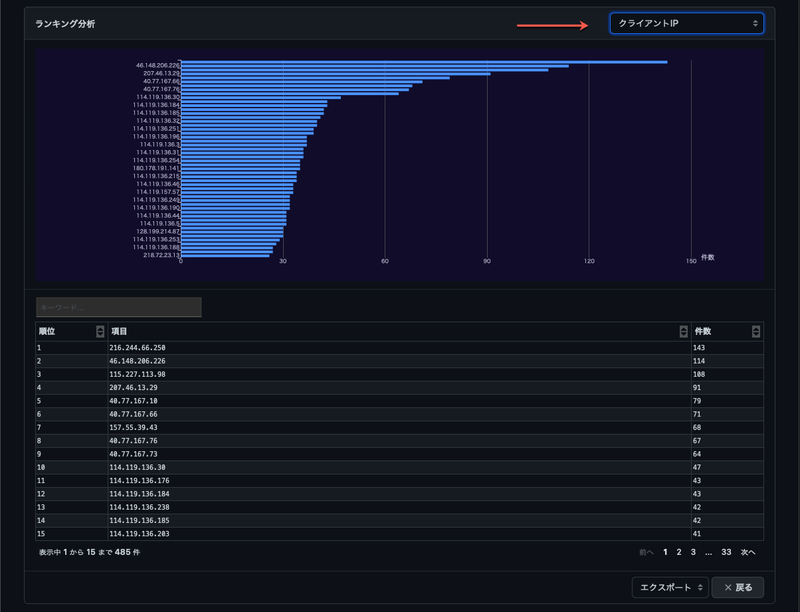


### 時系列分析

ログから抽出した数値データを時系列でグラフ表示します。右上に集計する項目と表示内容を選択するメニューがあります。

- 実データ
抽出した数値データをそのまま表示します。
- 分単位の集計
抽出した数値データを分単位で集計して表示します。平均値、中央値、分散、最大値、最小値を表示できます。
- 時間単位の集計
抽出した数値データを時間単位で集計して表示します。平均値、中央値、分散、最大値、最小値を表示できます。

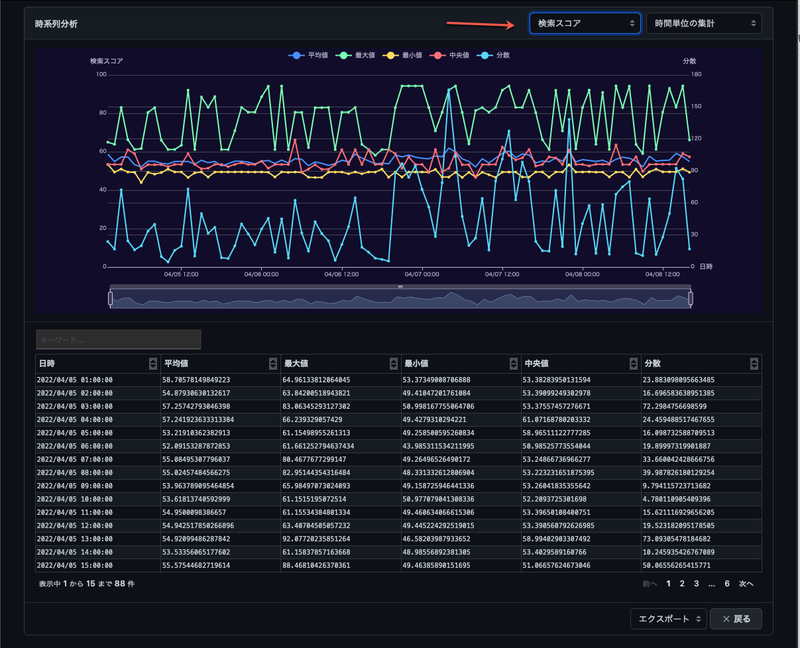


### 回帰分析

数値データを選択した方法で回帰分析した内容を表示します。linearならy=ax+bのような式のaとbを計算して線グラフ表示するものです。右の例ではあまり意味がないです。ディスクやメモリの空き容量を示すデータの場合、減っていく割合が算出できるかもしれません。


### 時系列３D分析

ログから抽出した数値データを時系列３Dグラフで表示するレポートです。Y軸は時刻固定です。X軸、Z軸、色分けの項目を右上のメニューから選択できます。３Dのグラフはドラッグすれば視点を変えることができます。
***「2dのグラフでは見えないものがある」***
と助手の猫が天から言っています。


### クラスター分析

ログから抽出した数値データを使ってクラスター分析した結果を表示するレポートです。右上のメニューでクラスター分析のための２つの数値項目と分類するクラスター数を指定します。「クラスター分析で見えるものがある」かもしれません。

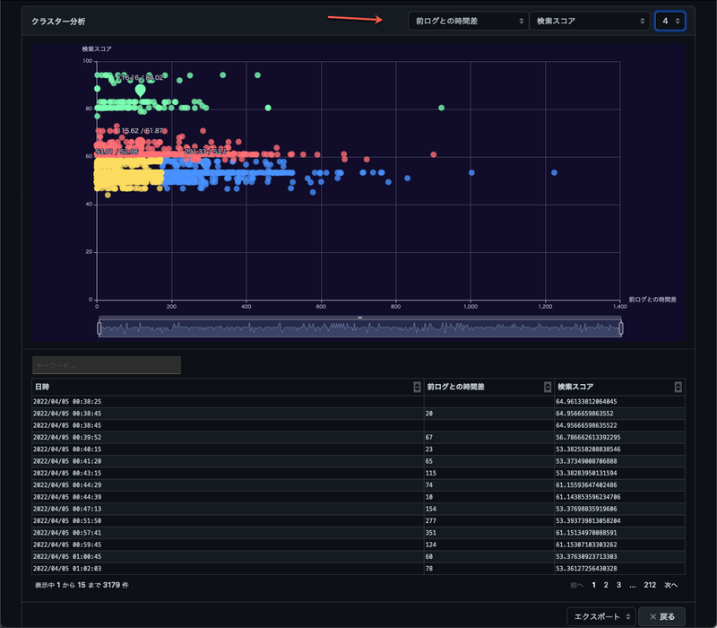

### ヒストグラム分析

ログから抽出した数値データからヒストグラムを表示するレポートです。


集計する項目を右上のメニューで選択できます。


### FFT分析(3D)

ログから抽出した数値データをFFT分析したレポートです。「FFTで周期的な変化が見えることがある」という感じです。

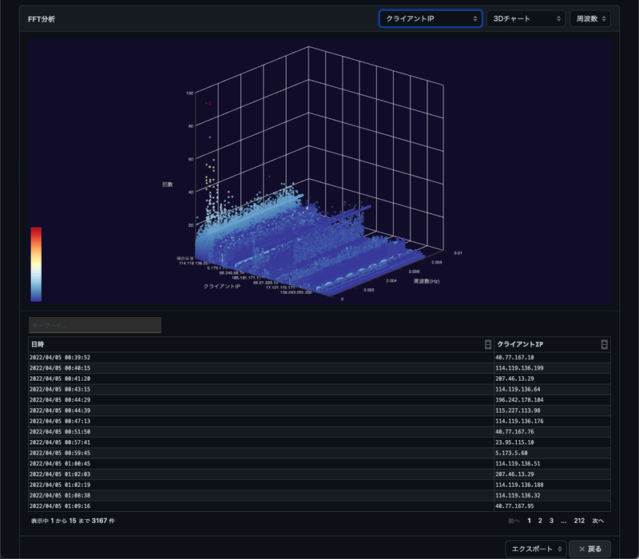

### FFT分析(2D)

右上のメニューで集計する項目、グラフの種類、周波数と周期の切り替えができます。２Dのグラフで特定のIPアドレスからのアクセス周期を示しています。

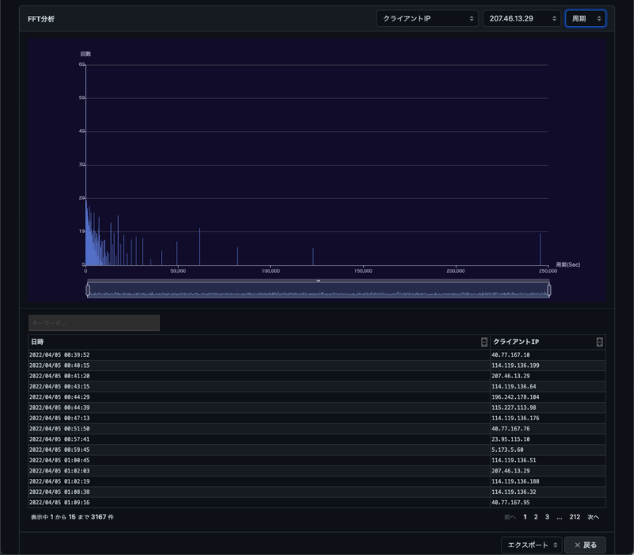


### 位置情報分析

ログの中のIPアドレスから位置情報を検索して表示するレポートです。右上のメニューで位置情報の項目と色分けする数値データの項目を指定します。地図上の点をダブルクリックすればGoogle Mapを表示します。

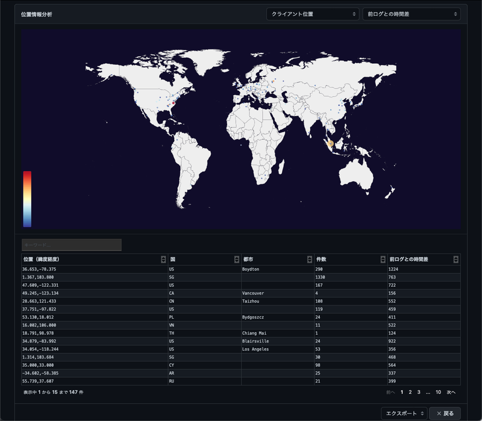


### グラフ（フロー）分析

ログから抽出した２つの項目の関係をグラフ（フロー）で分析するレポートです。ログインしているユーザーとログイン元のIPの関係とかを調べるのに役立ちます。右上のメニューで関係表示する２つの項目と色分けの数値項目、表示の種類を指定できます。

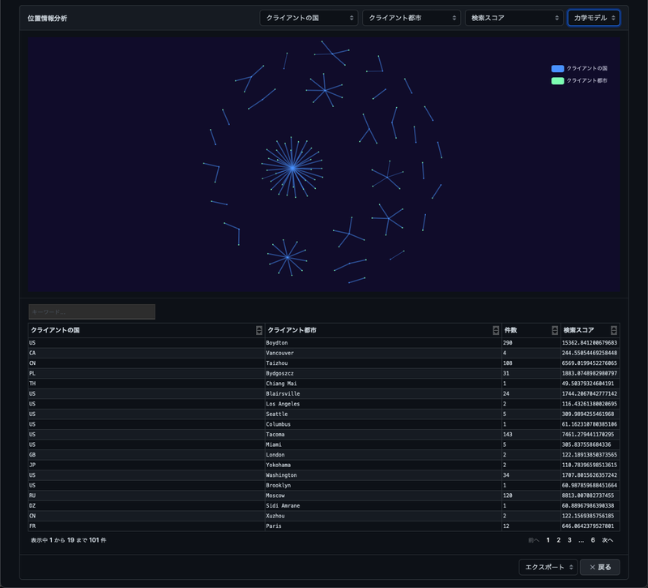


### フロー分析（地球儀）

ログから抽出したIPアドレスから位置情報を検索して通信の様子なども地球儀で表示するレポートです。デモ効果はありますが、「それほど見えるものはない」と思います。


### ヒートマップ

ログの件数などを日単位の時間帯や曜日による時間帯のヒートマップで表示するレポートです。月曜日の９時にログが多いというようなことが見えます。右上のメニューで集計する項目、表示の形式を選択できます。


### エクスポート

この記事で説明した全てのレポートはエクスポートできます。右したにエクスポートのメニューがあります。
- CSV
リストの部分だけをCSVファイルにエクスポートします。
- Excel
グラフとリストをExcelファイルにエクスポートします。

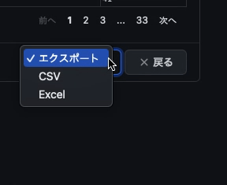

## 設定

### ログ種別定義

ログから情報を抽出するために使ったGrokの設定などを定義ファイルに保存するためのものです。編集して他の分析でも使えるようにするための機能です。

### AI連携設定

AI連携の設定します。


## ログの種類のカスタマイズ

組み込まれているログの種類以外で情報を抽出したい場合にはカスタムタイプを選択します。
抽出パターンをGrokの構文で記述します。Grokのパターンは

https://coralogix.com/blog/logstash-grok-tutorial-with-examples/

がわかりやすいと思いました。
このパターンを理解できれば多くのログ分析ツールで応用できるのでログ分析をするエンジニアのスキルアップにつながると思います。でも、覚える基本は４つだと思っています。

1. %{パターン:変数名}で情報を抽出する設定
2. ログの中で特徴的な文字列はそのまま残す
3. \s+で区切りのスペースの部分を指定
4. .+で可変の文字列を無視する

## Grokパターン編集の起動

TWLogAIANではGrokパターンをできるだけ簡単に作成できる機能を付けています。ログの右にあるE(編集)ボタンをクリックするとGrokパターンを編集する画面が表示されます。


## Grokパターン編集

Grokパターン編集画面には、テストデータに選択したログが表示されます。自動生成ボタンで抽出パターンを自動で作成できます。編集して＜テスト＞ボタンで抽出のテストができます。
編集してOKになったら名前をつけて保存すればあとで使えます。

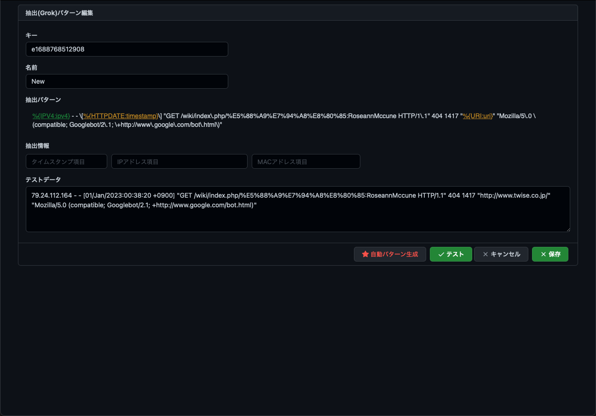


## ＜自動抽出パターン生成＞ボタン

テストデータの１行目のログを解析して自動でパターンを作成します。タイムスタンプ、IPアドレス、メールアドレス、URLなどを自動で変換します。
このマニュアルを書いている時に、splunk的な

```
ip=192.168.1.1
```

のようなパターン自動で認識できるようするアイデアを組み込んであります。


## ログ定義

保存した抽出パターンやフィールド定義は、ログ定義で確認できます。
インポートやエクスポートもできます。


## ログ種別定義ファイル

yaml形式なのでテキストエディターで編集できます。

```yaml
extractortypes:
- key: custom_20220307065138
  name: TCP接続数
  grok: '%{TIMESTAMP_ISO8601:timestamp}\s+(?:%{SYSLOGFACILITY} )?%{SYSLOGHOST:logsource}\s+%{NOTSPACE:tag}:\s+.*sce=%{INT:sce}.*'
  timefield: timestamp
  ipfields: ""
  macfields: ""
  view: ""
fieldtypes:
- key: sce
  name: 有効なTCP接続数
  type: number
  unit: "件"
```

`extractortypes`がログの定義です。`key`が定義の識別する値です。`name`は人間のための名前、`grok`がパターンです。`tilefield`がタイムスタンプとして認識する変数名、`ipfileds`がIPアドレスとしてホスト名検索、位置情報検索に使う変数名です。`macfields`がMACアドレスからベンダー名を検索するために使用する変数名です。`fieldtypes`が変数の定義です。`key`が変数名です。`name`が人間のための名前、`type`が変数の型です。数値(`number`)か文字列(`string`)を指定します。`unit`はグラフに表示する単位です。

## AI連携

AI連携は次の図のような構成になっています。


ollama

https://ollama.com

とweaviateを

https://weaviate.io/developers/weaviate/quickstart/local

を参照してセットアップしてください。

TWLogAIAN側は以下の手順でAIを利用します。

- AI連携の設定
- ログを分類と説明をつけてAIにエクスポート
- AIにログについて質問

### AI連携設定

ログ表示の画面の「設定」ー「AI連携設定」から表示します。

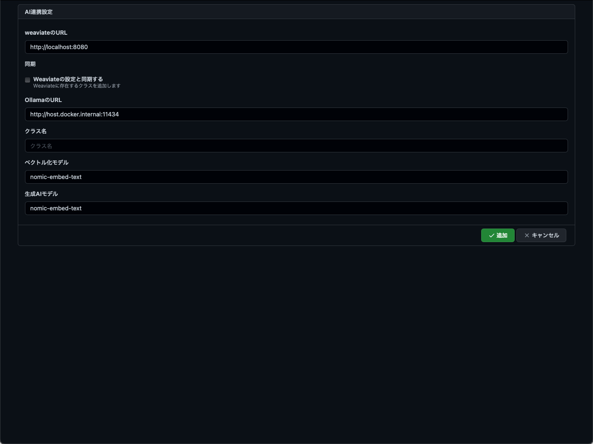

|項目|内容|
|---|---|
|Weaviate URL|WeaviateサーバーのURL|
|同期|Weaviateサーバーの設定を読み込む|
|Ollama URL|OllamaサーバーのURL|
|クラス名|設定の名前|
|ベクトル化モデル|ベクトル化に利用するモデル|
|生成AIモデル|生成AIに利用するモデル|

### AIへログをエクスポート

ログを検索後に、「エクスポート」-「AI」メーニューから
ログをエクスポートします。ログの検索結果が1000件以下の場合だけ
エクスポートできます。
エクスポート画面は

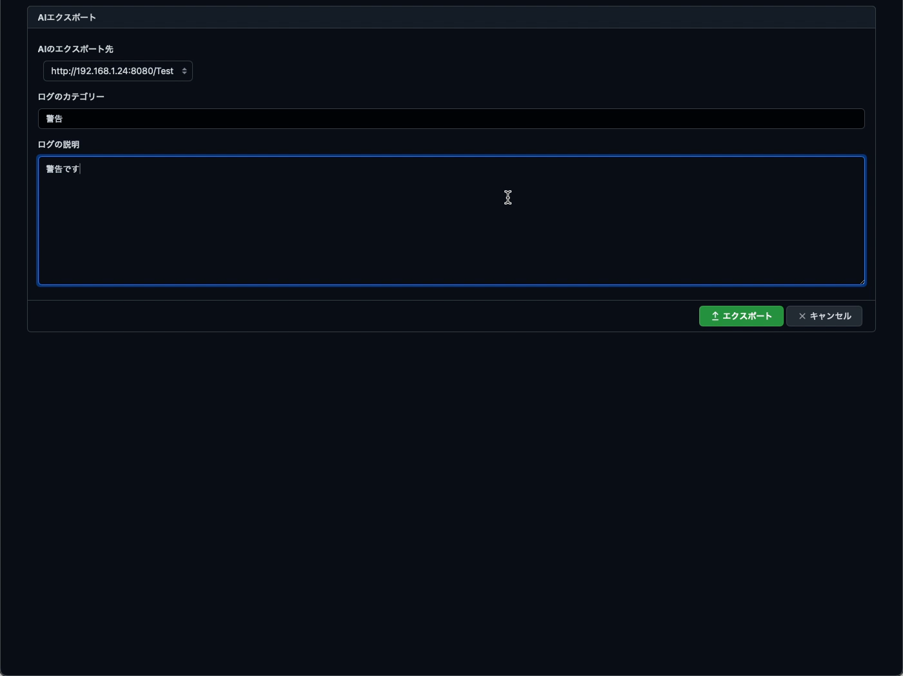

です。

|項目|内容|
|---|---|
|エクスポート先|エクスポート先のAI連携設定|
|分類|ログの分類を指定|
|説明|ログに関する説明を記載|

### AIに質問する

タイムオンリーのログのリストには、<AI>ボタンが表示されます。
クリックすると

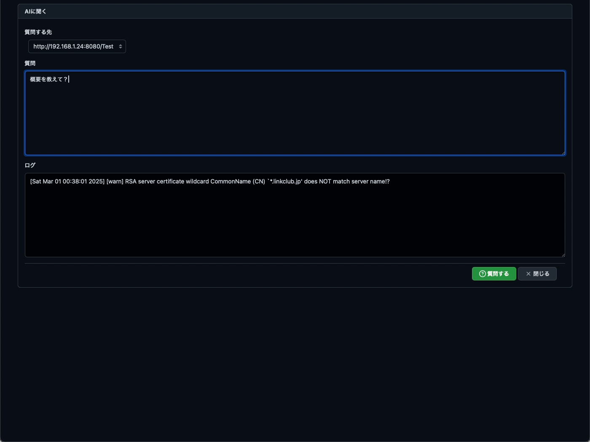

の質問画面が表示されます。

質問するAIを選択して、質問を入力して＜質問する＞をクリックすれば、

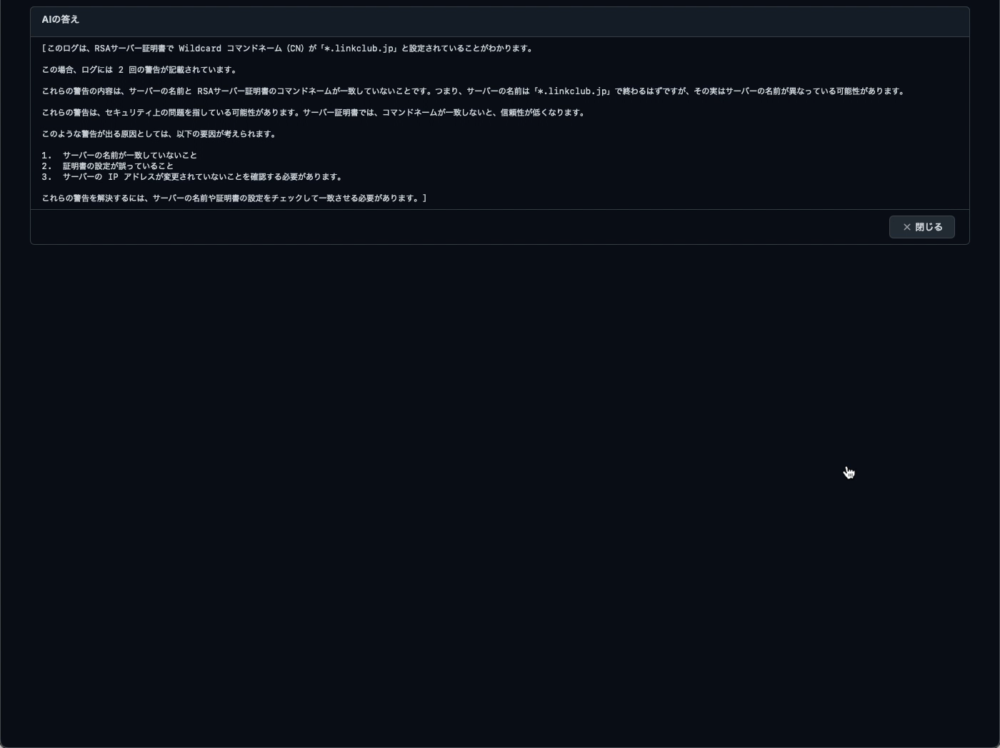

のように回答してくれるます。