# TWLogAIAN User Guide

Amazing log analysis tool with AI assist

{: width="256" }


## Why we make TWLogAIAN

TWLogAIAN began development on New Year's Day 2022
**"A log analysis tool that AI assists me"**
is.
The main purpose of developing this tool is to use it myself in practice.The main purpose is to use it for log analysis to investigate problems with software being developed and maintained.We create the best tools for this purpose.

## What's different from a typical log analysis system?

- Keep logs only during analysis
- Once the analysis is complete, you can delete it without a trace
- Can be used on a regular computer
- Create/delete indexes for your own full-text search

I think that's what it means.I'll be able to delete the folder and delete the folder to investigate the problem.Large-scale log analysis systems require a server with reasonable performance, but we have made efforts to make it easy to analyze on your own computer.

## What you can do

- Collect logs quickly from anywhere
- Fast filtering of collected logs
- Easy and fast data extraction from logs
- Create full-text search engine indexes from logs and extracted data
- Easily search and AI analysis of aggregated and extracted data
- Easily vision the aggregated data, extracted data, and AI analysis results
- Save lists and graphs of analysis results easily to CSV and Excel files


# Logs to be analyzed

- Local files
- Remote file (via SCP)
- Logs saved in TWSNMP FC
- Docker/Kubernets logs (via command/SSH)
- Gravwell's logs
- Windows Event Log (including remote)


# Contents of TWLogAIAN

Development is carried out in GO language.Full-text search engines include Blue
I'm using.

https://blugelabs.com/bluge/


## Install Windows

It is published on the Microsoft Store.

https://www.microsoft.com/store/apps/9P8TQLG999Z3


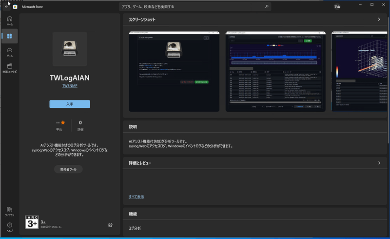


## Install MacOS

Published on the Apple App Store.

https://apps.apple.com/app/twlogaian/id1664596440

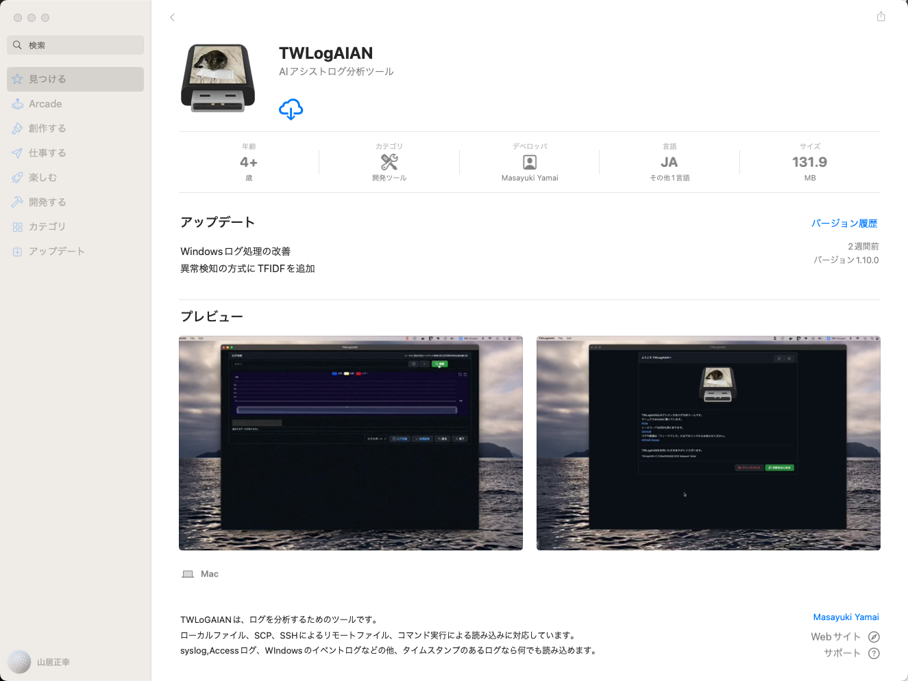


## Download the installer

https://github.com/twsnmp/TWLogAIAN/releases

Windows版のMSI形式のインストラーファイルTWLogAIAN.msiかMacOS版のMacOS版のTWLogAIAN.pkgをダウンロードしてください。


## Starting the Windows version

For Windows, start it from the Start menu.

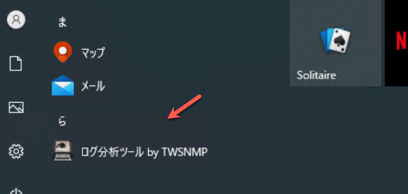


## Starting the MacOS version

For MacOS, start it using the launcher or whatever you like.

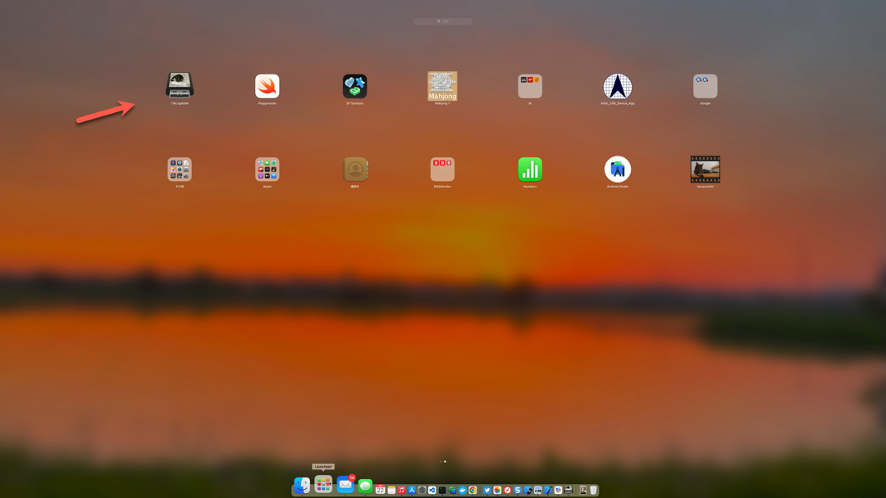


## Wellcom page

When you start it, the "Welcome page" will appear.

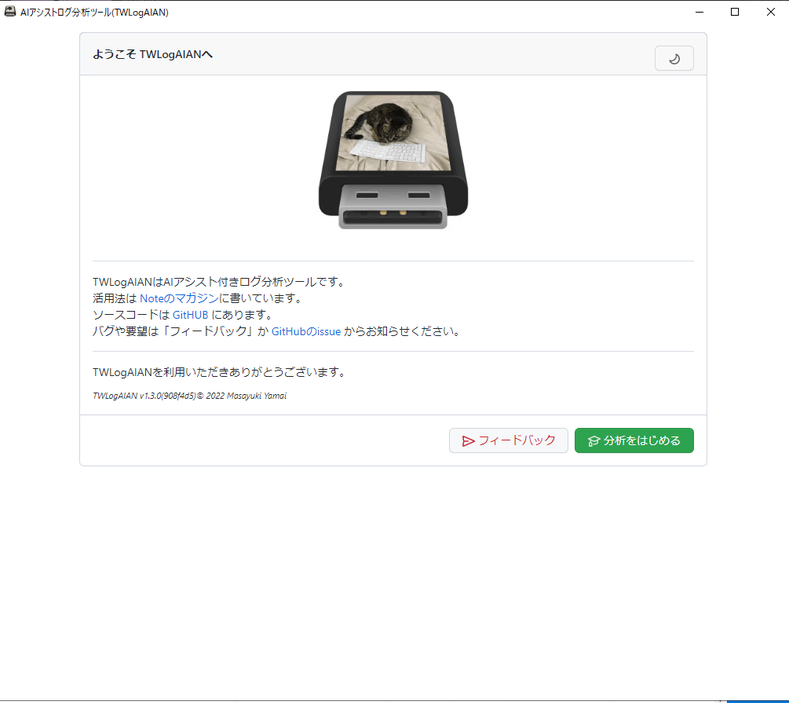


## Switching screen mode

The first is light mode (white screen).Click on the moon icon in the top right to enter dark mode.Click on the sun icon in the top right to return to light mode.You can only switch between them on this screen.Using Dark Mode will make you look like an expert.

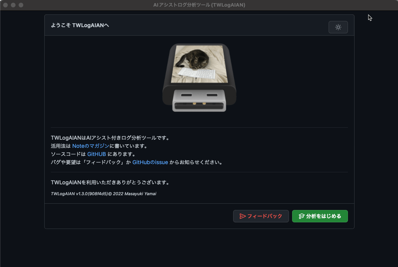


## Feedback

Click the <Feedback> button to see the feedback screen
will be displayed.Please enter your problems and requests and send them.
It will be delivered directly to the developer.I will respond as much as possible.
***Information other than the source IP address will not be sent.**

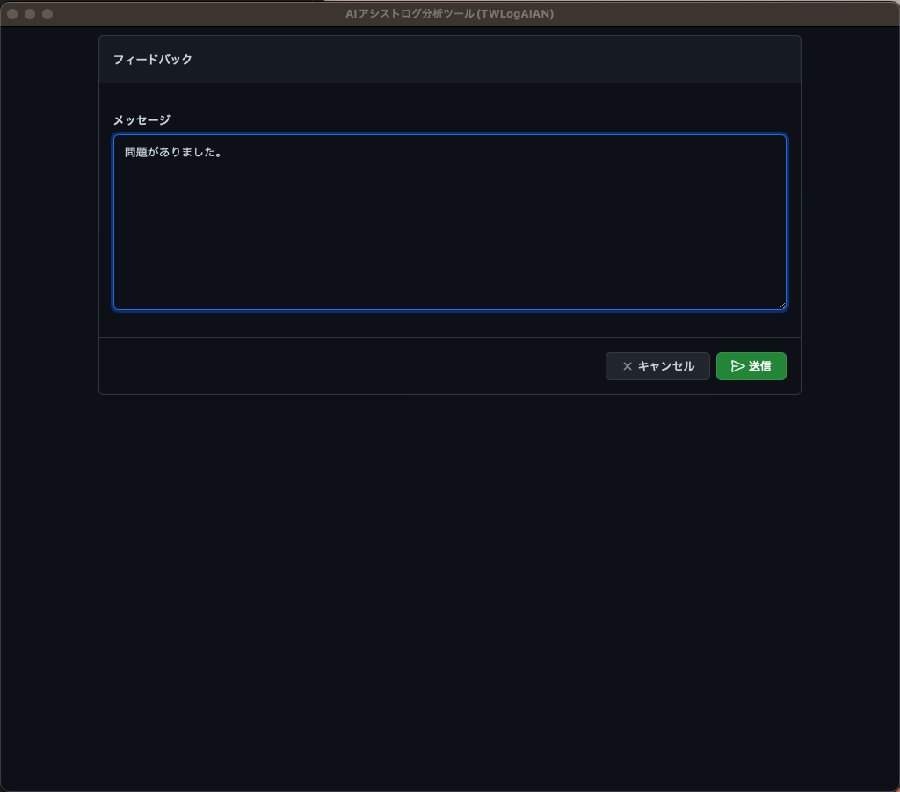


## A general flow of log analysis

1. Select a working folder
1. Setting the location to load the logs
1. Indexing settings
1. Loading the log
1. Searching logs
1. Analysis Report


## Select a working folder

Click the <Start Analysis> button on the Welcome screen to display the Work Folder Selection screen.The working folder will create configuration files and full-text search engine indexes for analysis.Once the analysis is complete, delete the entire folder and it will disappear.Select the working folder and click the < Select > button to display the Log Analysis Settings screen.


## Log Analysis Settings Screen

Select the working folder to display the log analysis settings screen.You have selected Custom settings for the log type to display all items.

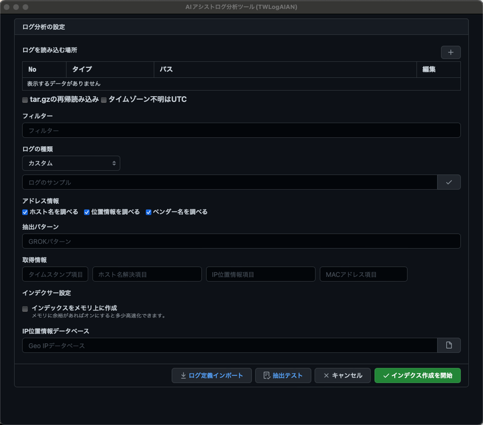


### Recursive loading of tar.gz

If there is a file compressed with tar.gz, and if you want to recursively load the contents of the file.There are no restrictions on the hierarchy.If you're not careful, you'll end up loading a large amount of logs.

### UTC is the time zone unknown

Many timestamps in logs do not include time zones, so if the time zone is unknown, we will treat it as local time.However, I have set it to UTC for people who don't like it.


### Filter

This setting is used to limit the rows to be loaded when loading a log.Can be specified using regular expressions.This is intended to create an index by reading only the logs you want to analyze from a large number of logs.Reducing the amount of target logs will help you reduce loading and searching times.The index size can also be reduced.

In the example access log,

```
POST
```

If you set this to this, you can only load logs (POST requests) that have the string POST in the log.

## Log Types

Specifies the type of log to load.The types of logs that TWLogAIAN knows about how to extract information include those listed on the right.Even with syslog alone, there are old BSD formats and new IETF formats that support time zones and digits subseconds.If you want to set it in detail yourself, select Custom.If you select automatic judgment, you can make a judgment automatically to some extent.

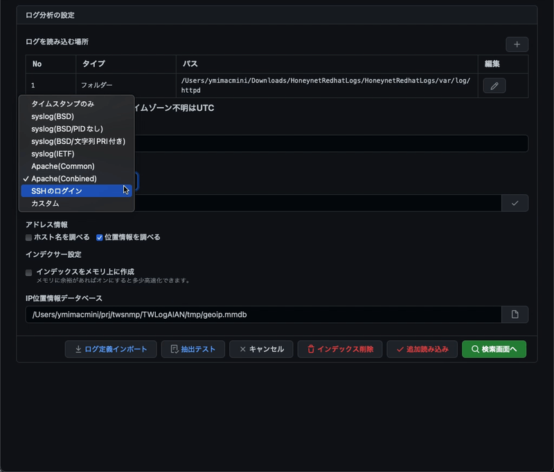


## Find the host name

Check the host name in DNS from the IP address entry in the log and add the entry.
For custom settings, enter the variable name of the item you want to check the host name in the "Host Name Resolution Item."For built-in log types such as Apache access logs, the items will be automatically set.


## Finding location information

Check the location information in the GeoIP database from the IP address entry in the log and add the entry.For custom settings, enter the variable name of the item you want to check the location information in the "IP Location Information Item."For built-in log types such as Apache access logs, the items will be automatically set.

Please download the location information database from the following site:

https://dev.maxmind.com/geoip/geolite2-free-geolocation-data/


Please set this file to the IP Location Database at the bottom of the Settings.

## Find the vendor name

Check the vendor name from the MAC address in the log and add the item.Specify the item name for checking the MAC address in the "MAC address item".The relationship between the MAC address and the vendor name is incorporated into TWLogAIAN.

## Timestamp Item

Specifies the variable name of the item to be used as a timestamp.If the field is blank, the string that looks like a timestamp on the far left side will be automatically retrieved as a timestamp.


## Hostname Resolution Item

Specifies the variable name of the item that resolves the host name from the IP address.Multiple values ​​can be specified separated by commas.

## IP Location Intelligence Project

Specifies the variable name of the item to retrieve location information from the IP address.Multiple values ​​can be specified separated by commas.

## MAC address entry

Specifies the variable name for the MAC address field to check the vendor name.Multiple values ​​can be specified separated by commas.


## Create an index in memory

Creates an index in memory for the full-text search engine Bluege.Loaded logs will also be saved in memory.It disappears when you exit the program.If you load a large amount of logs, you will naturally run out of memory.If not checked, create an index in the working folder.

## IP Location Database

Specifies the GeoIP database file.

## Where to load the log

This explains the location of logs that TWLogAIAN can load.
Here is an explanation of the red frame in the diagram on the right.You can also read log files in compressed files directly.It also supports Windows event logs.


## Adding a log loader

To specify where to load the log, click the <+> button in the "Log Loading Location" list on the Log Analysis Settings screen.The editing screen for the source (source) of the log will be displayed.

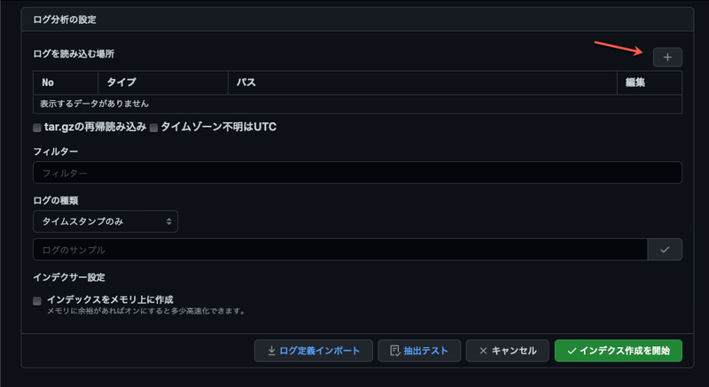


## Editing the source of the log load

Once you have added it, click the edit list button (pencil icon) to load it.
Please.The editing screen will be displayed.

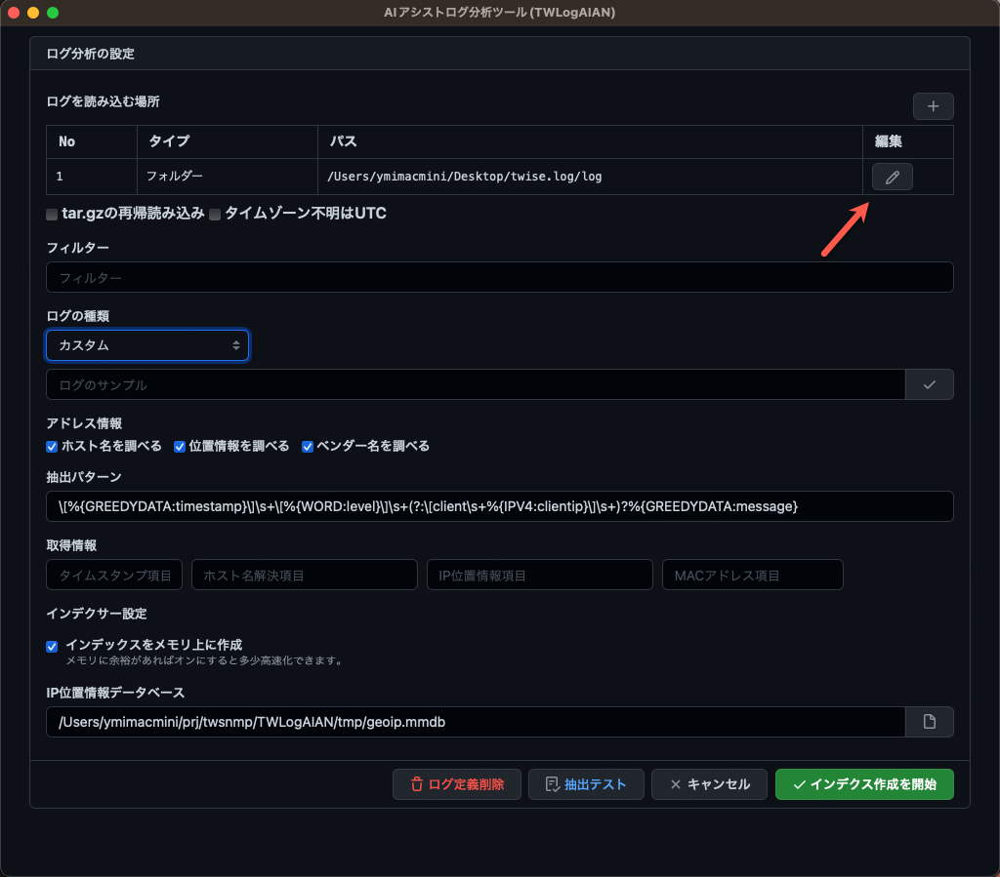


## Log Source Edit Screen

The editing screen for the log source (load source) looks like the image on the right.
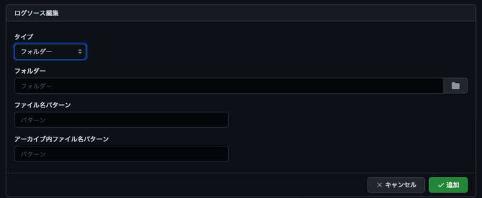


## Deleting log sources

On the editing screen, you can delete the source of the log that is being edited.
Please click the <Delete> button on the right.
You can also delete it by clicking the Delete list button.

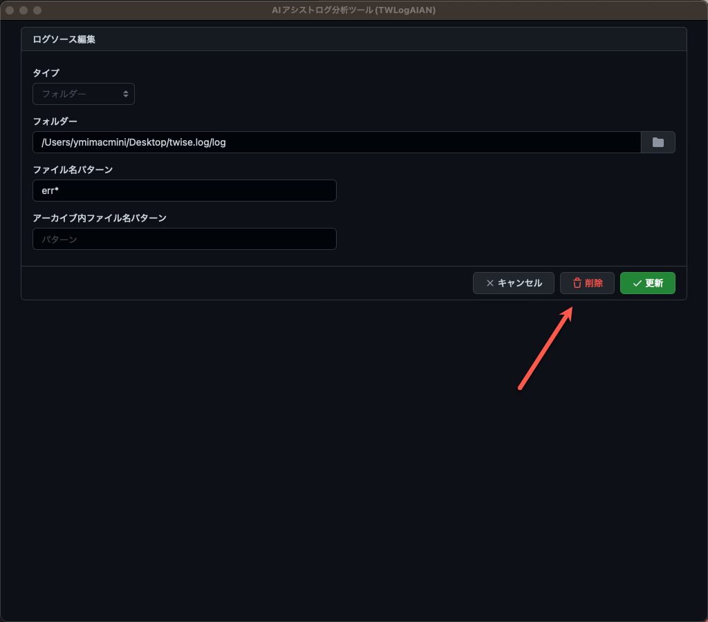


## Log loading source type

The type of log loading source is shown in the image on the right.The Windows version has a type that retrieves Windows event logs.

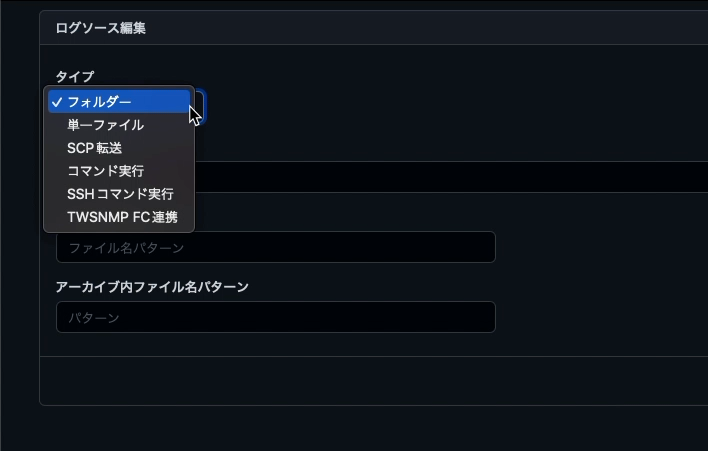

### Single File

Load from a single file.You can specify the log file to load.You can select a file by clicking the button to the right of the file name.For some reason, the file selection dialog box is in English on the Mac version.

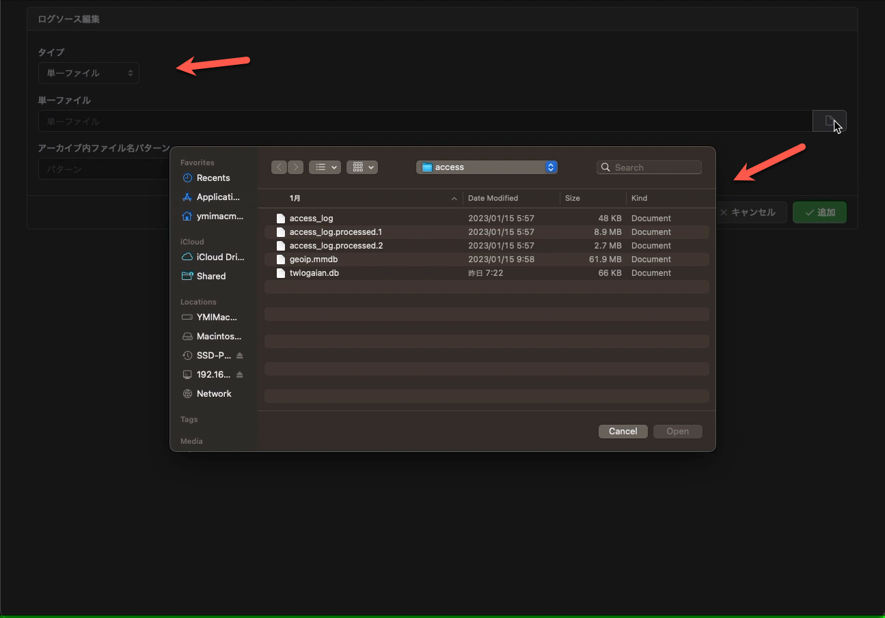


#### File name patterns in archives

You can also specify files compressed using ZIP or tar.gz.For compressed files, you can select the file in the compressed file by file name.File name patterns in the archive

```
access*
```

If you specify this, only files that start with access in the compressed file will be read.


### Folder

Specify the folder where multiple log files are stored.Loads files in the selected folder.There is only one folder hierarchy.Child folders are not supported.

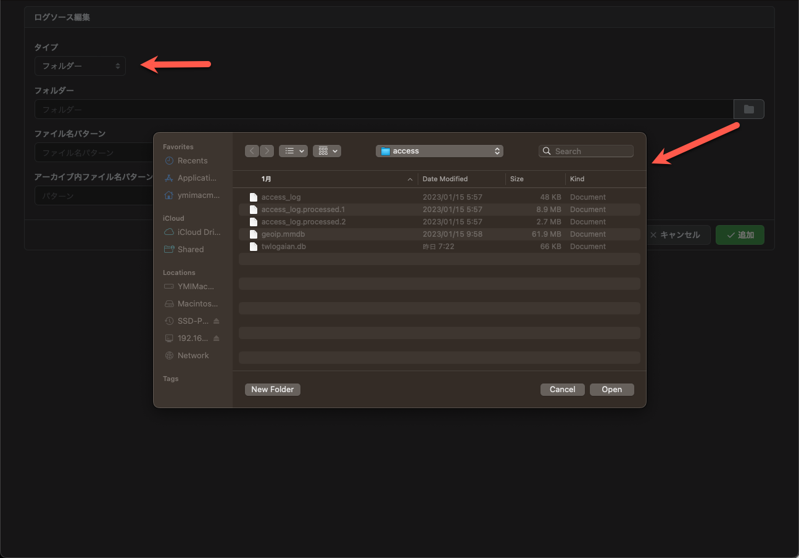


#### File name pattern

If you want to target only specific files in a folder, specify the file name pattern.

```
access*
```

If you specify this, it will only target files starting with access.It also applies to files compressed with ZIP or tar.gz in folders.Loads the internal log file.For compressed files, you can select the file in the compressed file by file name.This is the same as for a single file.


### SCP

You can also transfer log files from servers such as Linux and read them directly via SCP.It's much easier than transferring the file, saving it to your local PC and then loading it.The server's IP address, host name, the path to the log file on the server, the user ID and private key password (if any), the SSH private key (key) file (if not specified, use the file from the default storage location). The file is just in a folder on the server, and all that's left is the same as specifying a local folder.You can select the log file to be loaded by specifying the file name pattern or the file name pattern within the compressed file name.

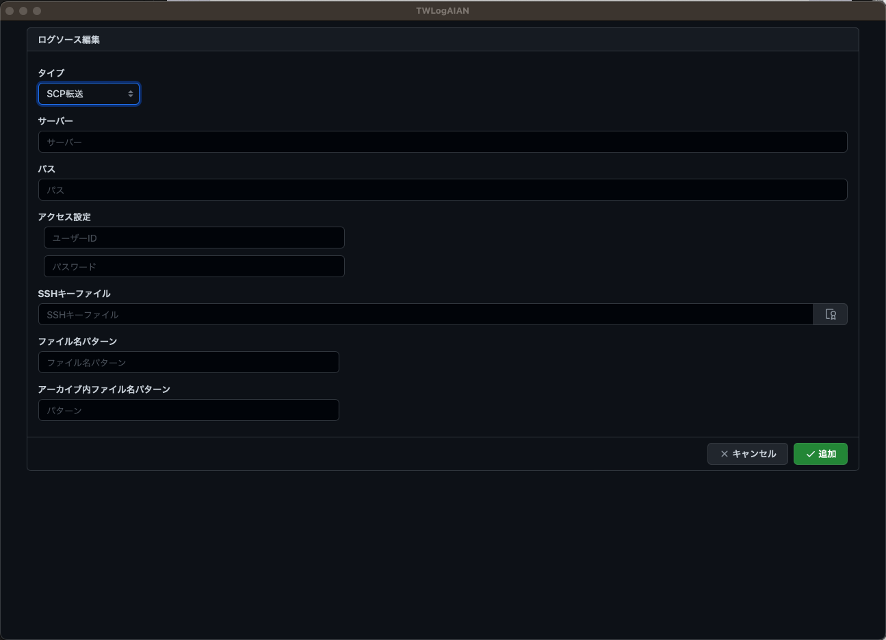


### Run the command

This function reads the output from the command executed as a log.This is useful when collecting and analyzing Docker and Kubernets logs using commands.Specifies the command to run.

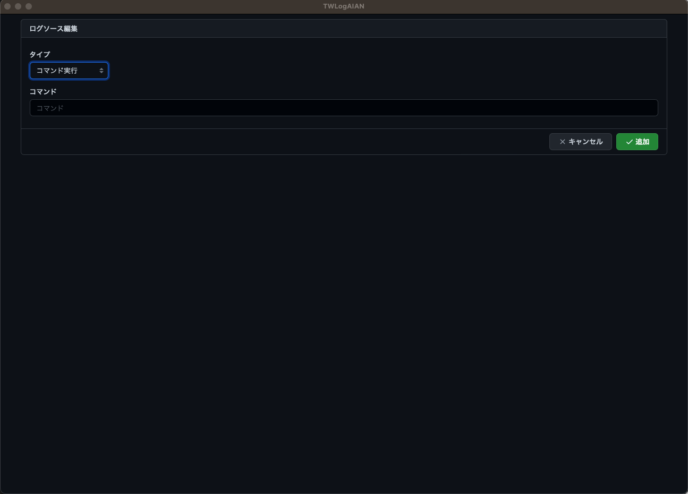


### Execute SSH command

It is similar to running a command, but the command to retrieve logs is executed on a server connected via SSH.I think it would be useful to use in a cloud environment.I haven't used it though.In addition to the commands to be executed, there are settings for accessing via SSH.The address, username, password, and location of the SSH key file.

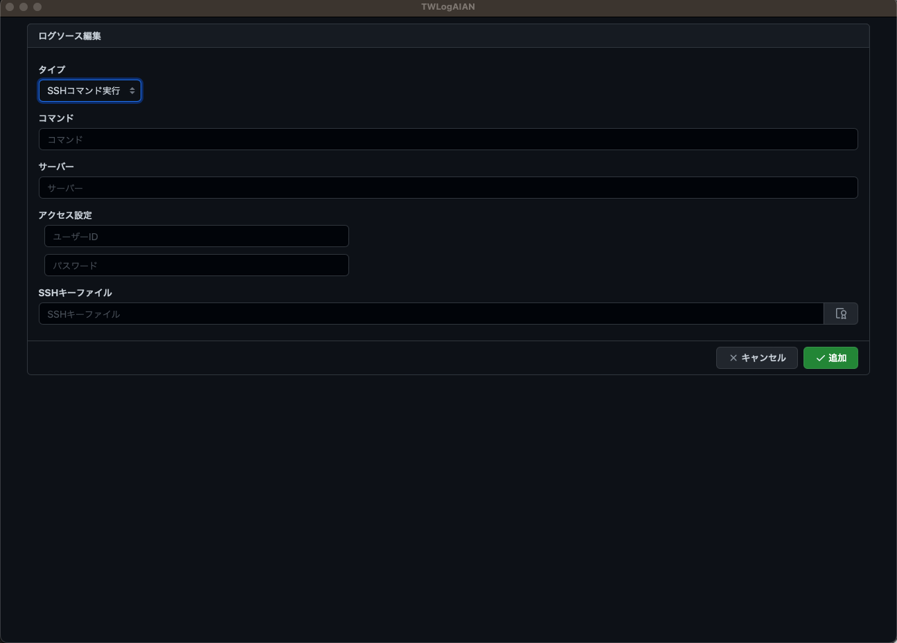


### TWSNMP FC integration

You can directly load the syslogs collected by TWNMP FC.Specify the TWSNMP FC URL for the server.Specify the user ID and password to log in to TWSNMP FC in the Access Settings.You also specify the conditions for searching for logs to be retrieved.You can specify duration and hostname, tags, and messages filters.


### Windows Event Log

In a Windows environment, you can load the Windows event log directly.I'm running wevtutil.exe to retrieve the logs.

https://docs.microsoft.com/ja-jp/windows-server/administration/windows-commands/wevtutil


A command prompt will be displayed while it is being retrieved.Please don't be surprised as it is intentionally displayed.You can also get logs for remote servers as well as Windows machines running TWLogAIAN.Specify the remote server for the server.Specify the user ID, password, and authentication method for authenticating in the access settings.If you want to retrieve local logs, you do not need to specify them.The logs to be retrieved are specified by period and channel.To retrieve event logs for a security channel, you must run TWLogAIAN with administrator privileges.

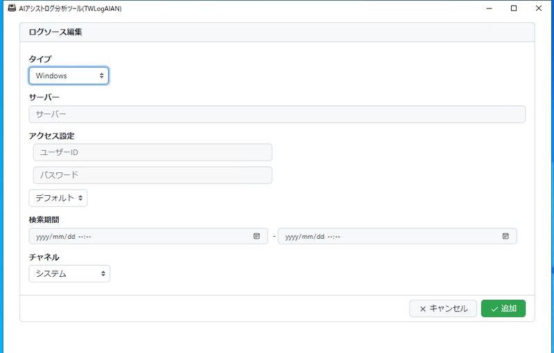


## Types of files that can be loaded

Basically, it supports text-format log files with timestamps.
The format of the timestamp can be automatically recognized.Files compressed with gz will be automatically unzipped and loaded.You can also load log files in ZIP files up to one level.In the case of tar.gz, it supports multi-level folders and multiple compression.This means that you can also unzip and load gz and tar.gz in tar.gz.If you want to load this recursively, check "Recursive load in tar.gz".It also supports Windows EVTX-style event logs.However, up to 1GB of each file is required to be read into memory.

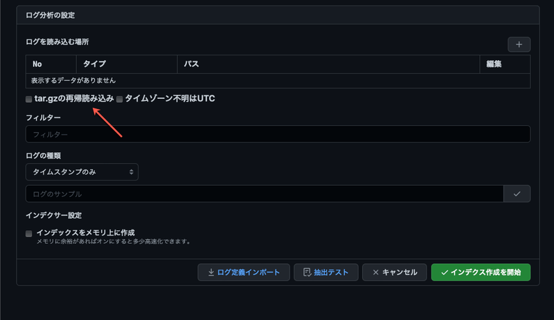

## Indexing

TWLogAIAN loads the log file and creates a full-text search engine index.This article explains the process for creating an index.Here is an explanation of the red frame section of the figure.


## What is index creation?

Once the log is loaded, meaningful information is extracted on a row-by-row basis and registered it in the index.for example,

```
114.119.136.254 - - [03/Apr/2022:00:39:21 +0900] "GET /wiki/index.php?
title=Must_Know_Mlm_Concepts_For_Accomplishment&action=history HTTP/1.1" 404 1417
 "-" "Mozilla/5.0 (Linux; Android 7.0;) AppleWebKit/537.36 (KHTML, like Gecko)
  Mobile Safari/537.36 (compatible; 
  PetalBot;+https://webmaster.petalsearch.com/site/petalbot)"
```

For Apache access logs like this, you will find information such as the client's IP address, time, request, and path.You can also register this line together in a full text search engine,
It is more useful when searching by extracting each item and registering it as an index item (field).It's said that the faster the search is and that it's easier to tally.


## Getting items by log type

If you treat this example as a type of Apache (Combined), the items shown in the image on the right will be extracted.In this example, items are added by checking the host name using DNS from the client's IP and location information.TWLogAIAN is a log analysis tool, so the lowest timestamp is extracted.The format of logs used in the world is included.You can also select the extraction items yourself using the custom settings.

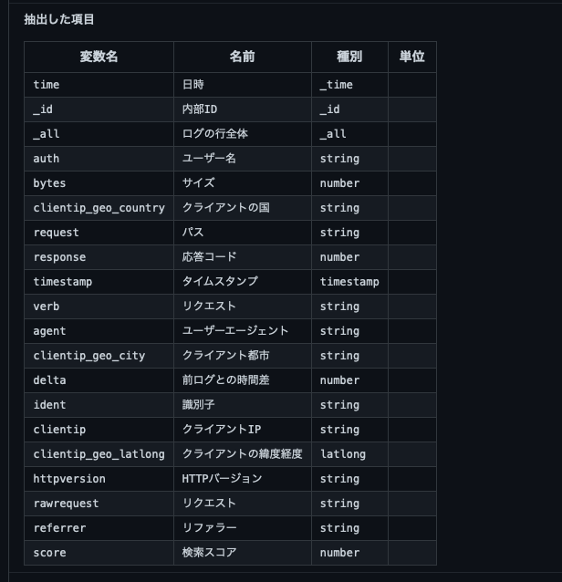

## Searching logs

Once you have loaded the log and created an index for the full-text search engine, you can search for the log.This is the red frame in the diagram on the right.


## Basics of log search

Immediately after the index is created, the screen will appear as shown in the image on the right.The number of logs loaded into the index and the processing time are displayed in the top right corner.The basic way to search for logs is to search by entering the keyword you want to search in the search statement column above.Search blank to display all items.
If you change the mode,

https://blevesearch.com/docs/Query-String-Query/

You can do this by entering a search statement using the syntax.

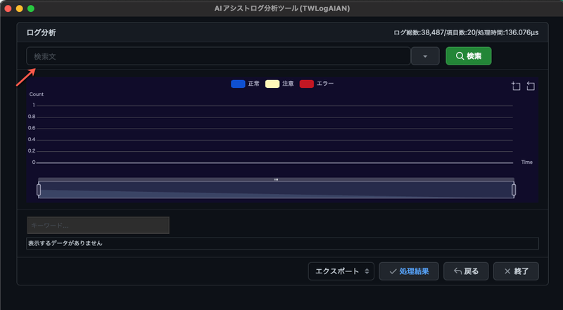


## Specify search criteria

Click the down arrow button next to the search statement to display a screen where you can specify the search criteria.This is a screen where you can set detailed conditions.

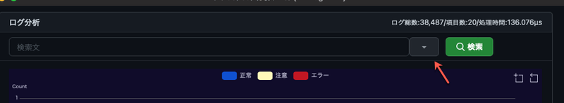

## Search criteria specification screen

- Search history
- Search statement mode
- Search period
- Maximum number
- How to detect abnormal logs
- Data extraction during search

You can close it using the up arrow button in the same location.

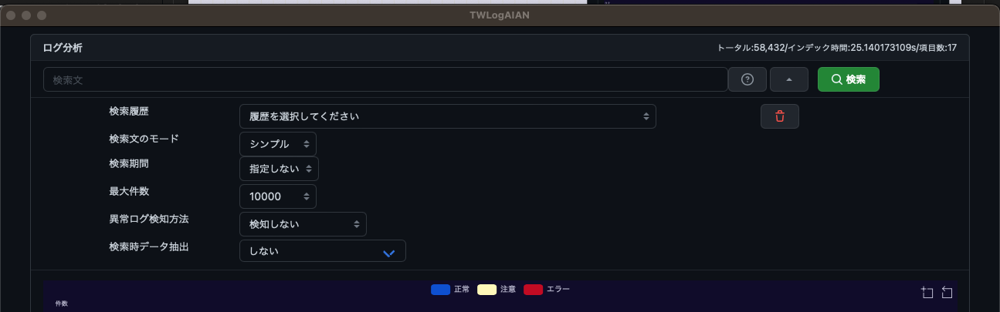

### Search history

A list of previously executed search statements.Select it and enter it into the search statement.You can clear it by clicking the delete button on the far right.

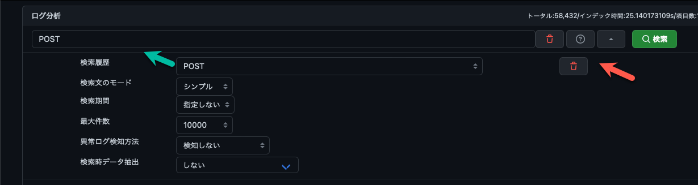

### Search statement mode

Specifies how to enter the search statement.There is a simple/regular expression/full-text search.Simple simply enter the keyword you want to search for.Regular expressions involve entering search statements as regular expressions.Selecting full-text search will display keywords and numerical judgment input.Specify the condition and enter it in the search statement using the + button on the right.

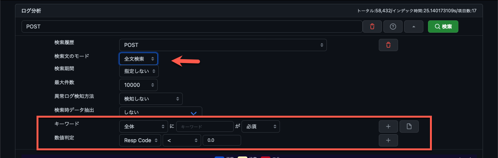


###  Search period

Specifies the time range to search for the log.There are two ways to specify it.
- Target specification
A mode where you copy and paste timestamps to specify the target time

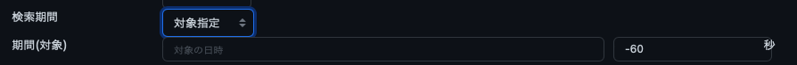

- Range specification
Mode for specifying the time range


## How to detect abnormal logs

An abnormal log is detected from the logs searched using AI (machine learning).Specifies the algorithm to detect.There is no detection/Isolation Forest/Local Outlier Factor/Auto Encoder.If you select something other than not detect, you can select a method for calculating feature amounts.You can specify the numeric data extracted from the log, the string, and the number of keywords to be used for SQL injection.The day and time zone are calculated from the log timestamps and the 24-hour time zone and added to the feature amount.For example, I added the server load figures because it has the characteristic of being low during the night on Sundays but high on Monday mornings.

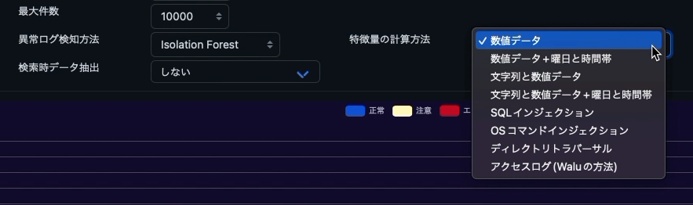


# View search results

Enter a search statement and run the search and the results will be displayed.

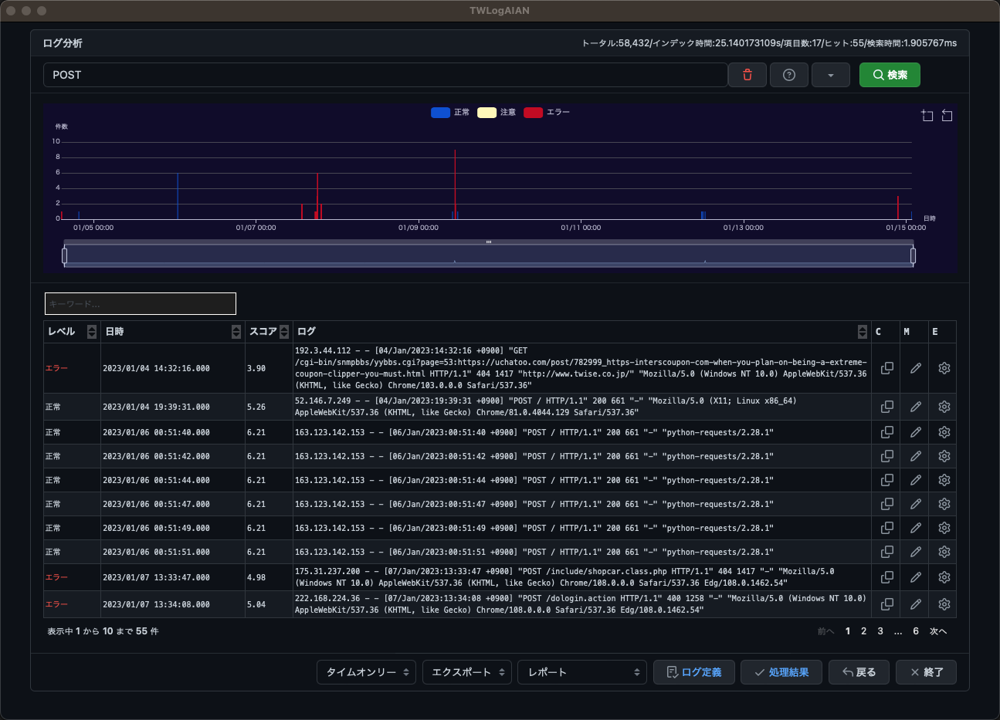

## Link to the graph time range

When you change the time range of the graph, the log list will also be displayed in conjunction with the log list.
You can select the range by pressing the zoom button in the top right corner of the graph.

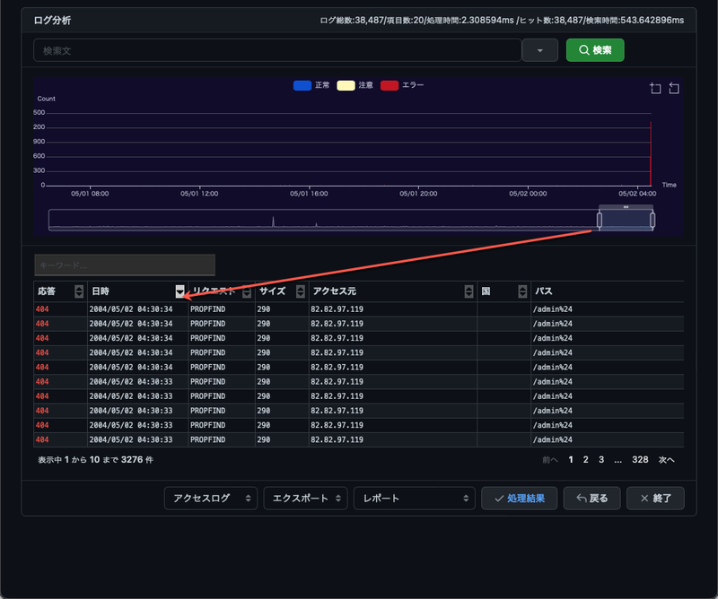

## Filter by keyword

Enter a string as a keyword to filter by the strings contained in the log.

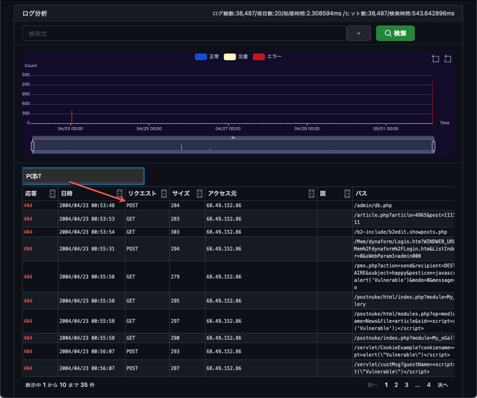

## Log display format

Below the search results, you can select the log display format.You can change the display format of the list by switching between this.

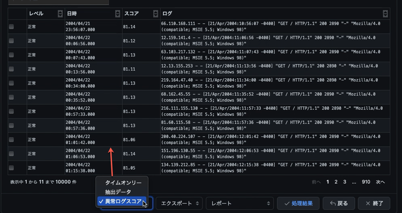


### Time Only

Displays only the time, search score, and log lines.Check the checkbox on the left and select logs to copy and save to clipboard or to memo.

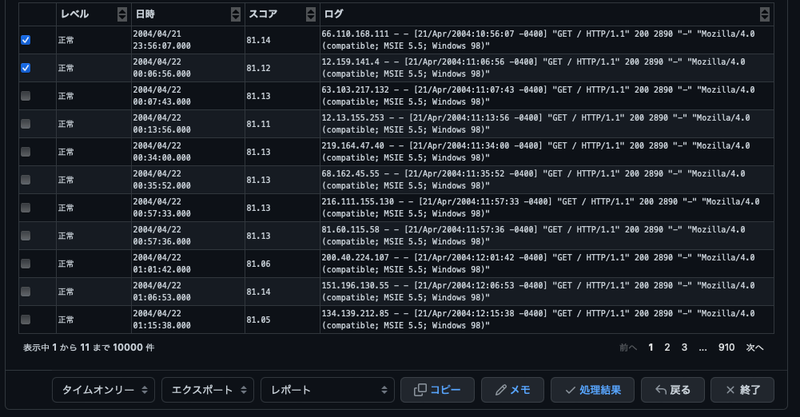


### syslog

This is a display specialized for syslog.It cannot be viewed in logs that have not extracted information in syslog format.

### Access Log

This is a display format specializing in access logs.It cannot be viewed on logs that have not extracted information in access format.This is the diagram on the right.

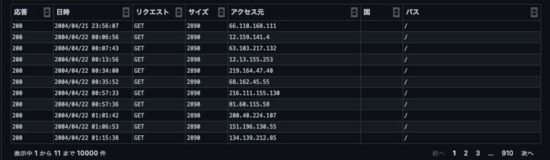

### Extracted data

Displays the data extracted from the log in a table format.You can scroll sideways when there are many items.

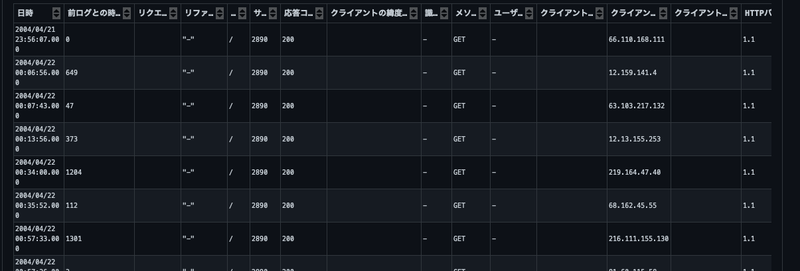


### Abnormal log score

It is similar to Time Only, but the score part becomes an abnormal score.
You can also select and copy memo.This is displayed only when abnormal log detection is turned on.

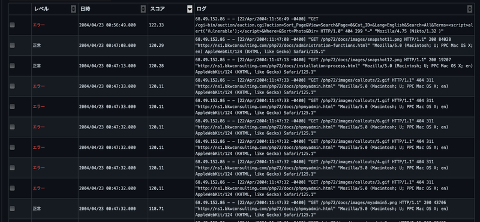


### export


Below the search results you will find the export selection.
- CSV
Saves the list displayed in the CSV file.
- Excel
Saves the list and graph images displayed in the Excel file.

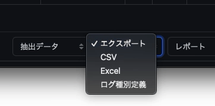

### Log type definition

This is used to save Grok settings used to extract information from the log in a definition file.This function allows you to edit it and use it in other analyses.


## Processing results

A screen will be displayed to create indexes and check the AI ​​learning status later.You can check the amount of logs, extracted items, and the time period when the amount of logs is high.

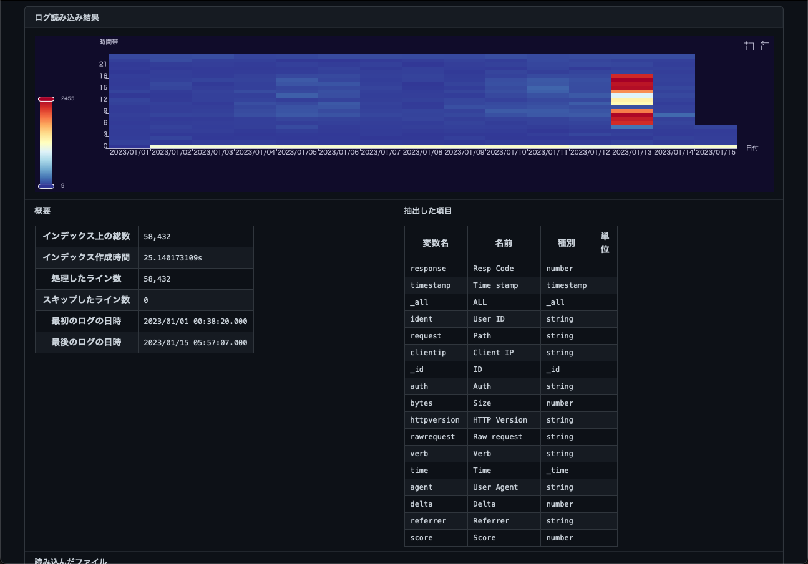


## レポートの表示方法

This is a description of the report function that displays log analysis results in graphs and lists.When you search for logs using TWLogAIAN, the report menu will appear at the bottom of the screen.Click to view the report items.Click to display the corresponding report screen.

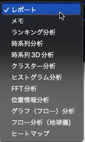

## Memo

This is a report that displays notes about logs added to notes on the Log Search screen.
You can add it using the <Memo> button to the right of the list in the logs.

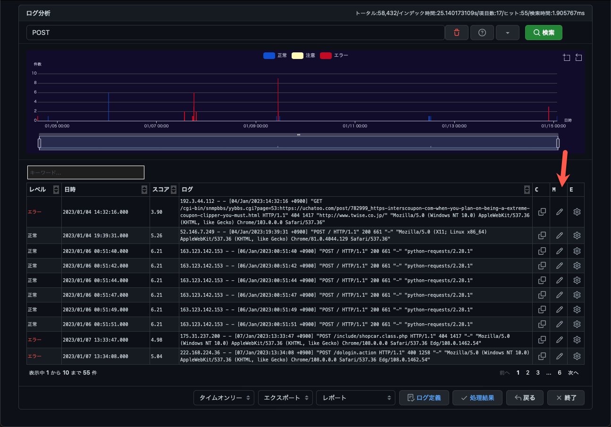


## View notes

Click "Memo" on the "Report" menu to display a screen similar to that shown below.The logs added to the notes are displayed in chronological order.

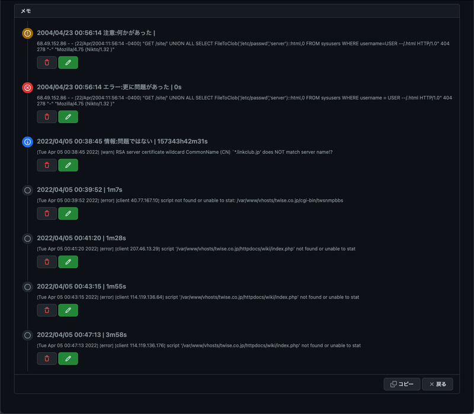


Notes have a <Delete> and <Edit> buttons to delete.

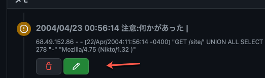

On the Edit screen, you can select a level to add a description.This function allows you to note what the selected log represents.

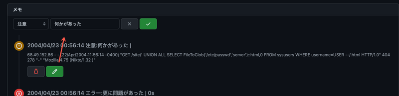

Once the memo is complete, click the <Copy> button at the bottom of the screen to copy the memo to the clipboard in text format.It is convenient for pasting the analysis results into an email and reporting them.


## Ranking analysis

Displays the rankings compiled based on information extracted from the log.You can select the items to be tallied in the menu at the top right.

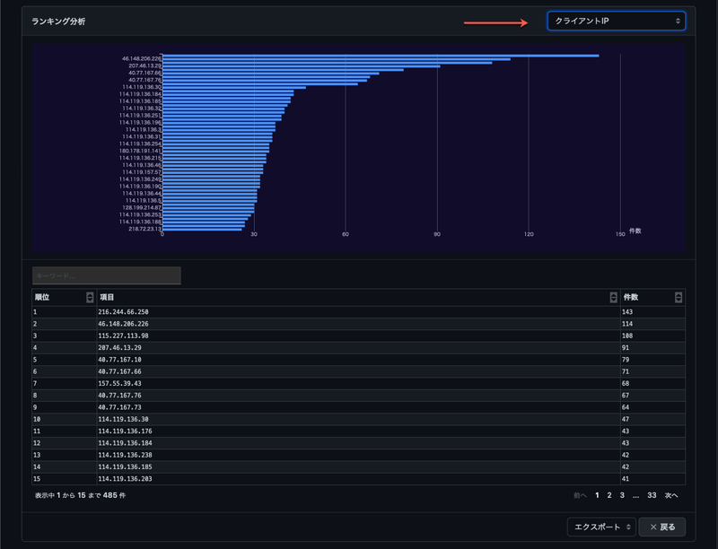


## Time series analysis

Displays the numerical data extracted from the log in chronological order graphs.In the top right corner, there is a menu where you can select the items to be aggregated and what to display.

- Actual data
The extracted numerical data is displayed as is.
- Aggregation in minutes
The extracted numerical data is displayed in minutes.You can view the mean, median, variance, maximum, and minimum values.
- Time unit aggregation
The extracted numerical data is displayed in aggregation by time.You can view the mean, median, variance, maximum, and minimum values.

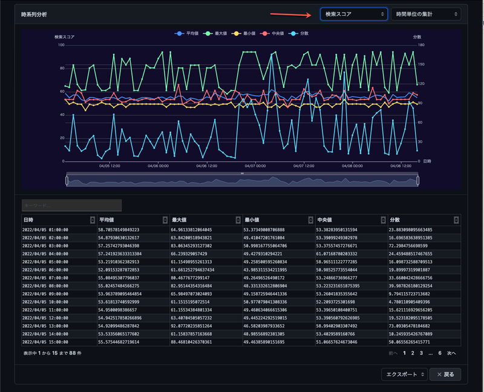


## Regression analysis

Displays the regression analysis using the selected method of numerical data.In linear, it calculates a and b of equations such as y=ax+b and displays a line graph.The example on the right doesn't really make much sense.For data indicating free disk or memory, you may be able to calculate the rate at which it will decrease.

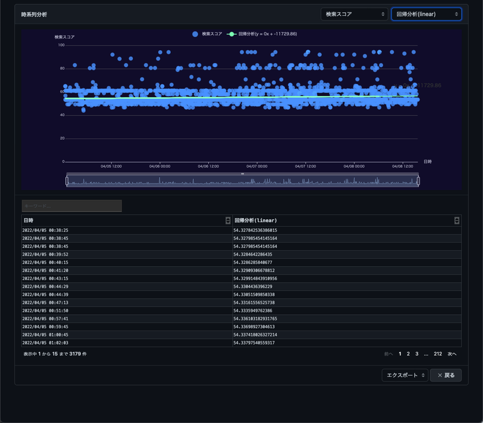


## Time series 3D analysis

This is a report that displays numerical data extracted from the log in a time series 3D graph.The Y-axis is fixed time.You can select X, Z, and color-coded items from the menu in the upper right corner.You can change your perspective by dragging 3D graphs.
*** "There are things that cannot be seen in the 2d graph"****
The assistant cat said from heaven.

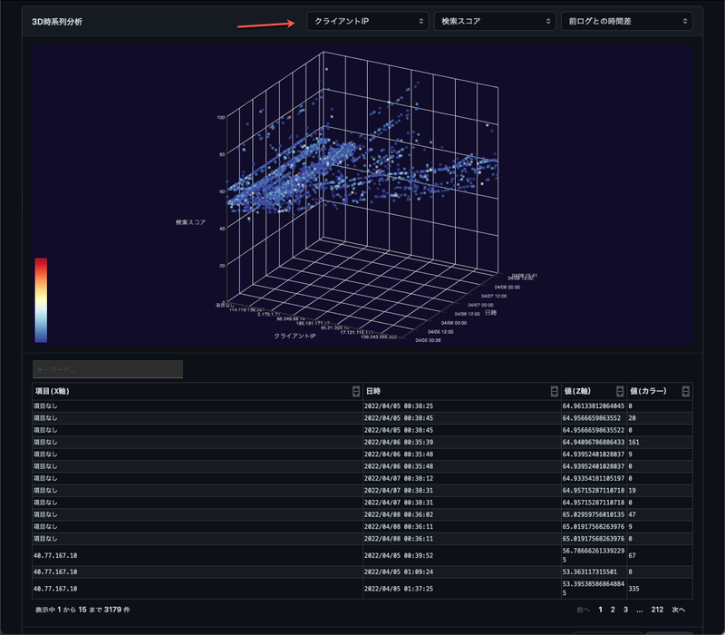


## Cluster analysis

This is a report that displays the results of cluster analysis using numerical data extracted from logs.In the menu on the top right, specify the number of clusters to be classified as two numerical items for cluster analysis.There may be something that can be seen in cluster analysis.

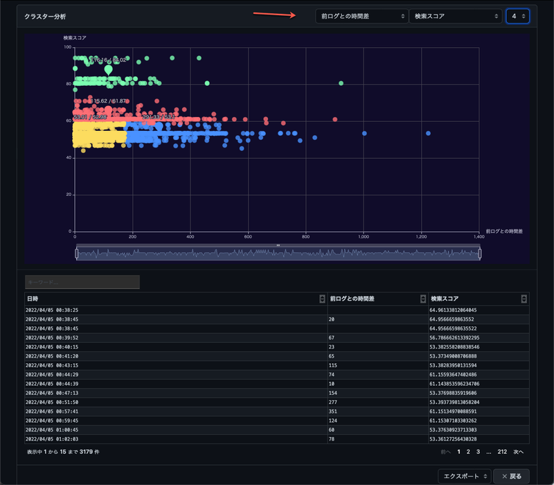

## Histogram analysis

This is a report that displays histograms from numerical data extracted from logs.

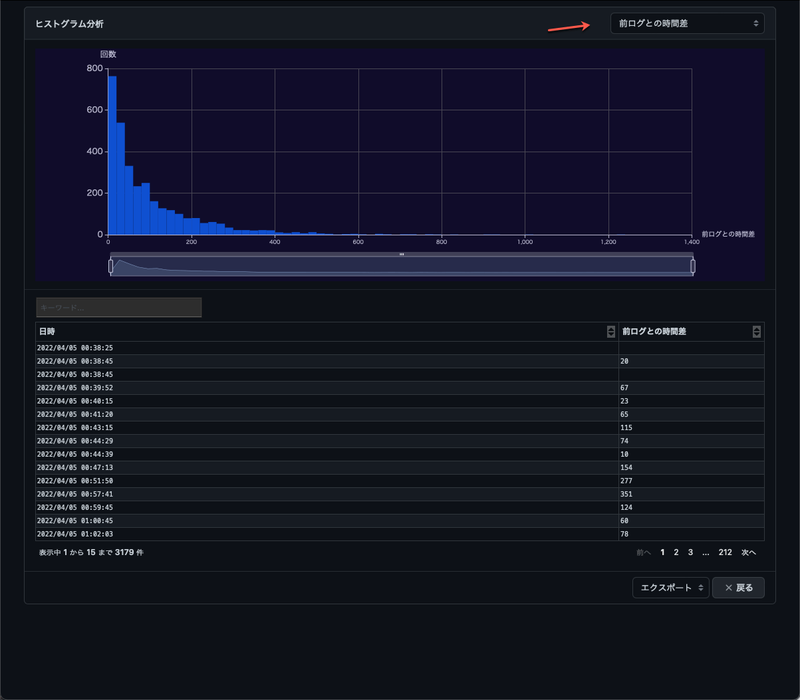

You can select the items to be tallied in the menu at the top right.

## FFT analysis (3D)

This is a report that analyzes numerical data extracted from the log by FFT analysis.It's like, "You can sometimes see periodic changes in FFT."

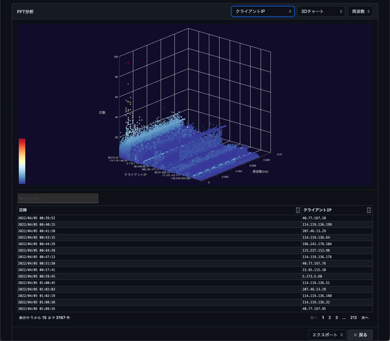


## FFT(2D)

You can switch between items to be aggregated, graph type, frequency and period in the menu on the top right.The 2D graph shows the access period from a specific IP address.

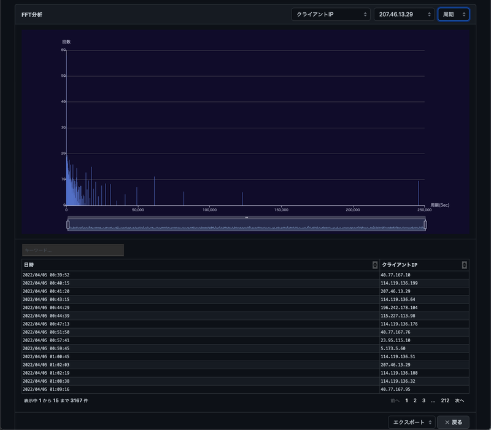


## Location intelligence analysis

This is a report that searches and displays location information from the IP address in the log.In the menu on the top right, specify the location information item and the numerical data item to be color-coded.Double-click on a dot on the map to display Google Maps.


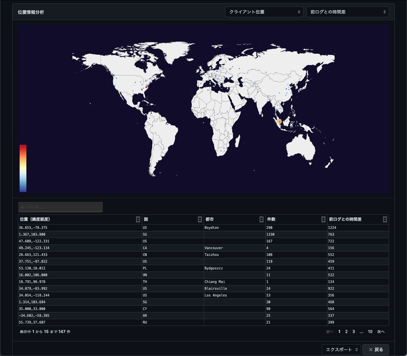


## Graph (flow) analysis

This is a report that analyzes the relationship between two items extracted from the log using a graph (flow).It is useful for checking the relationship between the logged in user and the IP you are logged in from.You can specify two related items, color-coded numeric items, and display types in the menu on the top right.

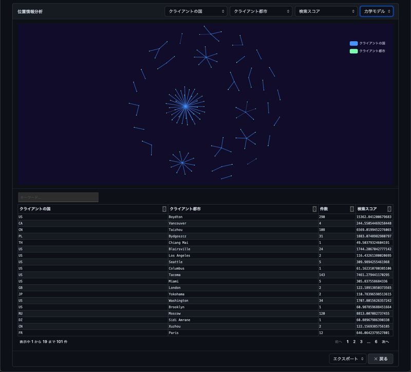

## Flow analysis (Globe)

This is a report that searches location information from the IP address extracted from the log and displays communications on a globe.It has a demo effect, but I don't think there's anything that looks very good.

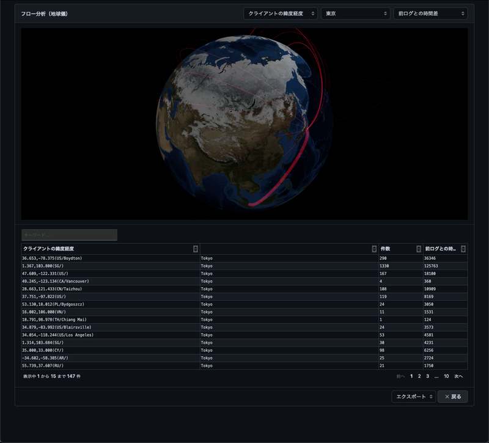

## Heatmap

This is a report that displays the number of logs, etc. in a heat map of the time zones per day and the day of the week.It seems that there are a lot of logs on Mondays at 9am.You can select the items to be tallied and the display format in the menu at the top right.

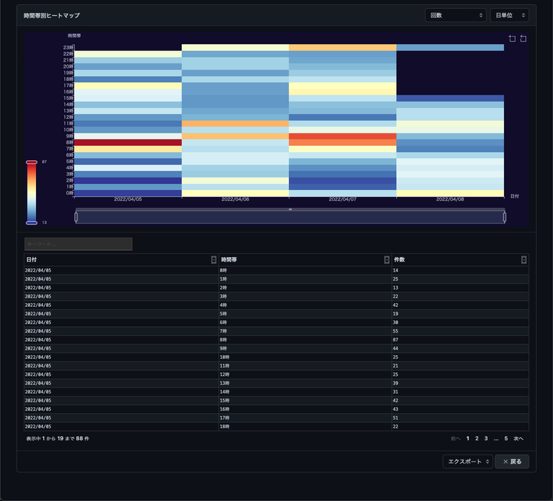


## export

All reports described here can be exported.To the right is the export menu.
- CSV
Export only the part of the list to a CSV file.
- Excel
Export the graphs and lists to an Excel file.

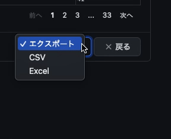

## Customizing log type

Select a custom type if you want to extract information from a different type of log that is not included.
Describe the extraction pattern in Grok's syntax.Grok's pattern is

https://coralogix.com/blog/logstash-grok-tutorial-with-examples/

I thought it was easy to understand.

If you can understand this pattern, it can be applied with many log analysis tools, so I think it will help improve the skills of engineers who perform log analysis.However, I think there are four basic things to remember.

1. Setting to extract information using %{Pattern:Variable name}
2. Leave the distinctive strings in the log as is
3. Specify the part of the separating space with \s+
4. Ignore variable strings with .+


## Launch Grok Pattern Editing

TWLogAIAN has a function that makes it easy to create Grok patterns.Click the E (edit) button to the right of the log to display a screen for editing the Grok pattern.

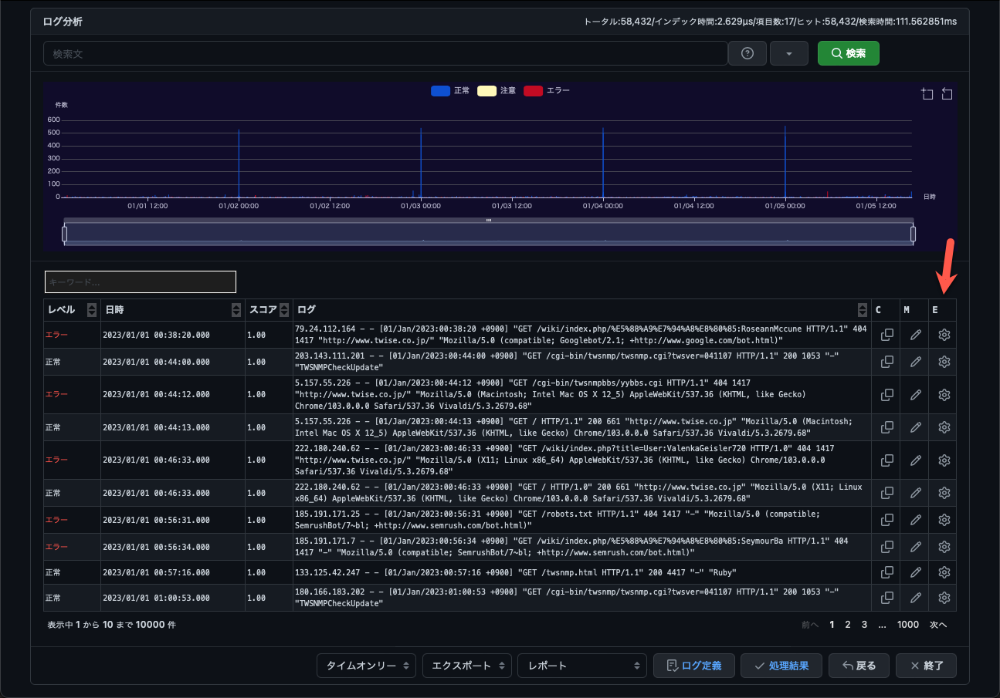

## Grok Pattern Edit

The Grok Pattern Edit screen displays the selected logs in the test data.You can automatically create extraction patterns using the Auto Generate button.You can edit and test extraction using the <Test> button.
Once you've edited it and saved it as a name and you can use it later.

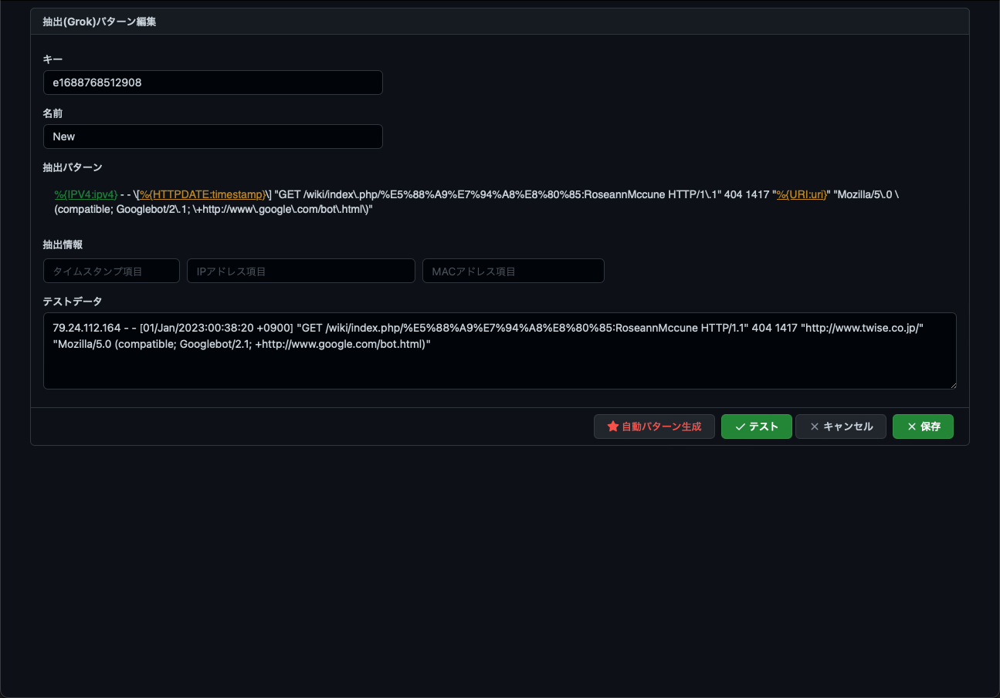


## <Automatic extraction pattern generation> button

The logs on the first line of the test data are analyzed and patterns are automatically created.Automatically converts timestamps, IP addresses, email addresses, URLs, etc.
When I was writing this manual, I was able to use a splunk version.

```
ip=192.168.1.1
```

It incorporates ideas to automatically recognize patterns like this.

## Log definition

You can check the saved extraction patterns and field definitions in the log definition.
You can also import and export.

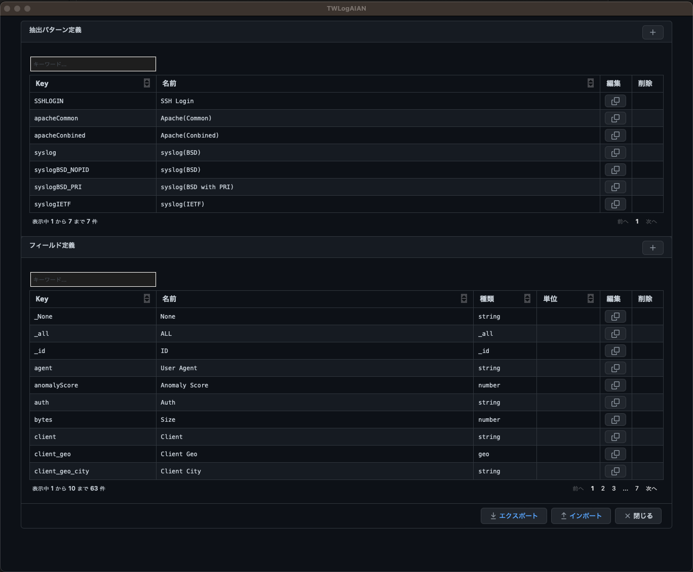

## Log type definition file

It is in yaml format, so you can edit it using a text editor.

```yaml
extractortypes:
- key: custom_20220307065138
  name: TCP接続数
  grok: '%{TIMESTAMP_ISO8601:timestamp}\s+(?:%{SYSLOGFACILITY} )?%{SYSLOGHOST:logsource}\s+%{NOTSPACE:tag}:\s+.*sce=%{INT:sce}.*'
  timefield: timestamp
  ipfields: ""
  macfields: ""
  view: ""
fieldtypes:
- key: sce
  name: 有効なTCP接続数
  type: number
  unit: "件"
```

`extractortypes` is the definition of the log.`key` is the value that the definition identifies.`name` is a name for humans, and `grok` is the pattern.This is the variable name that `tilefield` recognizes as a timestamp, and `ipfileds` uses as IP addresses for hostname search and location search.The variable name that `macfields` uses to search for vendor names from the MAC address.`fieldtypes` is the definition of the variable.`key` is the variable name.`name` is the name for a human, and `type` is the type of the variable.Specify a number (`number`) or a string (`string`).`unit` is the unit that is displayed in the graph.
