# TWLogAIAN User Guide

A powerful log analysis tool with AI assistance


## Log Analysis Flow

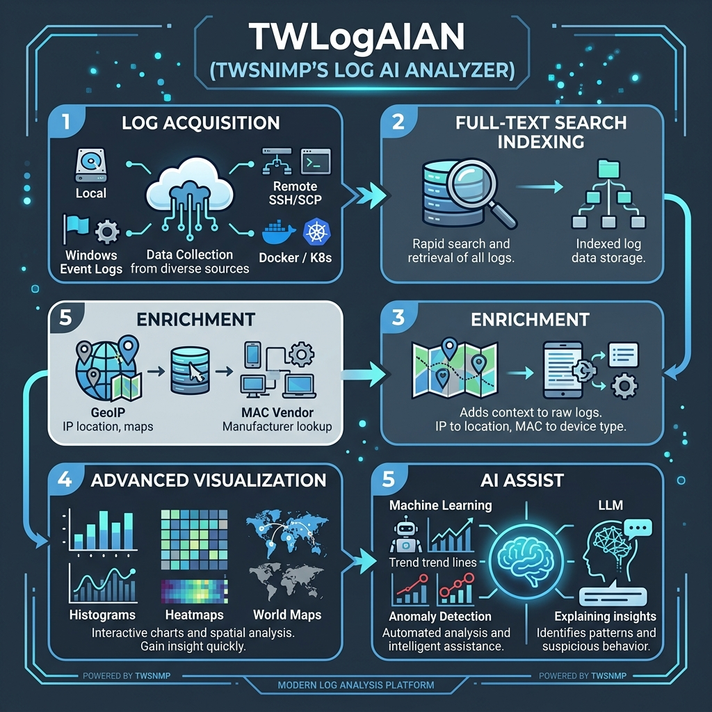


## Why TWLogAIAN is Being Developed

Development on TWLogAIAN started on New Year's Day, 2022. It is designed to be:
**"A log analysis tool where the AI assists me."**

The primary motivation for developing this tool is to use it myself in daily work. Specifically, I use it to analyze logs when investigating issues in the software I develop and support. TWLogAIAN is built to be the ideal tool for this exact purpose.


## How It Differs from Typical Log Analysis Systems

- Logs are kept only during analysis.
- Once the analysis is complete, everything can be deleted without a trace.
- Runs smoothly on a standard personal computer.
- Allows you to create and delete your own full-text search indexes.

The workflow is simple: when you get logs to troubleshoot a problem, you import them, perform the investigation, and once the issue is resolved, you can delete the folder to wipe all traces. While large-scale log analysis systems require high-performance servers, TWLogAIAN is designed to make lightweight analysis easy and accessible directly on your local computer.


## Key Features

- Quickly collect logs from various sources.
- Filter collected logs at high speed.
- Easily and quickly extract data fields from logs.
- Build full-text search indexes from logs and extracted data.
- Search and analyze aggregated and extracted data easily with AI assistance.
- Visualize aggregated data, extracted data, and AI analysis results.
- Export analysis results (lists and graphs) easily to CSV and Excel files.


# Supported Log Sources

- Local files
- Remote files (via SCP)
- Logs saved in TWSNMP FC
- Docker/Kubernetes logs (via command execution/SSH)
- Gravwell logs
- Windows Event Logs (including remote servers)


# Architecture of TWLogAIAN

The backend is developed in Go, and it uses Bluge as its full-text search engine:

https://blugelabs.com/bluge/


## Installation: Windows

Available on the Microsoft Store:

https://www.microsoft.com/store/apps/9P8TQLG999Z3


## Installation: macOS

Available on the Mac App Store:

https://apps.apple.com/app/twlogaian/id1664596440


## Installation: Linux

The Linux version can be downloaded from the GitHub Releases page:

https://github.com/twsnmp/TWLogAIAN/releases

1. Download the Linux (amd64) archive `TWLogAIAN-linux-amd64.tar.gz`.
2. Extract the archive in a terminal:
   ```bash
   tar -zxvf TWLogAIAN-linux-amd64.tar.gz
   ```
3. Run the extracted `TWLogAIAN` binary:
   ```bash
   ./TWLogAIAN
   ```

### Notes & Troubleshooting
TWLogAIAN uses the Wails framework, which requires **GTK3** and **WebKit2GTK (4.1)** at runtime. If the application fails to start due to missing libraries, install them via your distribution's package manager:
- **Ubuntu / Debian-based:**
  ```bash
  sudo apt update
  sudo apt install libgtk-3-0 libwebkit2gtk-4.1-0
  ```
- **Arch Linux:**
  ```bash
  sudo pacman -S gtk3 webkit2gtk-4.1
  ```


## Alternative Downloads

You can find the latest installer releases at:

https://github.com/twsnmp/TWLogAIAN/releases

Download the Windows MSI installer (`TWLogAIAN.msi`), the macOS PKG installer (`TWLogAIAN_dev.pkg`), or the Linux archive (`TWLogAIAN-linux-amd64.tar.gz`).


## Launching: Windows

On Windows, start the application from the Start menu.


## Launching: macOS

On macOS, launch the application from the Launchpad or via your preferred method.


## Launching: Linux

Run the `TWLogAIAN` executable in the directory where it was extracted, or register it in your desktop environment's launcher to start it.


## Welcome Screen

When launched, the Welcome screen is displayed.

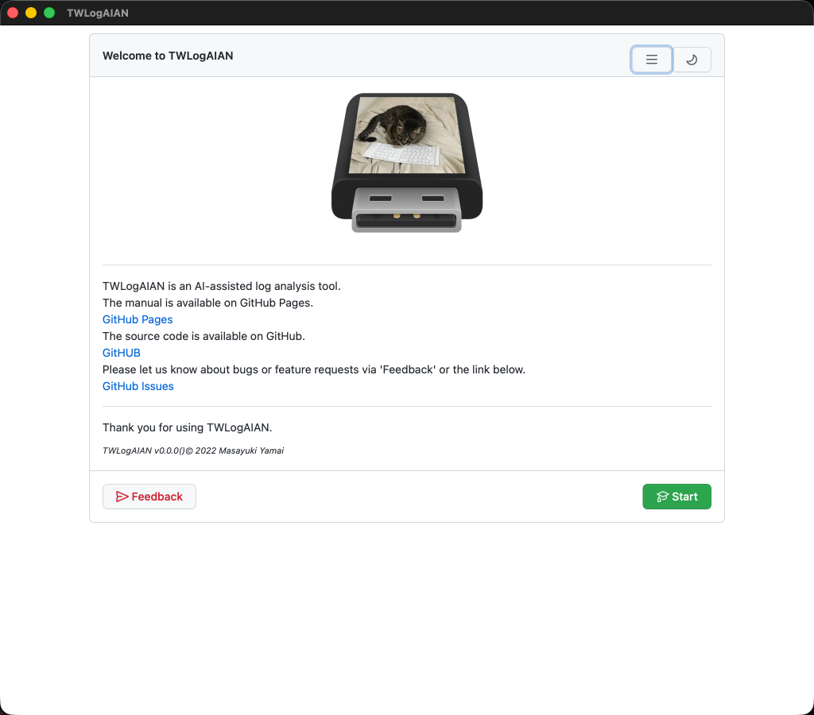


## Screen Mode Switch

The application starts in light mode by default. Click the moon icon in the top right to switch to dark mode. Click the sun icon in the top right to return to light mode. Note that mode switching is only available on this screen. Using dark mode will make you look like a pro.


## Feedback

Clicking the **Feedback** button opens the feedback dialog. Please enter any issues or feature requests and click **Send**. Your feedback goes directly to the developer, and I will do my best to address it.
***Please note: No information other than the source IP address is transmitted.**

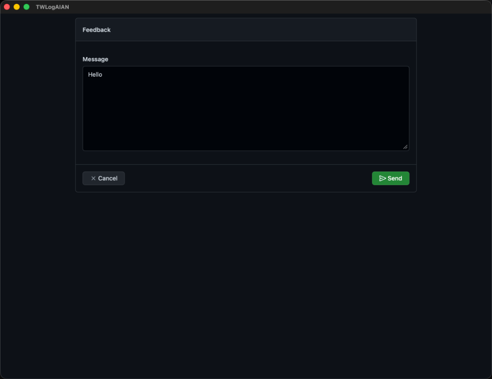


## Log Analysis Flow

1. Select a workspace folder
2. Configure log sources (where logs are loaded from)
3. Configure indexing options
4. Load logs
5. Search logs
6. View analysis reports


## Selecting a Workspace Folder

Click the **Start** button on the Welcome screen to open the workspace folder selection dialog. The selected folder will hold the configuration files and full-text search indexes created during analysis. Once the analysis is complete, deleting the entire folder cleans up all files. Select your folder and click **Select** to open the log analysis configuration screen.


## Log Analysis Settings Screen

Selecting the workspace folder displays the log analysis configuration screen. The image below shows the screen when "Custom" is selected for the log type, displaying all available options.


### Recursive tar.gz Extraction

Check this option to recursively extract and read archives nested inside other `tar.gz` files. There is no depth limit, so use this with care as it may result in loading an extremely large volume of logs.


### Treat Unknown Time Zone as UTC

Many log timestamps do not specify a time zone. By default, TWLogAIAN treats unknown time zones as the local time zone. If you prefer to interpret them as UTC, enable this option.


### Filters

Filters allow you to restrict which log lines are imported. You can specify a regular expression to match. Filtering helps you build a search index containing only the logs relevant to your analysis, which significantly reduces index size and speeds up import and search times.

For example, on an access log, setting the filter to:

```
POST
```

will only load logs that contain the string `POST` (i.e., HTTP POST requests).


## Log Types

Specify the format of the log you are loading. TWLogAIAN has built-in parsers for various common log formats (as shown on the right). For instance, it supports both the legacy BSD syslog format and the modern IETF syslog format (which includes time zones and sub-second timestamps). Select "Custom" if you want to define parsing rules yourself, or choose "Auto Detect" to let the application automatically identify the log format.


## Hostname Resolution

Enabling this option checks the IP addresses in the log via DNS and appends the resolved hostnames.
When using a custom log type, enter the variable names of the IP address fields in the **Hostname Resolution Items** field. For built-in log types (such as Apache access logs), these fields are configured automatically.


## GeoIP Lookup

Enabling this option looks up IP addresses in a GeoIP database to resolve location information and append it to the log records. For custom log types, enter the variable names of the IP fields in the **IP Location Items** field. For built-in log types, these fields are configured automatically.

For instructions on obtaining a compatible GeoIP database, please refer to the following article:

https://qiita.com/twsnmp/items/bfeab550b7f9b775f754

(Note: Download procedures may have changed).
Once downloaded, specify the path to the database file in the **IP Location Database** field at the bottom of the settings screen.


## MAC Address Vendor Lookup

Enabling this option checks MAC addresses in the logs against a built-in OUI database to resolve and append the hardware vendor names. Specify the MAC address variable name in the **MAC Address Items** field.


## Timestamp Field

Specifies the variable name of the field to be used as the log timestamp. If left blank, TWLogAIAN will automatically detect and use the leftmost timestamp-like string.


## Hostname Resolution Items

Specifies the variable names of the IP fields to resolve to hostnames. You can specify multiple fields separated by commas.


## IP Location Items

Specifies the variable names of the IP fields to check for location data. You can specify multiple fields separated by commas.


## MAC Address Items

Specifies the variable names of the MAC address fields to check for vendor names. You can specify multiple fields separated by commas.


## Create Index in Memory

Builds the Bluge search index in memory and keeps all loaded logs in memory. All data will be lost when the application is closed. Loading an extremely large volume of logs with this option active may run out of memory. If unchecked, the index is saved to the workspace folder on disk.


## IP Location Database

Specifies the path to the GeoIP database file.


## Log Loading Locations

This section explains where TWLogAIAN can load logs from (highlighted in red in the screenshot). Logs stored within compressed archives can be read directly. Windows event logs are also supported.


## Adding a Log Source

To specify a new log source, click the **+** button in the "Log Loading Location" list on the settings screen. This opens the log source creation/editing dialog.


## Editing a Log Source

To edit an existing log source, click the edit button (pencil icon) next to it in the list.


## Log Source Editing Dialog

The editing dialog for log sources is shown on the right.

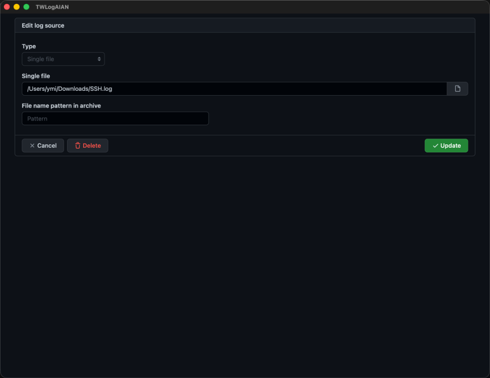


## Deleting a Log Source

You can delete a log source from its editing dialog by clicking the **Delete** button. Alternatively, click the delete button (trash can icon) directly in the sources list.


## Log Source Types

The available log source types are shown on the right. The Windows version includes a specific type to fetch Windows Event Logs.


### Single File

Imports logs from a single file. You can select the file using the button to the right of the path field. (Note: On macOS, the file chooser dialog may appear in English).

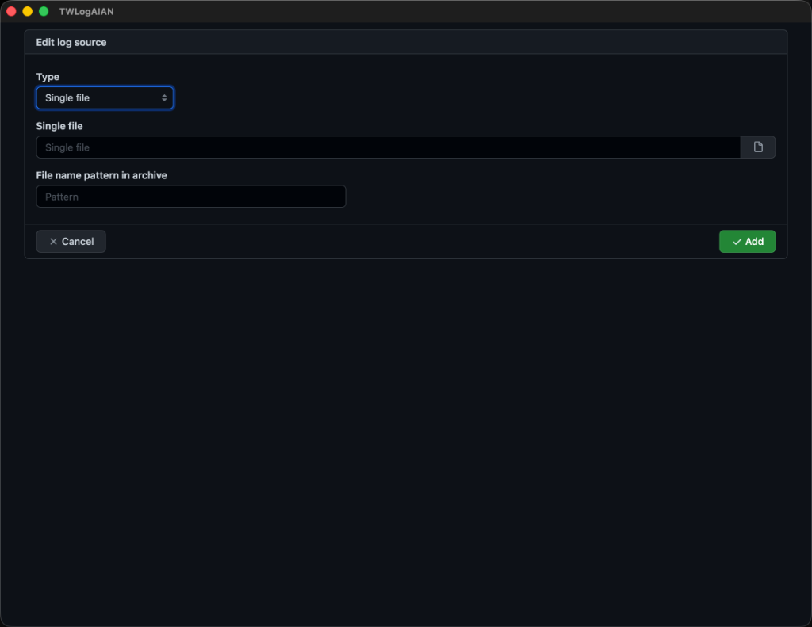


#### File Name Pattern in Archive

You can select compressed files (such as ZIP or `tar.gz`). For archives, you can specify file filters to choose which files inside the archive to read. Specifying a pattern like:

```
access*
```

will only load files inside the archive whose names start with "access".


### Folder

Imports all log files located within a specified folder. Note that only the top-level files in the folder are read; subdirectories are not supported.


#### File Name Pattern

To import only specific files within the folder, specify a file name pattern.

```
access*
```

This will limit the search to files starting with "access". This pattern also applies to ZIP and `tar.gz` archives inside the folder. For archives, you can also filter files inside them, identical to the Single File settings.


### SCP Transfer

You can fetch log files directly from Linux or other remote servers using SCP. This is much more convenient than manually transferring and saving files to your local PC. Specify the server's IP address/hostname, log path, user ID, private key password (if applicable), and the SSH private key path (defaults to the standard SSH location if left blank). Once configured, it behaves similarly to a local folder source; you can use file name patterns and archive filters to select target logs.


### Command Execution

Executes a command locally and imports its standard output as log entries. This is useful for fetching and analyzing Docker or Kubernetes logs on the fly. Specify the command to run.

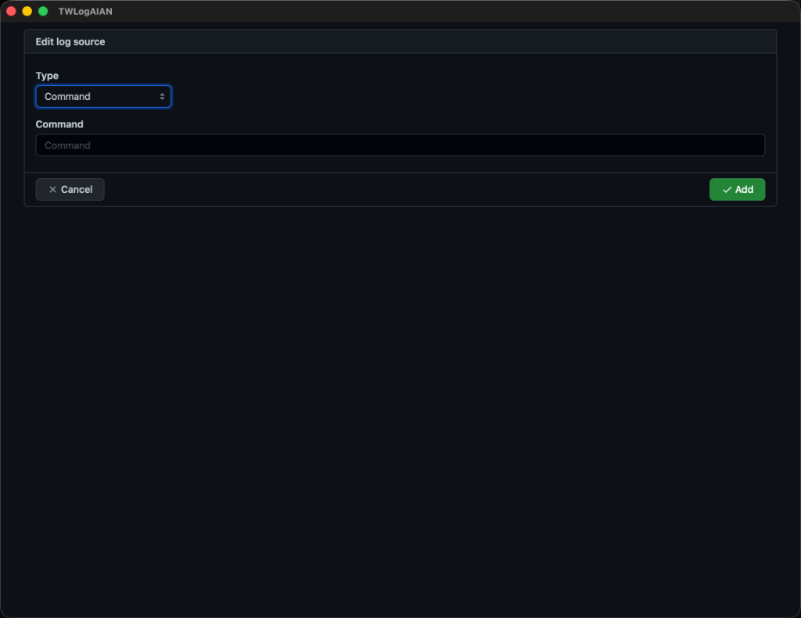


### SSH Command Execution

Similar to Command Execution, but the command is executed on a remote server connected via SSH. This is particularly convenient for analyzing logs in cloud environments. Along with the command, you need to configure SSH connection settings: server address, username, password, and the location of the SSH key file.

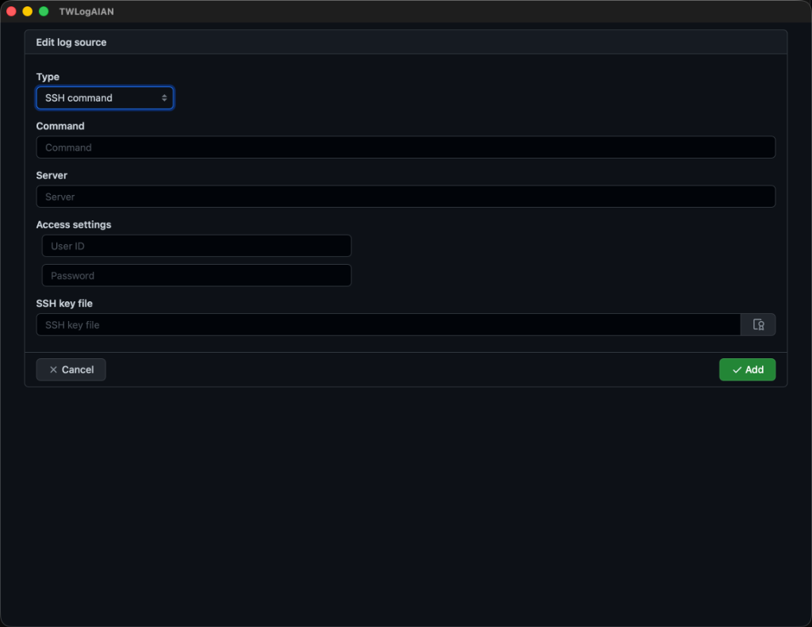


### TWSNMP FC Integration

Allows you to import syslogs directly from TWSNMP FC. Specify the TWSNMP FC server URL, along with the login credentials (user ID and password). You can also set filter criteria such as time range, hostname, tag, and message keywords to narrow down the retrieved logs.

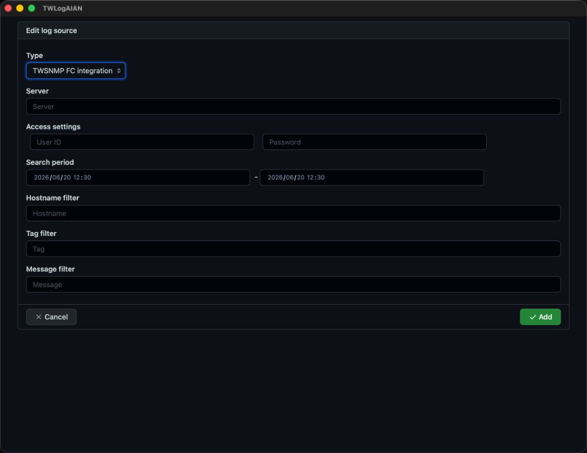


### Windows Event Logs

In a Windows environment, you can import Windows Event Logs directly. This feature utilizes `wevtutil.exe` to fetch logs:

https://docs.microsoft.com/en-us/windows-server/administration/windows-commands/wevtutil

(Note: A command prompt window will briefly appear during retrieval; this is intentional). You can retrieve logs from both the local Windows machine and remote servers. For remote servers, configure the target host, user ID, password, and authentication method in the access settings. For local logs, credentials are not required. Specify the time range and event channel (e.g., Application, Security). Note that to retrieve Security channel logs, TWLogAIAN must be run with administrator privileges.


## Supported File Formats

TWLogAIAN supports text-based log files that contain timestamps. The timestamp format is detected automatically. Gzip (`.gz`) archives are automatically extracted upon import. Log files inside ZIP archives are supported up to one nesting level. For `.tar.gz` archives, nested folders and multi-layered compression (such as archives inside archives) are fully supported. To enable this nested archive extraction, check the **Recursive tar.gz Extraction** option. Windows Event Log format (`.evtx`) is also supported, up to a file size limit of 1 GB per file (since files are loaded into memory).


## Indexing

TWLogAIAN reads log files and builds a full-text search index. This section explains the indexing process (highlighted in red in the screenshot).


## What is Indexing?

When logs are imported, TWLogAIAN parses each line to extract meaningful fields and registers them in the search index. For example, consider this Apache access log entry:

```
114.119.136.254 - - [03/Apr/2022:00:39:21 +0900] "GET /wiki/index.php?
title=Must_Know_Mlm_Concepts_For_Accomplishment&action=history HTTP/1.1" 404 1417
 "-" "Mozilla/5.0 (Linux; Android 7.0;) AppleWebKit/537.36 (KHTML, like Gecko)
  Mobile Safari/537.36 (compatible; 
  PetalBot;+https://webmaster.petalsearch.com/site/petalbot)"
```

This line contains structured data: client IP, timestamp, request method, path, status code, and response size. While you can index the entire line as plain text, extracting each value into index fields makes searches much faster and allows for easy aggregation and analysis.


## Field Extraction by Log Type

If we process the previous log entry using the **Apache (Combined)** type, the fields shown on the right will be extracted. In this example, the extracted fields include data directly parsed from the log content, as well as additional information like resolved hostnames (via DNS lookup) and geographical location details (via GeoIP). Because TWLogAIAN is a dedicated log analyzer, it requires at least a timestamp to be extracted. Common log formats are built-in, but you can also configure custom field extractions.


## Searching Logs

Once log loading and indexing are complete, you can search your logs. This corresponds to the area highlighted in red on the right.

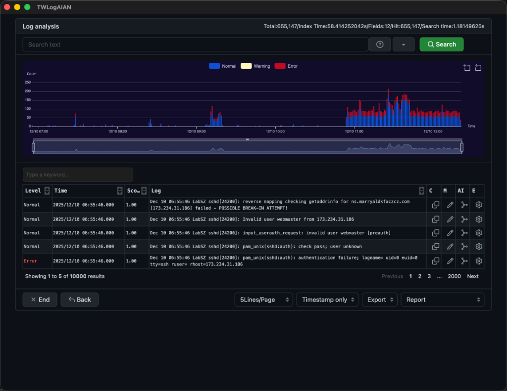


## Basics of Log Search

Immediately after indexing completes, the search screen will appear as shown. The number of logs indexed and the elapsed time are displayed in the top right. To search, enter keywords into the search box at the top. Leaving the search box blank and clicking search retrieves all logs. You can change the query mode to use Bleve query syntax:

https://blevesearch.com/docs/Query-String-Query/


## Specifying Search Criteria

Clicking the down arrow button next to the search box opens the search criteria panel, allowing you to set detailed search filters.


## Search Criteria Panel

- **Search History**: View past queries.
- **Query Mode**: Choose how the search string is interpreted.
- **Time Range**: Filter by timestamps.
- **Max Results**: Limit the number of matching records.
- **Anomaly Detection**: Run machine learning models to detect outliers.
- **Extract Data on Search**: Extract fields dynamically during search.

You can close this panel by clicking the up arrow button in the same location.


### Search History

A list of previously executed search queries. Click an item to populate the search box. You can clear the history using the delete button on the far right.


### Query Mode

Determines how your search input is parsed. Options include:
- **Simple**: Searches for exact matching keywords.
- **RegEx**: Searches using regular expression syntax.
- **Full Text**: Shows advanced fields for keyword and numeric criteria. Select conditions and click the **+** button to append them to the search query.


### Search Period

Specifies the time range for your search. There are two modes:
- **Target Mode**: Paste a specific timestamp to focus on a particular point in time.


- **Range Mode**: Specify a start and end time range.


## Anomaly Detection

Use machine learning models to identify anomalous log entries. Available algorithms include:
- **None** (No detection)
- **Isolation Forest**
- **Local Outlier Factor**
- **Auto Encoder**

If detection is enabled, you can select which features to analyze, such as extracted numeric fields, string variables, or the frequency of SQL injection signatures. The **Day/Time** option calculates the day of the week and hour of the day from log timestamps to include as features. (This is useful for detecting anomalies relative to routine schedules, such as load spikes that are normal on Monday mornings but anomalous on Sunday nights).


# Viewing Search Results

After running a query, the results screen is displayed as shown below.


## Linked Graph and Log List

Adjusting the time window on the chart will automatically update the log list to match that timeframe. Click the zoom button in the top right of the chart to select a custom range by dragging across the graph.


## Filtering by Keyword

You can enter a text string in the keyword filter box to dynamically filter the displayed log list.


## Log Display Formats

Beneath the search results, you can select the display format to change how log entries are presented in the list.


### Time Only

Displays only the timestamp, search score, and raw log message. You can select log entries via the checkbox on the left to copy them to the clipboard or save them to your notes.


### Syslog

A layout optimized for syslog files. This option is disabled if the logs were not parsed using syslog format.


### Access Log

A layout optimized for web server access logs. This option is disabled if the logs were not parsed using access log format.


### Extracted Data

Displays parsed fields in a structured table. You can scroll horizontally to view additional fields.

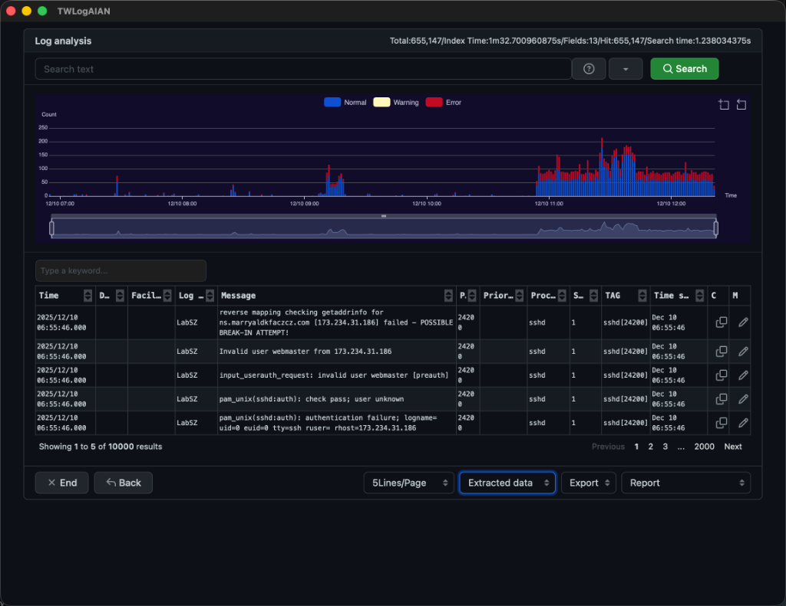


### Anomaly Score

Similar to the Time Only format, but the search score is replaced with the calculated anomaly score. This layout is only available when Anomaly Detection is enabled.


### Export

An export menu is available at the bottom of the search results screen.
- **CSV**: Saves the log list to a CSV file.
- **Excel**: Saves the log list and chart images to an Excel spreadsheet.
- **AI**: Exports the logs to the AI along with descriptive prompts.


# Reports

TWLogAIAN features robust reporting tools to visualize log analysis in charts and lists. Searching logs displays the reports menu at the bottom of the screen. Click on an item to open the corresponding report view.


## Processing Results

Displays a retrospective view of index creation and AI training states. You can review log volume metrics, parsed field definitions, and peak log activity hours.


## Notes (Memo)

The Notes report aggregates log entries you've flagged during search. You can add entries to your notes using the **Memo** button on the right side of the log search list.


### Viewing Notes

Selecting **Memo** from the **Report** menu displays the notes screen, showing flagged log entries in chronological order.


Each note features **Delete** and **Edit** buttons.


In the editing dialog, you can select severity levels and add descriptions. This is helpful for documenting what each log entry represents during investigations.


When finished, click the **Copy** button at the bottom of the screen to copy the compiled notes to your clipboard. This makes it easy to paste findings directly into emails or reports.


## Ranking Analysis

Displays compiled ranking charts based on fields extracted from the logs. You can select the target field to rank from the dropdown menu in the top right.

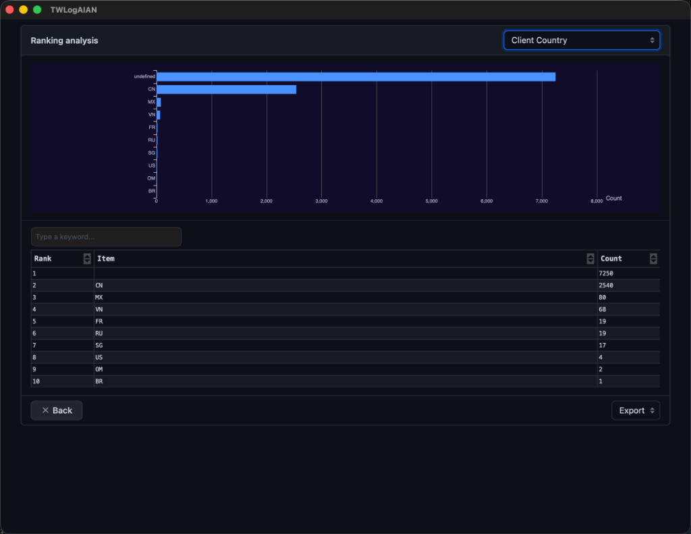


## Time Series Analysis

Plots extracted numeric data on a time-series line chart. Use the top-right menus to select the field and aggregation level:
- **Raw Data**: Plots the extracted numeric values directly.
- **Minutely Aggregation**: Aggregates data by the minute, displaying the mean, median, variance, max, and min values.
- **Hourly Aggregation**: Aggregates data by the hour, displaying the mean, median, variance, max, and min values.


## Regression Analysis

Performs regression analysis on selected numeric data using the chosen method. For example, the "Linear" method calculates the slope \(a\) and intercept \(b\) of the equation \(y = ax + b\) and overlays the trend line on the graph. (This is useful for metrics like disk space or memory utilization to project usage exhaustion rates).


## 3D Time Series Analysis

Plots numeric data on a 3D time-series graph. The Y-axis is fixed to time, while you can assign X-axis, Z-axis, and color-coding fields via the menus in the top right. You can rotate the graph and change your perspective by clicking and dragging.
***"There are things that cannot be seen in a 2D graph,"***
proclaims the Assistant Cat from above.


## Cluster Analysis

Performs cluster analysis using numeric fields extracted from the logs. Select two numeric fields and specify the target number of clusters in the top-right menu. Cluster analysis might reveal hidden patterns in your log metrics.


## Histogram Analysis

Displays a histogram distribution of selected numeric fields. Select the target field from the menu in the top right.

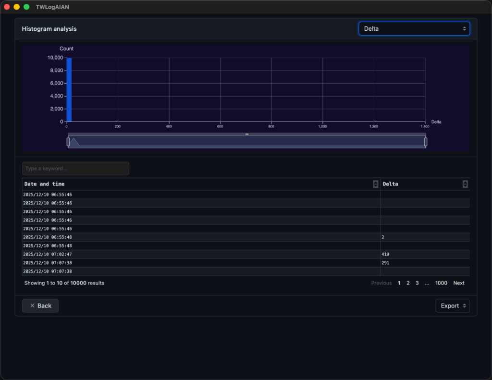


## FFT Analysis (3D)

Performs Fast Fourier Transform (FFT) analysis on numeric fields. FFT can help expose periodic patterns and cycles in log occurrences.

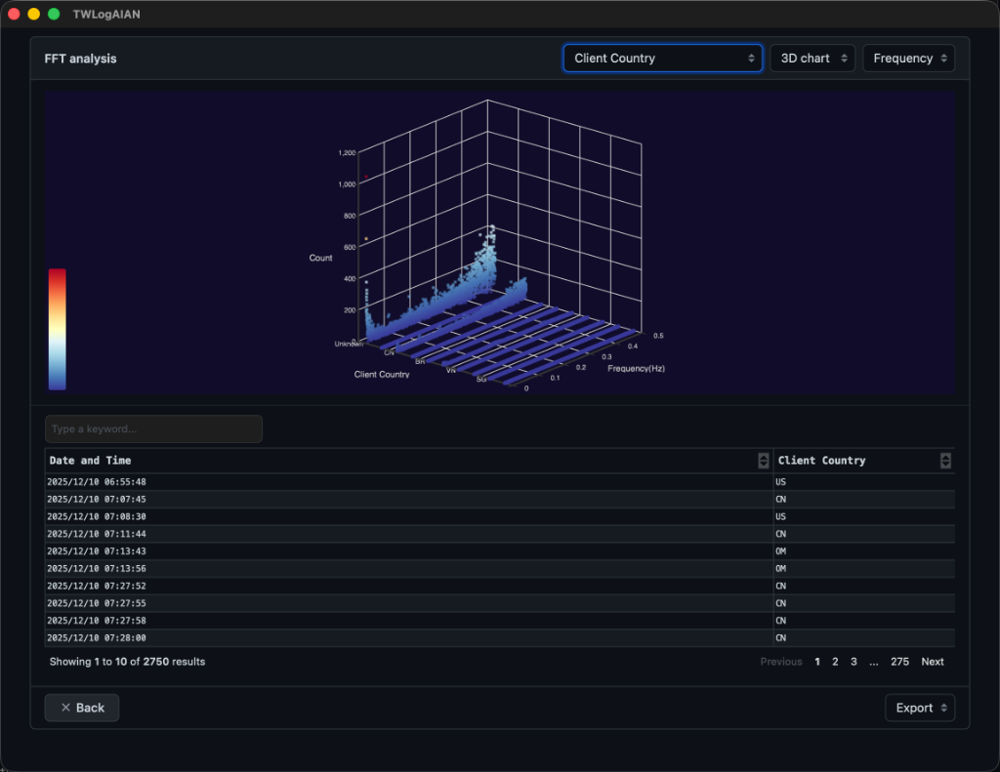


## FFT Analysis (2D)

Provides detailed 2D frequency domain charts. Use the top-right menus to select the target field, chart type, and toggle between frequency and period. (The 2D graph shown on the right highlights access interval periods from a specific IP address).

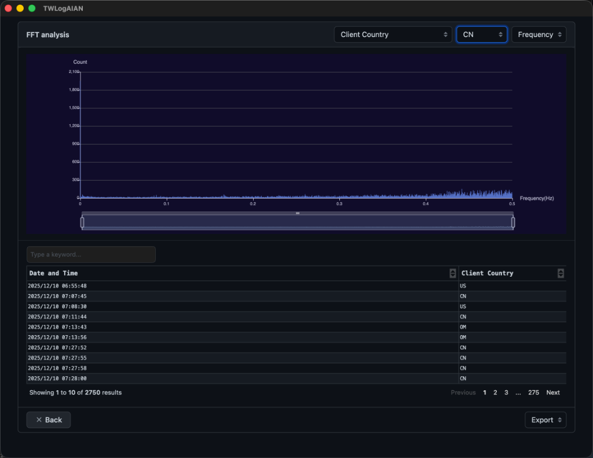


## Location Analysis (Map)

Plots geographic coordinates resolved from log IP addresses on a map. Select the location field and the numeric field to control color coding from the top-right menu. Double-clicking a point on the map opens Google Maps for that location.


## Flow Graph Analysis

Visualizes the relationship between two extracted log fields as a network flow graph. This is helpful for tracing connections, such as mapping logged-in user accounts to their origin IP addresses. Select the source/destination fields, color-coding metrics, and chart type in the top-right menu.


## Flow Analysis (Globe)

Visualizes IP address locations and communication paths on a 3D interactive globe. (While visually impressive for demonstrations, it may not offer as much analytical depth as other charts).


## Heatmap

Displays log frequencies in a grid mapped by hour of the day versus day of the week (or day of the month). This makes it easy to spot schedule-based patterns, such as spikes occurring at 9:00 AM on Mondays. Use the top-right menu to select fields and grid layouts.


## Exporting Reports

All of the reports described above can be exported. Access the export menu in the bottom right:
- **CSV**: Exports the raw data list to a CSV file.
- **Excel**: Exports both charts and data tables to an Excel spreadsheet.


# Settings

## Log Type Definitions

Allows you to save Grok patterns and other field extraction settings to definition files, which can then be reused in other analyses.


## AI Integration Settings

Configure connections to Large Language Models (LLMs) such as Ollama, Gemini, OpenAI, or Anthropic to request automated log explanations. Specify the API key, model name, and the base URL for local deployments (e.g., Ollama). Note that this feature transmits your selected logs and prompt instructions directly to the LLM without RAG (Retrieval-Augmented Generation) lookup.


# Customizing Log Types

To extract data fields from log formats that are not supported out of the box, select the **Custom** log type.
You can define extraction rules using Grok syntax. For a quick tutorial on Grok, we recommend the following guide:

https://coralogix.com/blog/logstash-grok-tutorial-with-examples/

Learning Grok syntax is highly beneficial for log analysis engineers, as it is widely supported across various log management tools. Fortunately, there are only four main concepts you need to master:

1. Use `%{PATTERN:variable_name}` to extract information into fields.
2. Keep literal characters from the log message as-is in the pattern.
3. Use `\s+` to match delimiting whitespace.
4. Use `.+` to ignore variable-length strings.


## Launching Grok Pattern Editing

TWLogAIAN provides helper tools to make writing Grok patterns as simple as possible. Clicking the **E** (Edit) button next to a log entry launches the Grok pattern editor.


## Grok Pattern Editor

The Grok Pattern Editor displays the selected log entry as test data. Click the **Auto Generate** button to automatically draft an extraction pattern. You can test and refine your pattern by clicking the **Test** button. Once satisfied, save it under a unique name for future use.

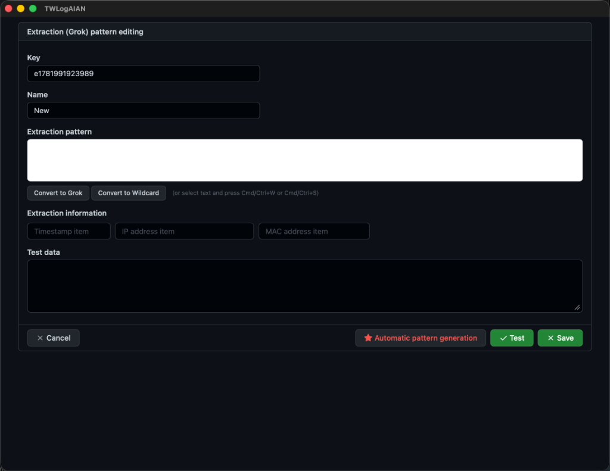


## Auto Generate Pattern Button

Analyzes the first line of the test log and automatically generates a matching pattern, converting timestamps, IP addresses, email addresses, and URLs into appropriate Grok patterns. When developing this guide, I also added support to automatically detect key-value syntax patterns (similar to Splunk), such as:

```
ip=192.168.1.1
```


## Log Definition

You can review saved extraction patterns and field configurations in the log definition screen. It also supports importing and exporting configuration definitions.


## Log Type Definition File

Log definitions are saved in YAML format and can be modified with any standard text editor.

```yaml
extractortypes:
- key: custom_20220307065138
  name: TCP接続数
  grok: '%{TIMESTAMP_ISO8601:timestamp}\s+(?:%{SYSLOGFACILITY} )?%{SYSLOGHOST:logsource}\s+%{NOTSPACE:tag}:\s+.*sce=%{INT:sce}.*'
  timefield: timestamp
  ipfields: ""
  macfields: ""
  view: ""
fieldtypes:
- key: sce
  name: 有効なTCP接続数
  type: number
  unit: "件"
```

- `extractortypes`: List of log type parsing definitions.
  - `key`: A unique identifier for the definition.
  - `name`: A user-friendly name for display.
  - `grok`: The Grok extraction pattern.
  - `timefield`: The field recognized as the log timestamp.
  - `ipfields`: A comma-separated list of IP address fields used for hostname and GeoIP location resolution.
  - `macfields`: A comma-separated list of MAC address fields used for hardware vendor lookup.
- `fieldtypes`: List of variable type definitions.
  - `key`: The variable name.
  - `name`: A user-friendly label for display.
  - `type`: The data type of the field (`number` or `string`).
  - `unit`: The unit of measurement displayed on charts.
