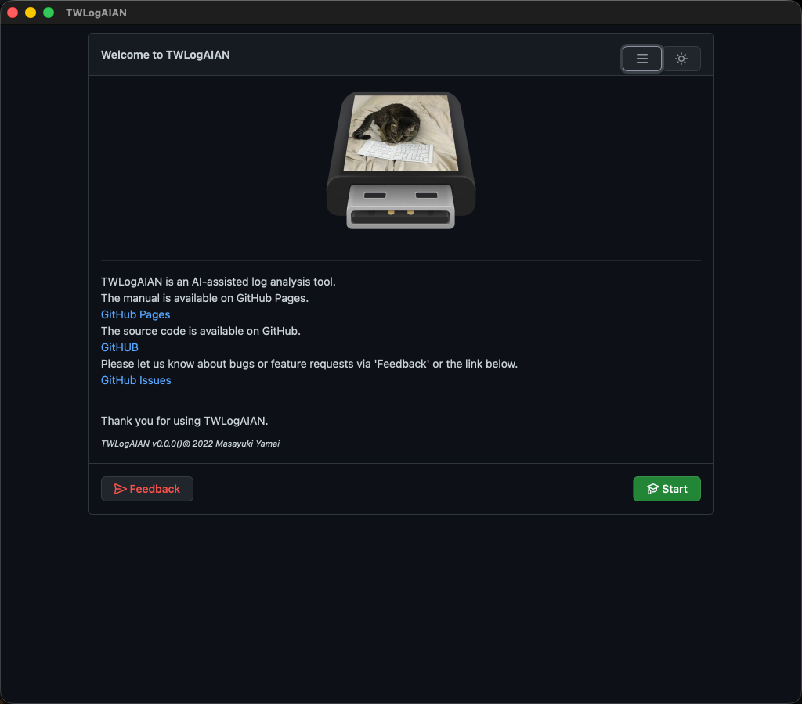
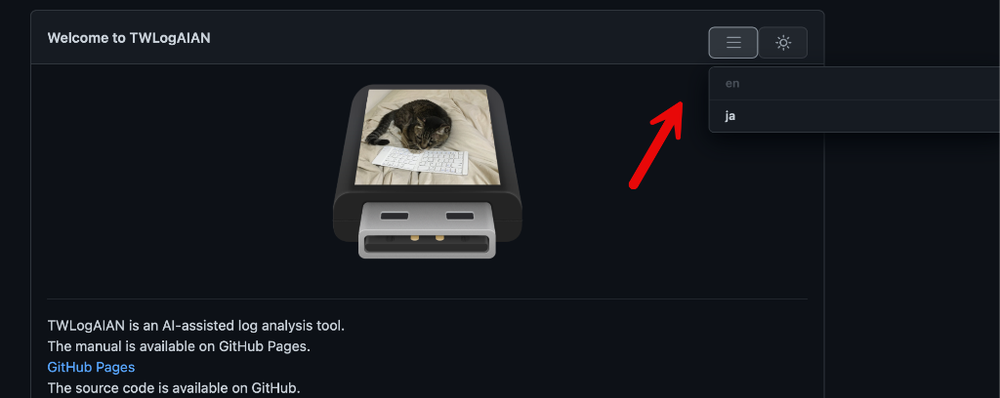
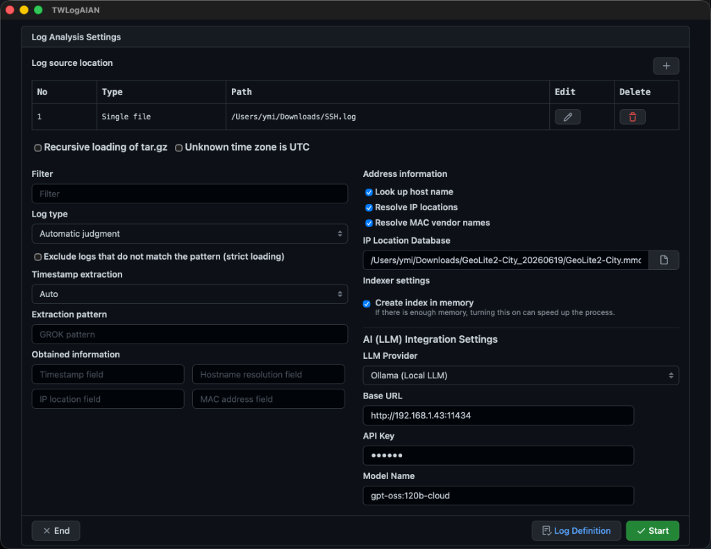
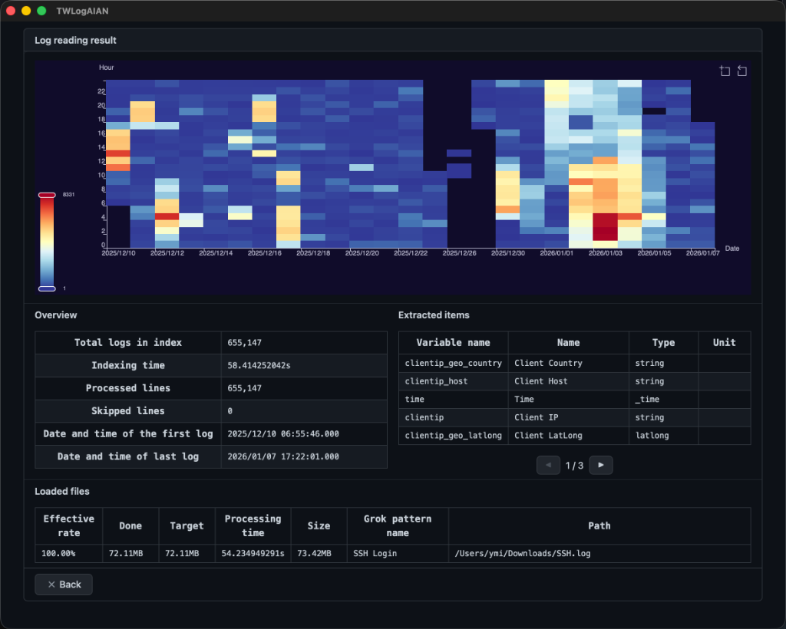
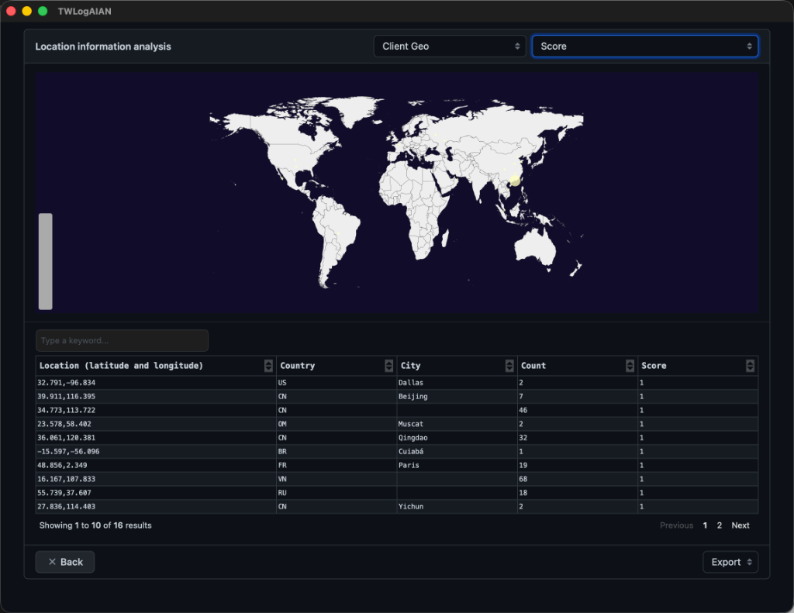

# Getting Started with TWLogAIAN

A powerful log analysis tool with AI assistance


[Back](./index.html)


# Introduction

This guide explains how to install and start using TWLogAIAN, a convenient AI-assisted log analysis tool. TWLogAIAN is built for software developers and support engineers. It is designed around a simple workflow: "easily collect logs, build indexes to simplify searches, analyze results with rich visualizations, and clean up effortlessly when you're done."


# How TWLogAIAN Works

TWLogAIAN imports logs into a full-text search engine to make them searchable. It then helps you analyze the search results using machine learning (AI) and rich visualization tools.


## Windows: Microsoft Store

[Microsoft Store](https://ms-windows-store//pdp/?productid=9P8TQLG999Z3)


## Windows: MSI

Download and install `TWLogAIAN.msi` from [GitHub Releases](https://github.com/twsnmp/TWLogAIAN/releases).


## Windows: Scoop

Refer to the [Scoop website](https://scoop.sh/) to install Scoop, then run:

```
> scoop bucket add twsnmp https://github.com/twsnmp/scoop-bucket
> scoop install twlogaian
```

to install TWLogAIAN.


## macOS: App Store

Install from the [App Store](https://apps.apple.com/app/twlogaian/id1664596440).


## Linux

Download `TWLogAIAN-linux-amd64.tar.gz` from [GitHub Releases](https://github.com/twsnmp/TWLogAIAN/releases), extract the archive, and run the executable.

### Installation & Execution Steps

1. Open a terminal and extract the downloaded archive:
   ```bash
   tar -zxvf TWLogAIAN-linux-amd64.tar.gz
   ```
2. Run the extracted `TWLogAIAN` executable:
   ```bash
   ./TWLogAIAN
   ```

### Notes & Troubleshooting
- TWLogAIAN uses the Wails framework, which requires **GTK3** and **WebKit2GTK (4.1)** at runtime. If the application fails to start due to missing libraries, install them using the package manager for your distribution:
  - **Ubuntu / Debian-based:**
    ```bash
    sudo apt update
    ```
    ```bash
    sudo apt install libgtk-3-0 libwebkit2gtk-4.1-0
    ```
  - **Arch Linux:**
    ```bash
    sudo pacman -S gtk3 webkit2gtk-4.1
    ```


## Starting TWLogAIAN

Launch the application using your preferred method—such as the Start menu on Windows or the Launchpad on macOS. You should see the Welcome screen.


## Dark Mode

Click the 🌙 icon in the top right to switch to dark mode.
Personally, I love dark mode.
I suspect anyone aspiring to be a white hat hacker prefers dark mode as well. Rumor has it that only white hat hackers exist in the cat world. (By the Assistant Cat)




## Language Switch

You can switch the interface language to English using the dropdown menu in the top right.




# Log Analysis Flow in TWLogAIAN

The general analysis workflow is as follows:
 
1. Select a workspace folder
2. Configure where to load logs from
3. Configure how logs are processed
4. Load (index) the logs
5. Search and analyze the logs


## Selecting a Workspace Folder

Clicking the **Start** button opens a dialog to select a workspace folder. In this folder, TWLogAIAN creates configuration files and full-text search indexes for your analysis. When you are finished, you can delete the entire folder to clean up everything without leaving a trace.


## Configuring Log Sources

Once you select a workspace folder, the log analysis configuration screen will be displayed.
First, specify where your logs are located. You can add a new source by clicking the **+** button.
In this example, files in the specified folder with names starting with "access" will be imported.




## Configuring Log Loading & Processing Options

After specifying the log source, you can configure how the logs are processed during import. Options include handling nested archives, default time zones for logs without them, filtering out unwanted logs, extracting specific data from logs, resolving hostnames/locations from IP addresses, and choosing where to create the search index.


## Loading the Logs

Click the **Start** button to begin loading and indexing the logs. A progress bar will show the loading status.


## Searching Logs

Once log loading and indexing are complete, the search screen will appear. Simply click the **Search** button to retrieve the logs.


## Processing Results

You can check the import status by clicking the **Processing result** button. This screen allows you to inspect data fields extracted from the logs and see the peak hours of log activity.




## Search Criteria

You can refine your search by specifying various search criteria, such as time range, keywords, numeric ranges, and location details. Settings for anomaly detection and data extraction are also available here.


## Reports

If you enable features like time range grouping or location extraction from IP addresses, you can view rich visual reports, such as map locations.




Enjoy a comfortable and productive log analysis experience!