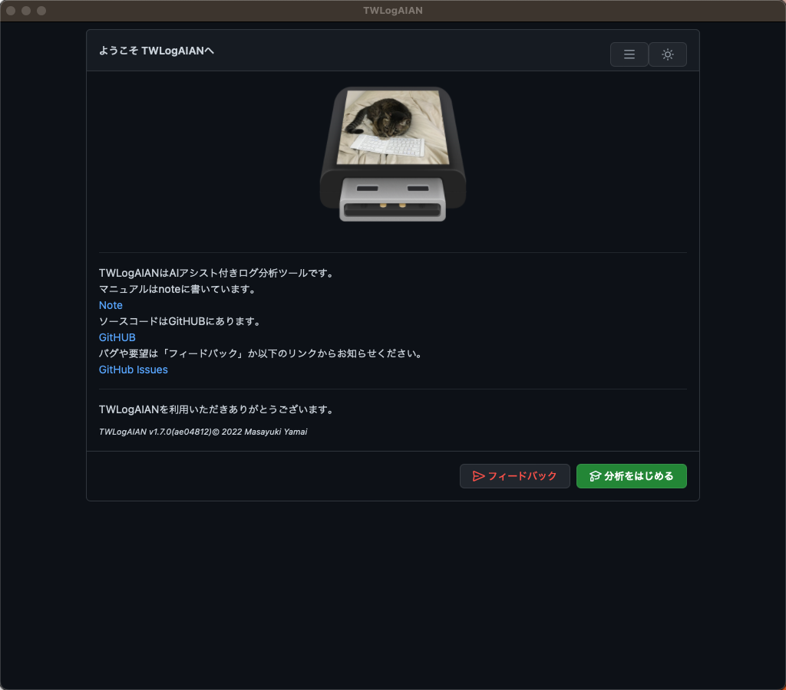
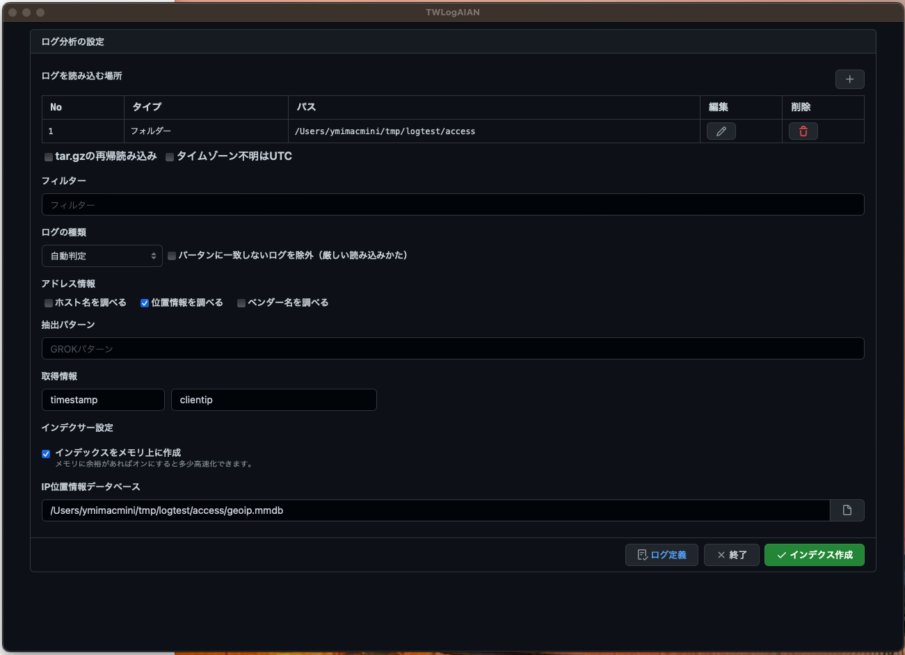
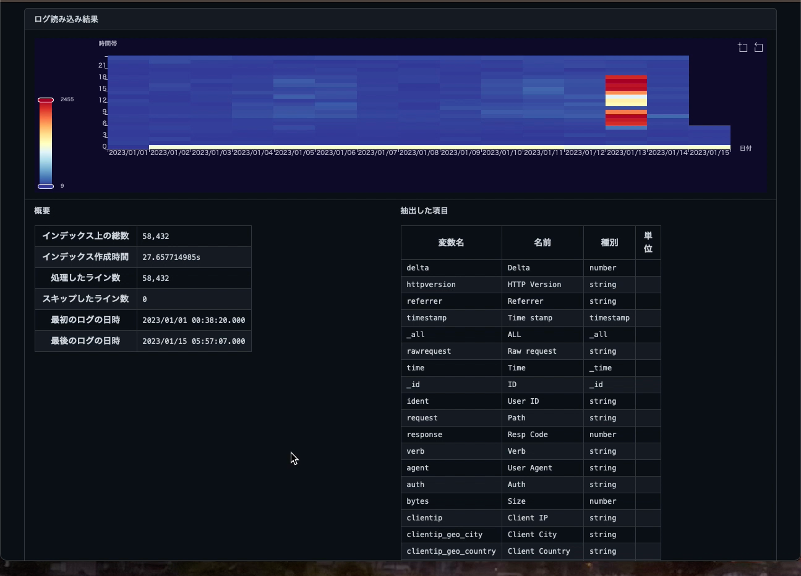
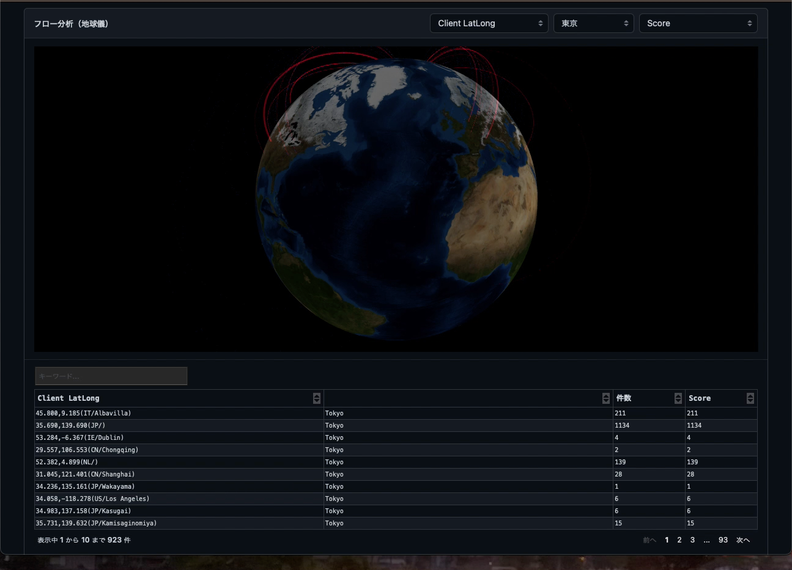

# Getting Started [Back](./index.html)

Amazing log analysis tool with AI assist

{: width="256" }


# About

This is an explanation of how to install and start using the convenient AI-assisted log analysis tool TWLogAIAN.TWLogAIAN is a log analysis tool for those who develop and support software.It is created with the idea of ​​"easy to collect logs, create indexes that make searches easier, analyze search results in rich expressions, and easily clean up when finished.


# How TWLogAIAN works

You can load logs into a full-text search engine and search for them.It helps you analyze search results with machine learning (AI) and visualization.


## Install from Microsoft Store

[Microsoft Store](https://ms-windows-store//pdp/?productid=9P8TQLG999Z3)


## Windows MSI

Download and install TWLogAIAN.msi from

[GitHUB Releases](https://github.com/twsnmp/TWLogAIAN/releases)


## Scoop

See the following after installing Scoop:

[Scoop](https://scoop.sh/)


Install TWLogAIAN with

```
>scoop bucket add twsnmp https://github.com/twsnmp/scoop-bucket
>scoop install twlogaian
```


## Install MAC OS verison from App Store

[App Store](https://apps.apple.com/app/twlogaian/id1664596440)


## Start TWLogAIAN

If you are using Windows, start the menu from the Mac OS, launcher, etc., etc., etc., start it using any method you like.You should see the Welcome screen.


## Dark Mode

Click on the 🌙 mark in the top right to enter dark mode.
I like dark mode.
I think people who are aiming to become White Hackers probably like dark mode.It seems that there are only white hackers in the cat world.
By assistant cat




## Language switching

You can switch the screen display to English in the menu at the top right.


# Analysis flow using TWLogAIAN

The general analysis process is
 
1. Select a working folder
2. Setting the log load location
3. Configuring log loading processing
4. Loading the log
5. Search and analyze logs

.


## Select a working folder

Click the <Start> button to display the working folder selection screen.The working folder will create configuration files and full-text search engine indexes for analysis.Once the analysis is complete, delete the entire folder and it will disappear.You can destroy evidence.


## Setting the log load location

Select the working folder to display the log analysis settings screen.
First, set the location where the logs will be loaded.Set where the logs to be analyzed are located.You can add it at the beginning using the <+> button.
In this example, the filenames in the specified folder start with access.


## Configuring log loading operations

Once you have specified the location to load the target log, you will be setting the processing when loading.There are settings related to handling compressed files in compressed files, handling time when there is no time zone, setting to restrict the logs to be loaded with filters, setting to extract data from logs, setting to check host name and location information from information such as IP addresses, and setting to create indexes.



## Loading the log

Click the <Create Index> button to start loading the log.The progress will be displayed while loading.


## Searching logs

Once the log is loaded and the index creation is complete, the search screen will be displayed.For now, click the Search button to search.


## Processing results

You can check the status of log loading using the <Processing Results> button.You can check the items of data extracted from the log and the times when there are many logs.




## Search criteria

You can also search by specifying search criteria.
Time range, keywords, numerical range, location information, etc.
There are also settings for abnormality detection and data extraction.


## Report

You can also view reports by setting the settings to extract location information from time range, location information, and IP addresses.



 

 Now, enjoy a comfortable log analysis life.